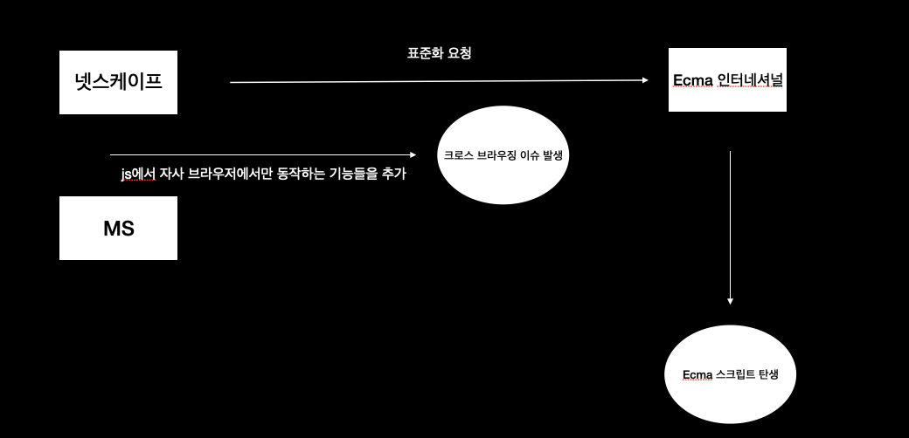

# 1장

프로그래밍이란 컴퓨터에게 요구사항을 정확하고 상세하게 설명해 주는 것이다.

컴파일러 = 번역기, 인터프리터

# 2장

Ajax -> Asynchronous Javascript and xml => axios, Rails.ajax

V8 javascript engine -> event loop 사용
node js는 비동기 I/O 지원(event loop(setTimeout, setInterval, requestAnimationFrame등은 콜스택이 비워지고 나서 실행됨)), 단일스레드 이벤트 루프 기반(이벤트가 발생했을때에 정해진 동작을 수행 -> 요청에 대한 처리, 수행이 좋다)

단일 스레드 이기 때문에 cpu 바운드가 걸리면 좋지 않음, 실시간 데이터를 처리하기 위한 I/O가 빈번하게 발생하는 SPA에 좋음

EcmaScript는 Javascript내에 정의되어 있는 표준임 -> Javascript가 부모 EcmaScript가 출세한 자식같은 느낌

자바스크립트는 인터프리터 언어이다 (한줄씩 바이트 코드로 변환후 실행됨)

|컴파일러 언어|인터프리터 언어|
|-|-|
|코드가 실행되기 전에 소스코드를 기계어로 번역후 실행|런타임에 한 줄씩 바이트코드로 변환후 실행|
|실행 파일 생성|실행 파일이 생성되지 않음|
|컴파일 단계 + 실행 단계|컴파일과 실행이 분리되어있지 않음, 인터프리터는 한 줄씩 변환후 즉시 실행|
|실행에 앞서 컴파일은 단 한번 수행|코드가 실행될 때마다 인터프리트 과정이 반복 수행|
|컴파일과 실행단계가 분리되어 있어 속도가 빠르다|인터프리트 단계와 실행 단계가 분리되어 있지 않고 반복 수행되므로 코드 실행 속도가 비교적 느리다|

자바스크립트는 **프로토타입 기반의 객체지향 언어**다.