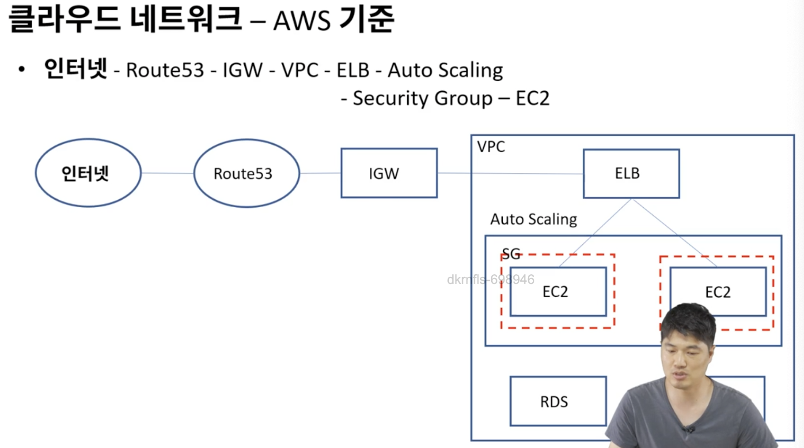
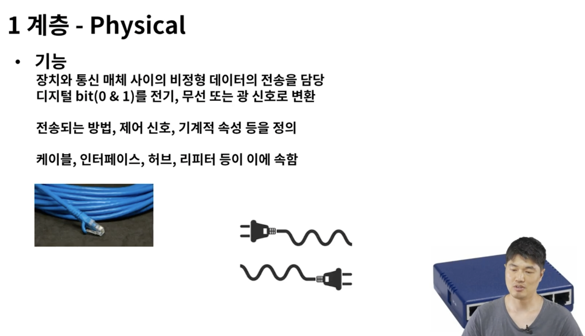
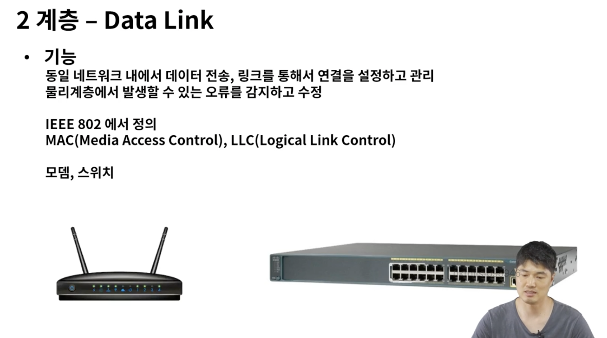
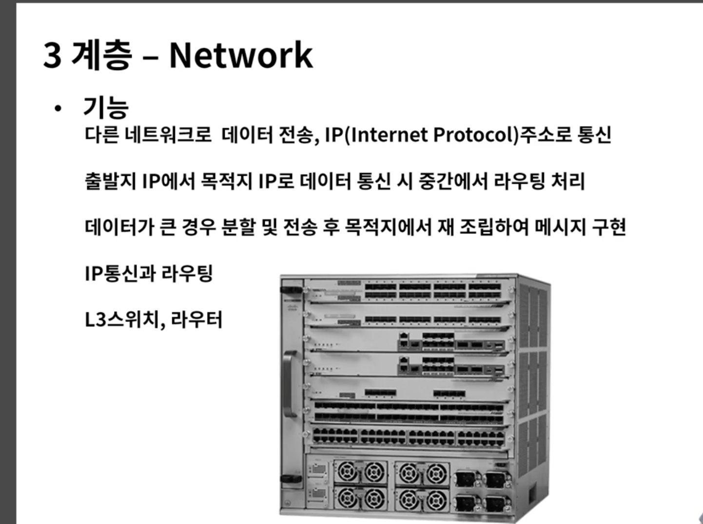
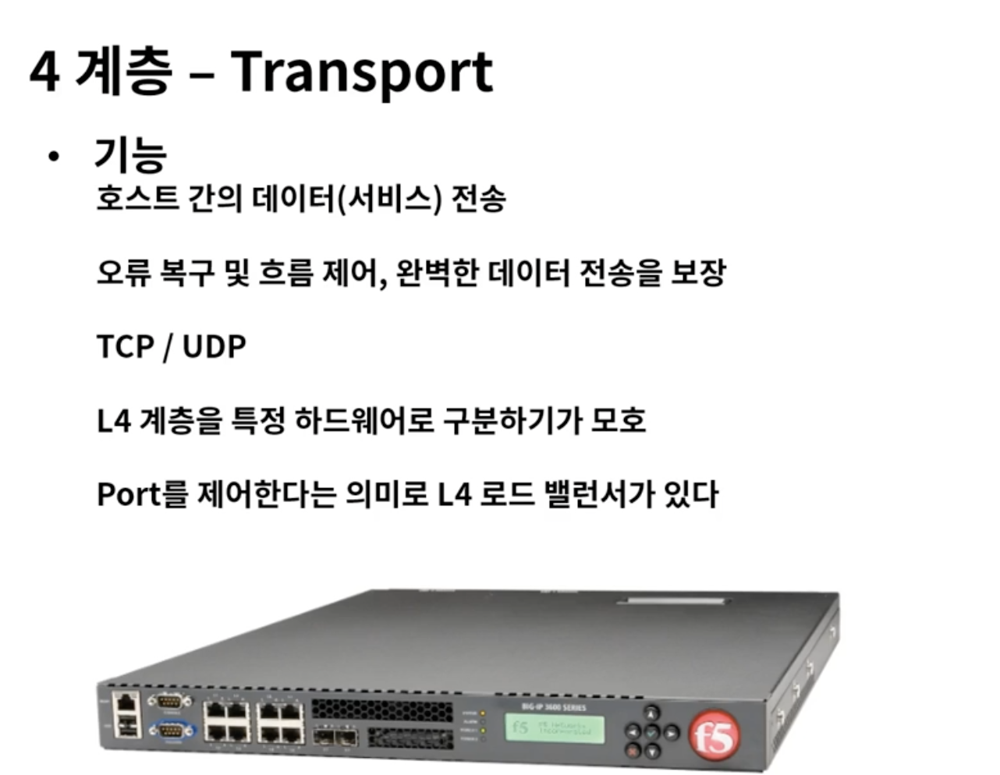
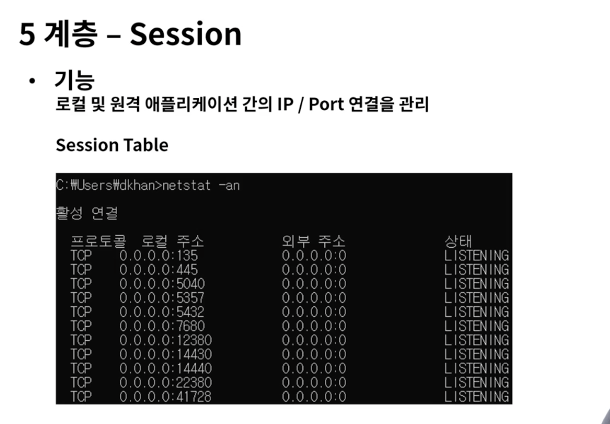
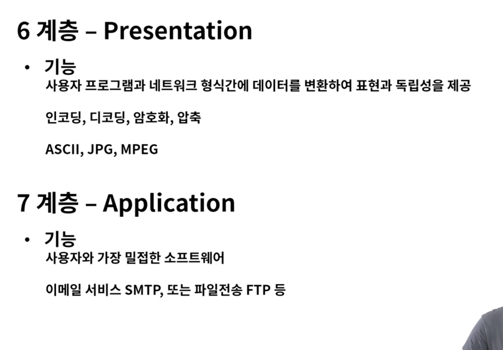
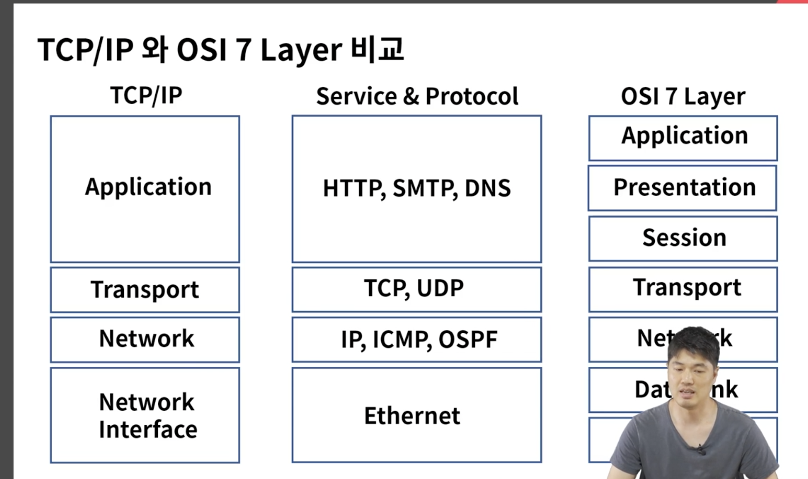
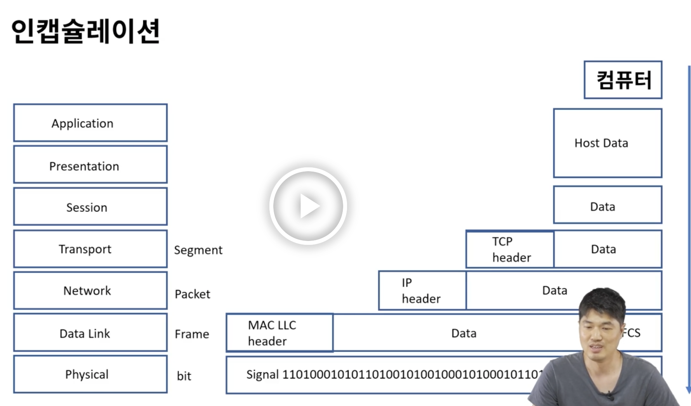
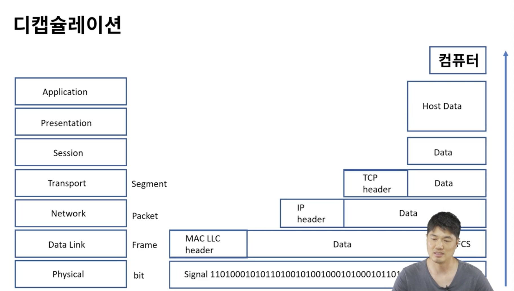

# 네트워크 소개

### 네트워크란
- 분산되어 있는 컴퓨터들이 자원을 공유할 수 있게 통신망으로 연결한다
- 분산된 컴퓨터들이 자원을 공유할 수 있게 연결한 것

### 네트워크 형태
LAN 근거리 통신망
WAN LAN망을 연결, ISP로 연결

VPN(Virtual Private Network) 가상 사설망, 공중망을 사설망처럼 사용, 암호화

### 네트워크 구조(Topology)

스타, 링, 메쉬, 버스, 트리

### 홈 네트워크
인터넷 - ISP - 모뎀 - 공유기 - 컴퓨터
(모뎀에는 하나밖에 연결 못함)

### 기업용 네트워크
ISP - 전용선 - 라우터 - 방화벽 
                        - L3백본 - L2스위치 - 서버, 컴퓨터 
                        -  L4 로드밸런서 - DMZ

### 클라우드 네트워크 
인터넷 - Route53 - IGW - VPC - ELB - AutoScaling - SecurityGroup - EC2

### OSI 7 Layer
-> 네트워크 프로토콜과 통신을 7계층으로 표현
-> 프로토콜을 기능별로 나누고 계층 별로 구분
-> 벤더간 호환성을 위한 표준 필요 -> 쉬운 접근성으로 기술의 발전

### OSI 7 Layer 모델
Application 응용 서비스 HTTP(웹), SMTP(메일)
Presentation 인코딩 / 암호화 / 압축
Session   TCP/IP 통신 연결을 수립/ 유지 / 중단
Transport Tcp, UDP, l4로드밸런서
Network Ip통신, 라우팅, l3스위치/라우터
DataLink 이더넷, 랜카드, Mac 통신, 에러검출/재전송, 모뎀/스위치
Physical 네트워크 하드웨어 전송 기술

Mac 주소는 기기끼리 고유한 번호

### TCP / IP 모델과 캡슐화
-> 네트워크 프로토콜의 모음으로 패킷 통신 방식의 IP와 전송 조절 프로토콜인 TCP로 이루어져 있다

Application 응용 프로그램간 표준화 된 데이터 교환
Transport TCP / UDP
Network 패킷을 처리하고 다른 네트워크로 연결
Network Interface 물리 계층으로 네트워크 노드들을 상호 연결

### TCP/IP와 OSI 7 Layer 비교

### 인캡슐레이션

### 디캡슐레이션

