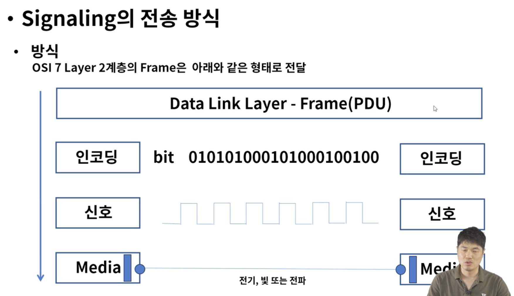
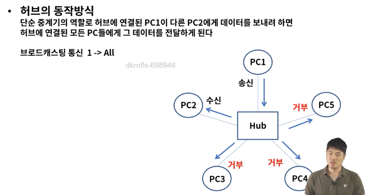
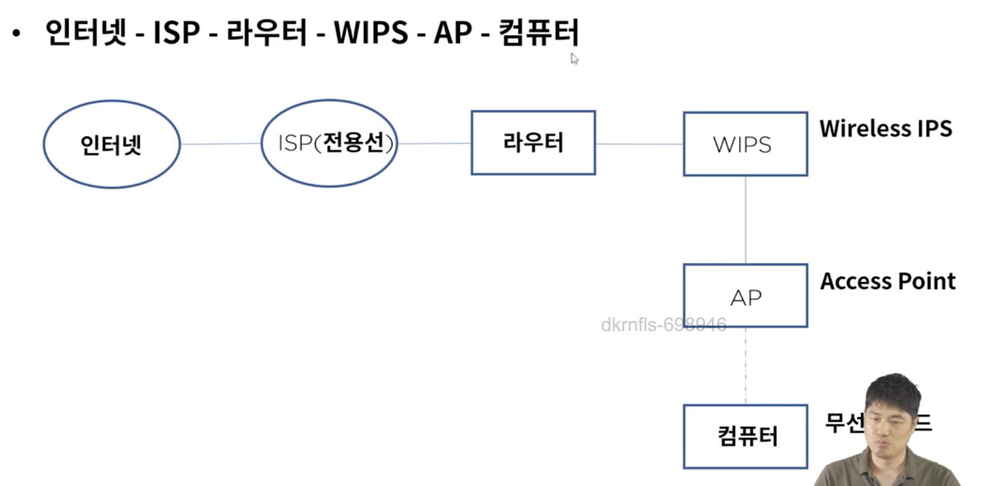

# 물리계층

### 물리계층이란?
네트워크 장치의 전기적, 기계적 속성 및 전송하는 수단을 정의
상위 계층인 데이터 링크 계층의 프레임을 신호로 인코딩하여 네트워크 장치로 전송
통신 장치와 커넥터, 인코딩(bit -> signal), 송수신을 담당하는 회로등의 요소가 있다

### Signaling의 종류
* 전기(유선 케이블)
* 광(빛) 광섬유
* 전파(무선)

* 허브 => 전기신호 증폭시켜서 포트에 연결된 PC들끼리 통신이 가능하게 한다.
허브는 모든 Pc에 보내버림 (브로드캐스트 방식)

### UTP 케이블이란?
* Unshielded Twisted Pair, 주로 근거리 통신망에서 사용되는 케이블, 이더넷 망 구성시 가장 많이 보게되는 케이블

### 코드 배열
* 8P8C -> 8개의 선 배열에 따라 다이렉트 또는 크로스 케이블로 구성

### Wifi 란?
전자기기들이 무선랜에 연결할 수 있게 하는 기술

### 무선랜 구성
* 인터넷 - ISP - 라우터 - WIPS - AP - 컴퓨터

고려사항 -> AP의 반경과 동시접속 단말기의 개수

### WireShark
오픈소스 패킷 분석 프로그램
인터페이스를 선택하고 패킷을 실시간 확인 및 저장 후 분석이 가능하다
pcap 파일을 통해서 Frame - L2 - L3 - L4 정보를 확인 가능하다

- 패킷 스위칭
- OSI 7 layer
- 쿠키 / 웹 캐시(프록시 서버)
- 보안- 스니핑, 스푸핑, Dos(denial of service)
- web과 http
- dns
    - DNS record
    - type=a
    - type=ns
    - type=mx
    - type=cname
- streaming and content distribution network(CDN) ⇒ 요즘 대세
- TCP / UDP
    - TCP의 데이터 전송 보장 원리(reliable)
    - TCP의 혼잡 제어 원리(congestion control)
    - TCP의 흐름제어(flow control)
    - 연결설정 (3, 4 hand shaking)
    - GO BACK N 알고리즘
    - SELECTIVE repeat 알고리즘
    - seq, number, ack을 이용한 통신 timeline에 따른 과정

- IP
  - forwarding, routing
    - 라우팅 프로토콜
    - distance vector
    - link state 알고리즘
    - 다익스트라 알고리즘
    - 밸만포트 알고리즘
    - BCP, OSPF, 포워딩 테이블
  - 패킷 스케쥴러
  - ipv4, NAT, ipv6
  - ip 패킷 구성
  - fragmentation, reassembly
  - subnet
  - DHCP
  - 터널링, vpc

  - 브라우저에 url을 쳤을 때 원하는 페이지가 나오기까지의 과정
  - CDN
  - LB(로드 밸런서)
  - PROXY