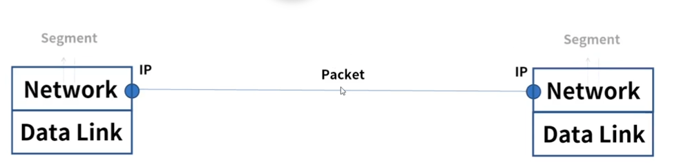
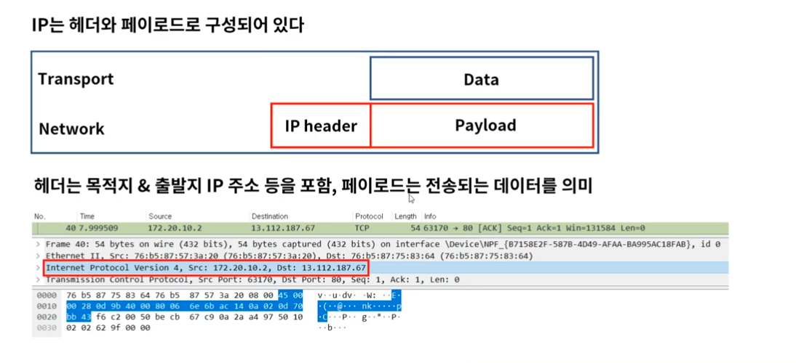
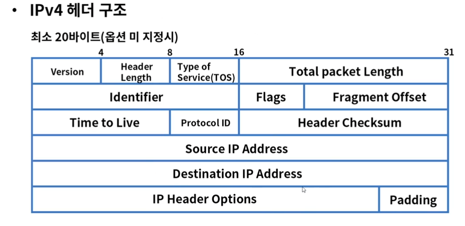
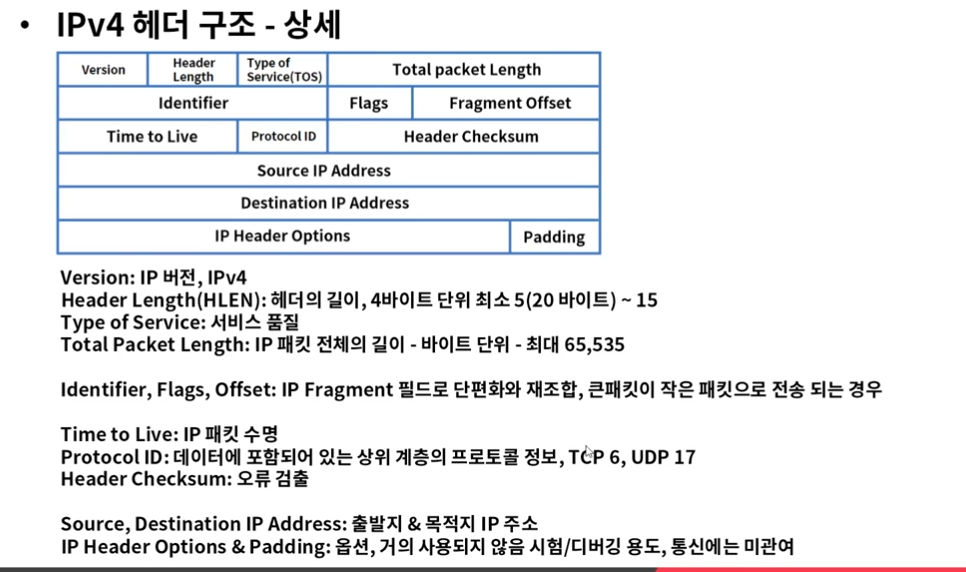
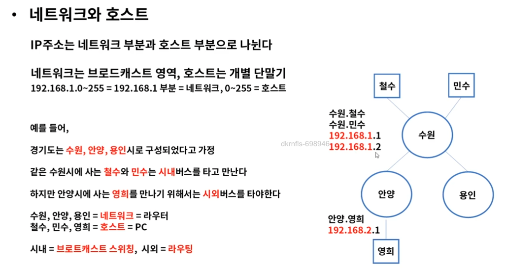
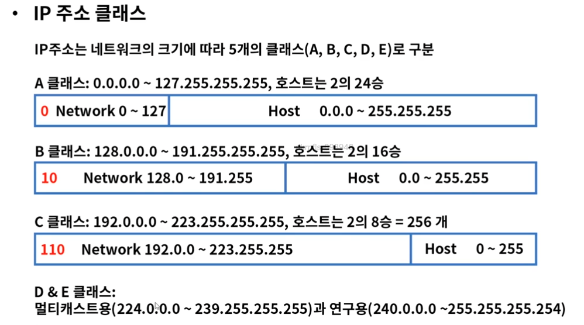

# IP주소와 라우팅

### 역할
* OSI 7 Layer의 3계층
* 패킷 포워딩, 네트워크간 라우터를 통한 라우팅 수행
* IP(Internet Protocol)주소를 사용하여 통신, 계층적 구조
* 대표 장비 => 라우터

### IP 구조 
* 헤더 + 페이로드

=> 한줄씩 4바이트, 위의 5줄 이미 꽉차져 있으므로 최소 20바이트

  

