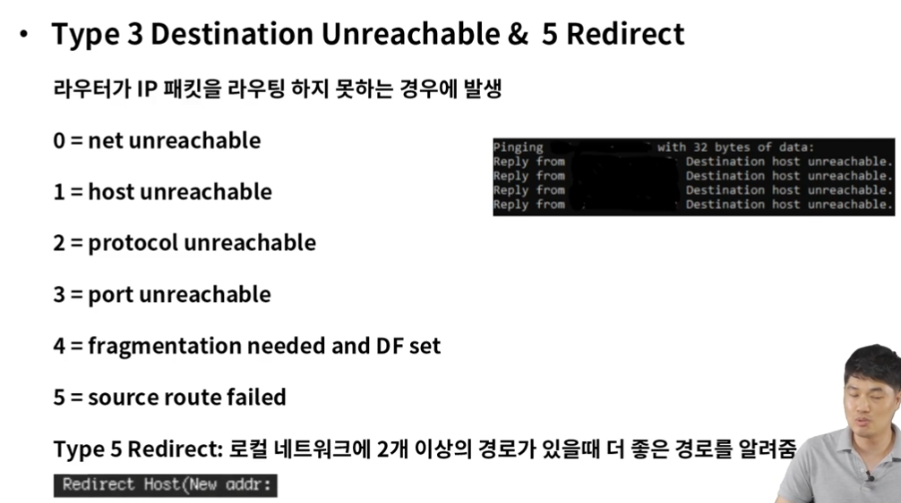

# IP주소와 라우팅

### 역할
* OSI 7 Layer의 3계층
* 패킷 포워딩, 네트워크간 라우터를 통한 라우팅 수행
* IP(Internet Protocol)주소를 사용하여 통신, 계층적 구조
* 대표 장비 => 라우터

### IP 구조 
* 헤더 + 페이로드

=> 한줄씩 4바이트, 위의 5줄 이미 꽉차져 있으므로 최소 20바이트

  

### 라우터의 이해
* 목적지 IP주소를 확인하고 하나 또는 그 이상의 네트워크 간의 패킷의 경로를 선택하여 전송
Router: 네트워크 간의 패킷을 전송해주는 장비
Routing: 네트워크 간의 패킷을 전달하는 경로를 선택하는 과정
Routed: 라우터가 라우팅을 해주는 대상, IP

### 서브넷 마스크
* 서브넷: 부분망, IP주소는 네트워크와 호스트로 구분
할당된 네트워크 영역을 효율적으로 사용하기 위해 서브넷으로 쪼개서 구성
네트워크를 작은 네트워크 서브넷으로 구분 하는 것 -> 서브넷 마스크

비트의 수는 네트워크 영역에서 1의 개수를 의미!!

* 계산법

### 라우터 동작 방식
* Static 라우팅
=> 가장 기본적인 라우팅 방식, 수동으로 경로를 라우터에 설정하여 패킷을 처리
경로는 **라우팅 테이블**에 목적지 IP주소 & 인터페이스 정보를 설정

Hop: 소스와 목적지 간의 경로, 라우터 거질때마다 hop 증가(최대 hop count같은걸로 제한 걸기도 함)
TTL(Time to Live): 패킷이 폐기되기전 hop 카운트
각 라우터는 패킷이 인입되면 TTL을 1씩 감소, TTL=0이 되면 폐기, 부정확한 패킷의 루프 방지

### ICMP의 정의 (Internet Control Message Protocol)
* 인터넷 제어 메시지 프로토콜
IP 통신은 목적지에 패킷을 정상적으로 전달하는 방법은 있지만 에러 발생시 처리 불가
ICMP는 IP 통신의 에러 상황을 출발지에 전달 & 메시지 제어 역할

### DHCP의 정의 (Dynamic Host Control Protocol)
* 동적 호스트 구성 프로토콜
* DHCP 서버를 사용하여 클라이언트인 네트워크 장치에 IP 주소를 자동으로 할당

- 요청에 의한 IP 할당으로 효율성 극대화
- 잘못된 IP 설정으로 인한 장애 예방
- IP 변경이 잦은 호스트의 관리

### DHCP의 동작과정
* IP 할당
기본 네트워크 구성, Gateway - Switch - DHCP Server - PC

1. DHCPDISCOVER : PC는 DHCP Server를 발견
2. DHCPOFFER : DHCP Server는 PC에게 IP 제안
3. DHCPREQUEST : PC는 제안 받은 IP 할당을 요청
4. DHCPACK : DHCP Server는 요청 수락

