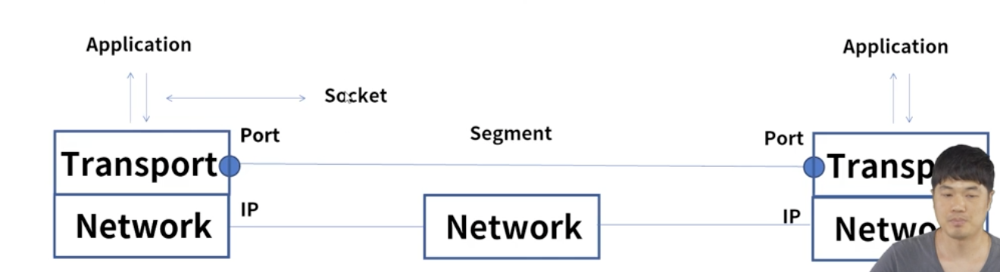
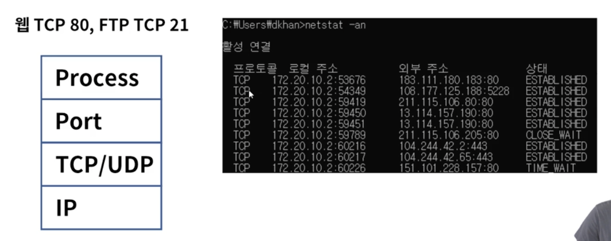
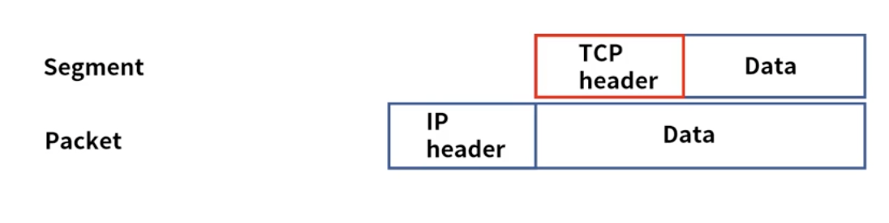
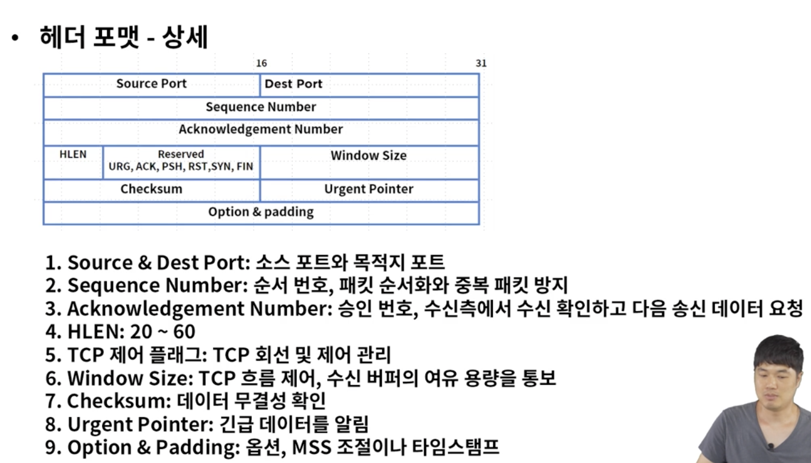
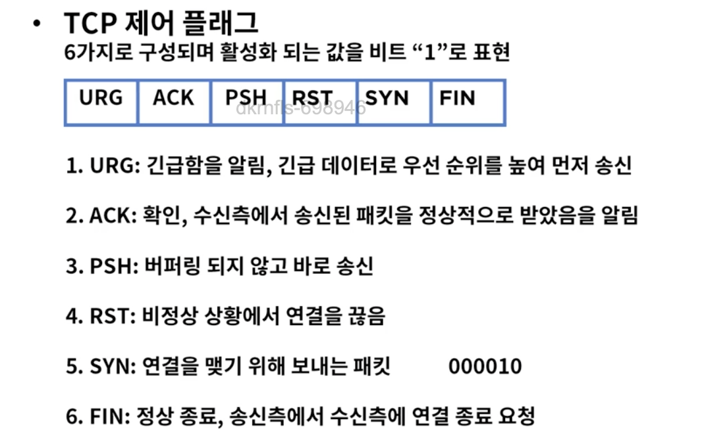
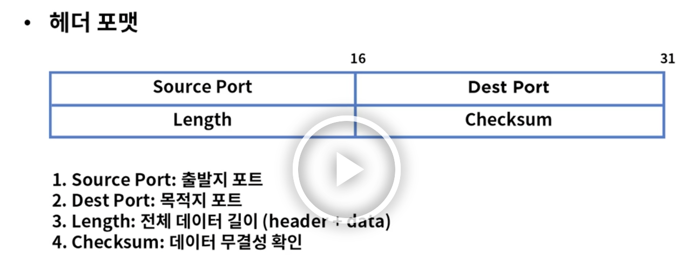

# TCP && UDP

### Transport 계층
* End to End 서비스, 커넥션(연결)을 관리
* TCP & UDP, 소켓을 통한 프로세스별 통신



* Port 
=> 전송 계층에서 사용, 특정 프로세스를 구분하는 단위
0 ~ 65535
0 ~ 1023 : well-known port(보통 사용 안함)
1024 ~ 49151:registered port 

웹 TCP 80, FTP TCP 21


### TCP(Transmission Control Protocol)
* 정의 
=> 인터넷을 구성하는 핵심 프로토콜
신뢰성 기반, 데이터를 에러없이 전송, 1:1 통신
연결지향, connection-oriented, 패킷의 상태 정보를 확인하고 유지
에러 발생시 재전송 요청, 에러 복구 


```
4계층 세그먼트 => TCP header + data
3계층 패킷 => Ip header + data
2계층 데이터 프레임 => header + data + trailer
```
* 헤더 포맷

HLEN => 최소 20바이트에서 최대 60바이트 의미

* TCP 제어 플래그
=> 6가지로 구성 활성화 되는 비트 '1'로 표현


### UDP(User Datagram Protocol)
* 신뢰성이 낮음, 데이터 전송이 빠름
* 송신측은 데이터를 보내고 확인 안함, 1:n 통신
* connectionless, 재전송 불가, 실시간 데이터 전송(동영상, 스트리밍 등등)
* 스트리밍 서비스의 경우 재전송 보다는 실시간 데이터 전송이 중요

```
segment   UDP header + data
packet    IP header + data
```

* 헤더 포맷


