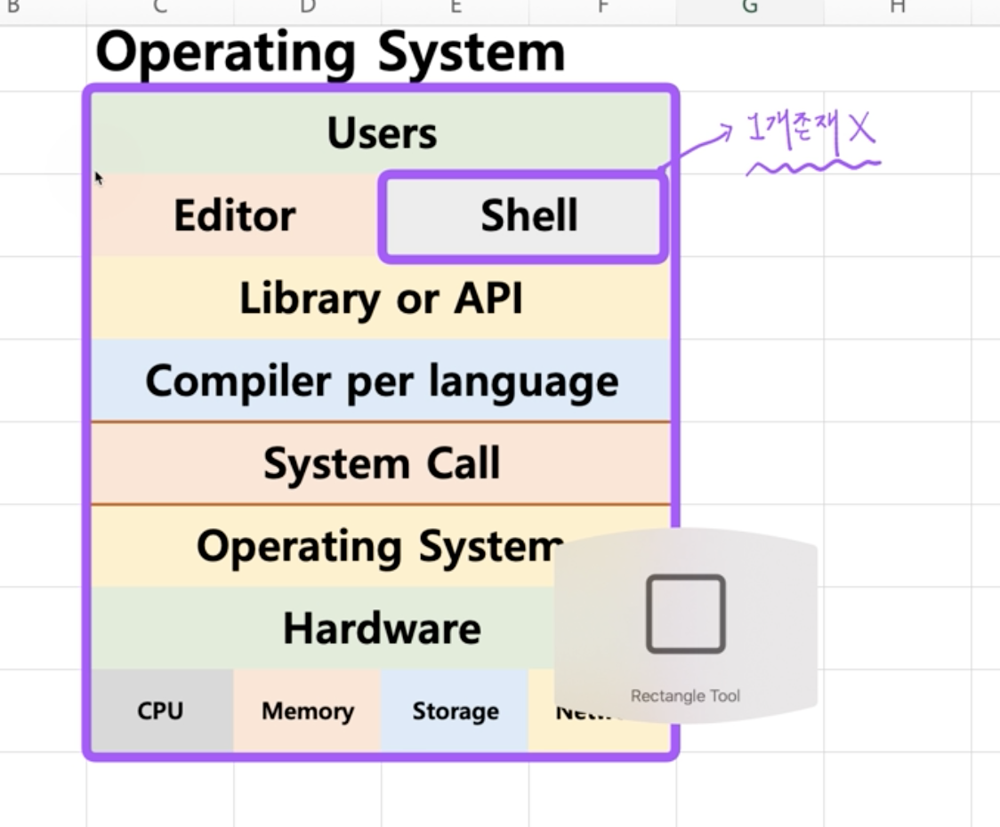
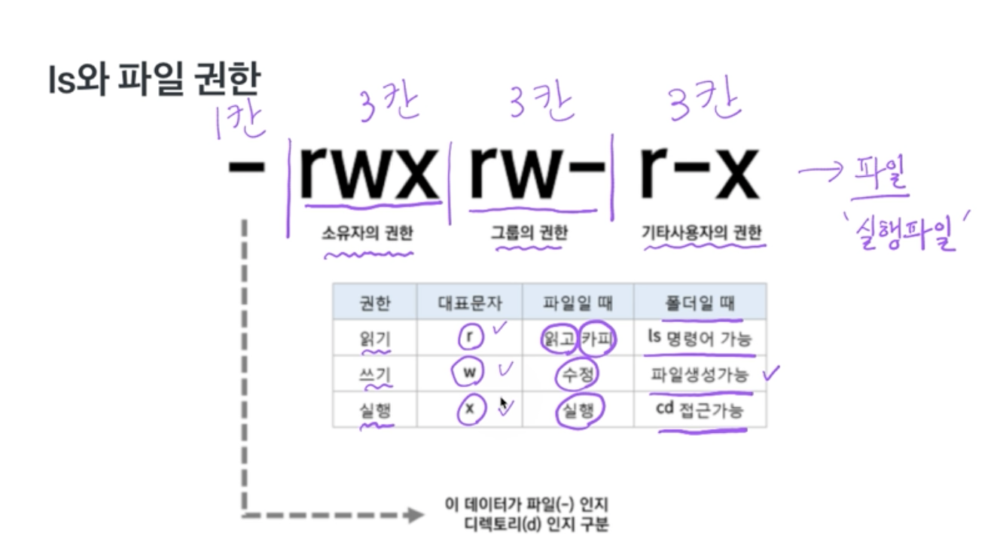
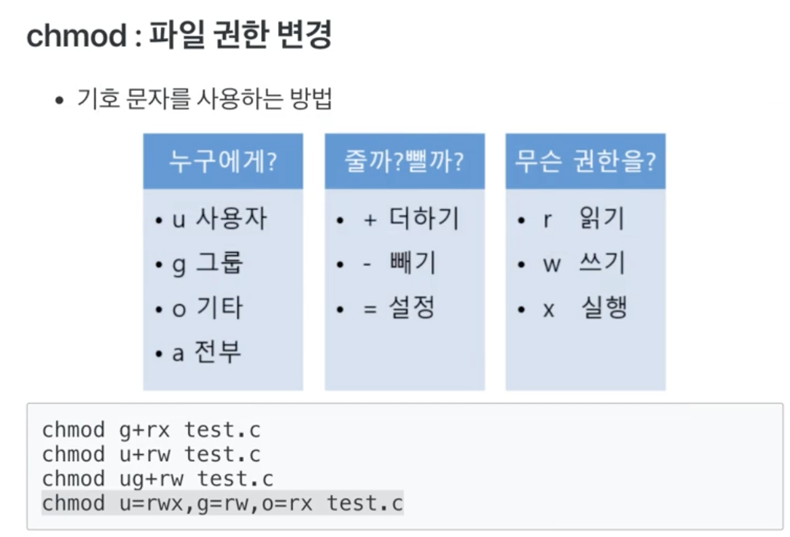
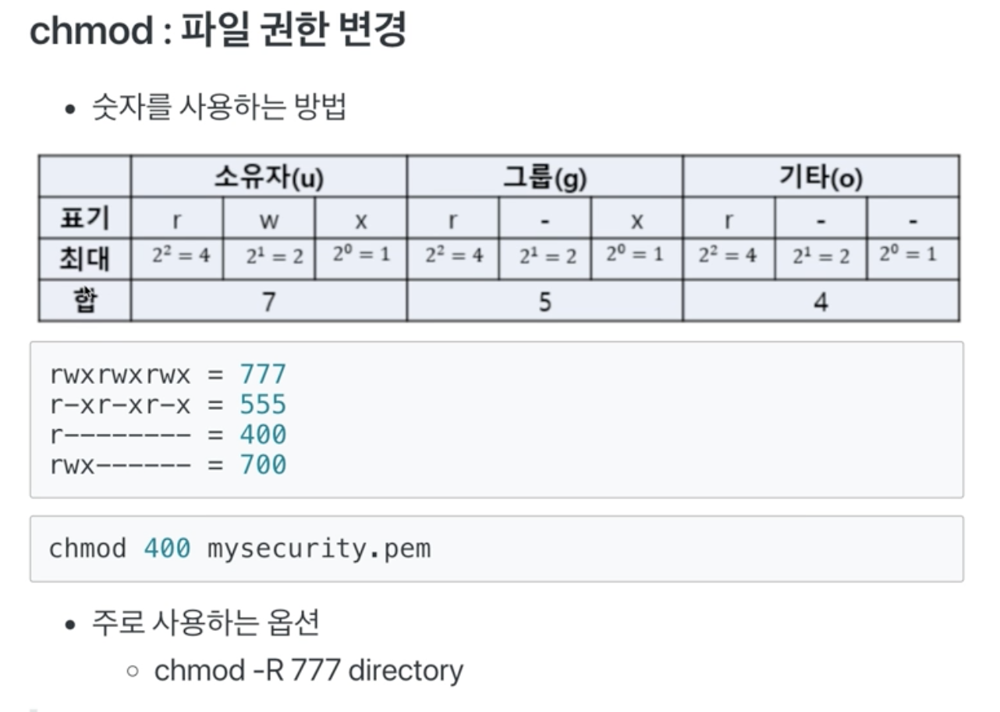
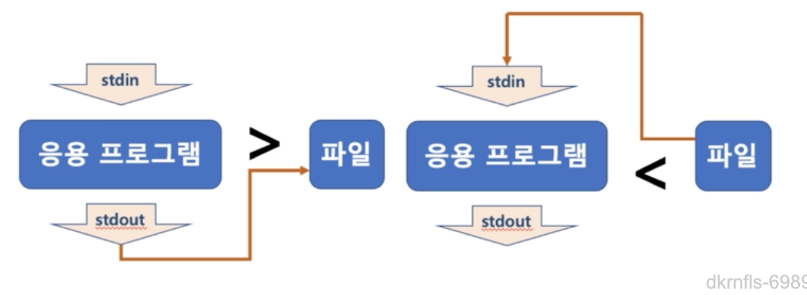
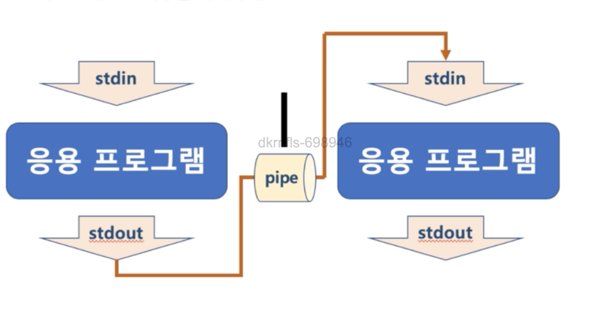
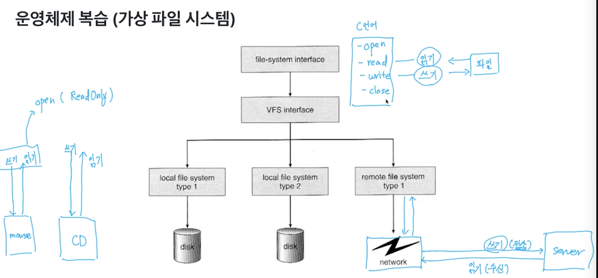
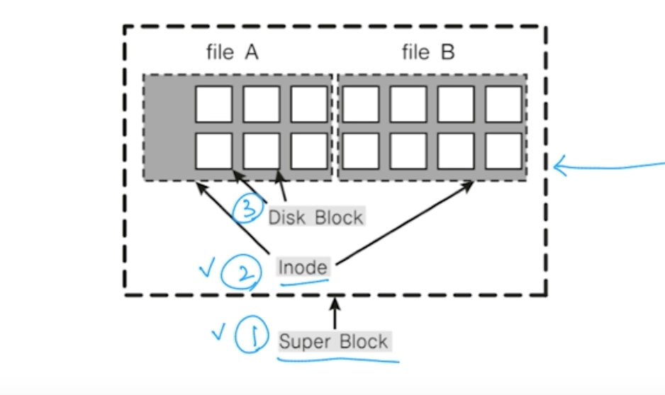
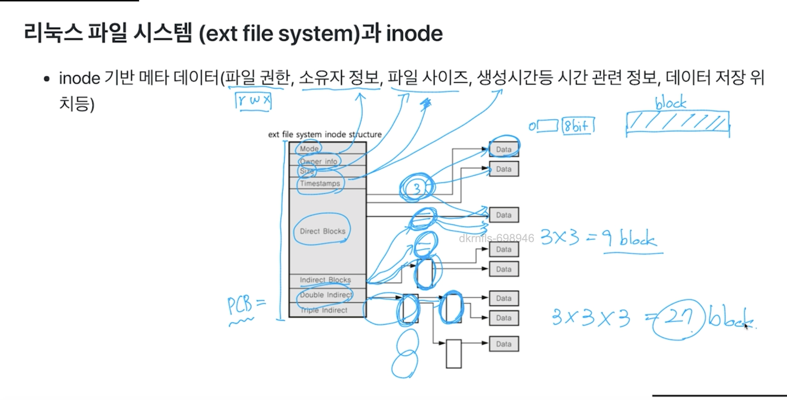
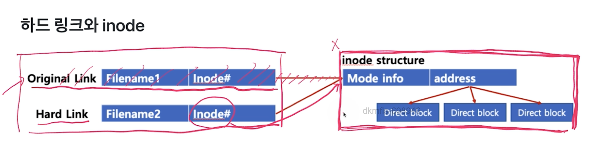

# 시스템 프로그래밍 

* 리눅스
  * 서버에 많이 사용되는 운영체제


* GNU 프로젝트
  * GNU = GNU is Not Unix
  * 유닉스 운영체제를 여러 회사에서 각자 개발, 소스를 공유하지 않는 문화
  * 상호 협력적인 문화로 돌아갈것을 주장하며 GNU 선언문을 발표
  * GNU 프로젝트를 지원하기 위해 자유 소프트웨어 재단 설립과, GNU 공개 라이선스(GPL)라는 규약을 제공


사용자가 운영체제의 기능에 접근할 수 있는 방법은 두개
응용 프로그램에서 시스템 콜을 통해 운영체제의 기능을 사용하거나
사용자가 쉘에서 운영체제의 기능을 사용하거나

vi,  vim(vi improved)


유닉스/리눅스 기본 구성 알아두기

리눅스와 파일
* 모든 것은 파일이라는 철학을 따름
  * 모든 인터렉션은 파일을 읽고, 쓰는 것처럼 이루어져 있음
  * 마우스, 키보드와 같은 모든 디바이스 관련된 기술도 파일과 같이 다루어 진다. (키보드도 파일, 마우스도 파일)

* 파일 네임스페이스
  * 전역 네임스페이스를 제공
    * A 드라이브: A:/ (x)
    * C 드라이브 C:/windows (x)
  * /media/floofy/dave.jpg

* 파일은 inode 고유값과 자료구조에 의해 주요 정보 관리

리눅스와 프로세스
* 리눅스 실행 파일 포맷 - ELF(Executable and Linkable Format)
  * 콜스택, 코드(텍스트), 데이터 및 BSS 섹션
  * 일종의 포맷인데 스택의 주소를 내림차순 or 오름차순으로 할거냐 힙을 오름차순, 내림차순으로 조질거냐 같은 포맷

* 다양한 시스템 리소스와 관련
  * 시스템콜 호출을 통해 리소스 처리 가능토록 구성
    * 타이머, 시그널, 파일, 네트워크, 디바이스, IPC 기법

* 가상메모리 지원
  * 각 프로세스는 pid(프로세스 ID) 고유값으로 구분
  * init 프로세스(첫 번째 프로세스)를 기반으로 fork() 시스템 콜을 사용해서, 신규 프로세스가 생성

리눅스와 권한
* 운영체제는 사용자/리소스 권한을 관리
* 리눅스는 사용자/그룹으로 권한을 관리
* root는 슈퍼관리자(해커들이 하는 최대의 목표는 root관리자를 획득하는 것)
* 파일마다 소유자, 소유자 그룹, 모든 사용자에 대해 
  * 읽고 쓰고 실행하는 권한을 관리
  * 접근 권한 정보는 inode의 자료구조에 저장

정리
* 리눅스는 모든 리소스를 파일로 관리(inode)
* 리눅스의 프로세스
  * ELF 포멧
  * 시스템콜 기반 리소스 처리 가능토록 구성
    * 타이머, 시그널, 파일, 네트워크 등등
  * 가상 메모리 사용
  * pid 기반 구분
  * init 프로세스 기반 fork() 사용해서, 프로세스가 생성, 프로세스의 부모, 자식 관계
* 리눅스 사용자 (로그인 사용자/그룹) 권한 관리
* 리눅스 리소스 (소유자, 소유자 그룹, 모든 사용자에 대한 읽고, 쓰고, 실행하는 권한 설정) 권한 관리


다중 지원자 종류 관리
쉘: 사용자와 컴퓨터 하드웨어 또는 운영체제간 인터페이스
* 사용자의 명령을 해석해서, 커널에 명령을 요청해주는 역할




쉘 종류 
* bourne-Again Shell(bash): 리눅스 거의 디폴트
* Bourne shell (sh)
* C shell (csh)
등등

리눅스 기본 명령어 정리

쉘 사용법 정리 

ls와 파일 권한
* 파일마다 소유자, 소유자 그룹, 모든 사용자에 대해
  * 읽고, 쓰고, 실행하는 권한 설정
  * 소유자 접근 권한 정보는 inode에 저장

```
# ls debi* -al
-rwxr-xr-x 1 root root 120 Jul 19 19:28 debian-start
```







head, tail, more, rm

정리 
* 쉘 Bourne-Again Shell - (bash): GNU 프로젝트의 일환으로 개발됨, 리눅스 거의 디폴트임
* user관련 명령: whoami, useradd, adduser, passwd, su - 명령, sudo
* Directory/file 관련 명령: pwd, cd, ls, cat, head/tail, more, rm
* Directory/file 권한 관련 명령: chmod, chown, chgrp
* 관리자 권한으로 실행하기: sudo
* 다양한 옵션은 man 명령으로 메뉴얼 확인이 가능함

### 리눅스 리다이렉션(redirection)과 파이프(pipe)

Standard Stream(표준 입출력)
* command로 실행되는 프로세스는 세 가지 스트림을 가지고 있음
  * 표준 입력 스트림(Standard Input Stream) - stdin
  * 표준 출력 스트림(Standard Output Stream) - stdout
  * 오류 출력 스트림(Standard Error Stream) - stderr
* 모든 스트림은 일반적인 plain text로 console에 출력하도록 되어 있음

#### 리다이렉션(redirection)
* 표준 스트림 흐름을 바꿔줄 수 있다
  * '>' , '<' 을 사용함
  * 주로 명령어 표준 출력을 화면이 아닌 파일에 쓸 때
  

* 예
  * ls > files.txt
    * ls로 출력되는 표준 출력 스트림의 방향을 files.txt로 바꿔줌
  * head < files.txt
    * files.txt의 파일 내용이 head라는 파일의 처음부터 10라인까지 출력해주는 명령으로 넣어짐
  * head < files.txt > files2.txt
    * head의 출력 스트림이 files2.txt로 들어감
  * 기존 파일에 추가는 >> 또는 <<  사용
    * ls >> files.txt
    * files.txt 파일 끝에 ls 내용이 추가됨

#### 파이프(pipe)
* 두 프로세스 사이에서 한 프로세스의 출력 스트림을 또다른 프로세스의 입력 스트림으로 사용할 때 사용됨


* 예
  * ls | grep files.txt
    * ls 명령을 통한 출력 내용이 grep 명령의 입력 스트림으로 들어감
    * grep files.txt는 grep 명령의 입력 스트림을 검색해서 files.txt가 포함된 내용만 출력해줌


프로세스 vs 바이너리
* 코드 이미지 또는 바이너리: 실행파일
* 실행 중인 프로그램 : 프로세스
  * 가상 메모리 및 물리 메모리 정보
  * 시스템 리소스 관련 정보
  * 스케줄링 단위
  (폰 노이만 구조) -> 모든 코드가 메모리에 올라간 상태에서 메모리에서 코드를 한줄 한줄 읽어가면서 cpu에서 실행되는 구조

리눅스는 다양한 프로세스 실행 환경
* 리눅스는 기본적으로 다양한 프로세스가 실행됨

### foreground process / background process
* foreground process
  * 쉘에서 프로세스 실행 명령 하면 프로세스 수행 종료까지 다른 입력 하지 못하는 프로세스
* background process
  * 사용자 입력과 상관없이 실행되는 프로세스
  * 쉘에서 해당 프로세스 실행 시, 맨 뒤에 &를 붙여줌
```
# find / -name '*.py' > list.txt &
[1] 57
```
* [1]은 작업번호, 57은 pid를 나타냄

jobs를 치면 백라운드로 진행 또는 중지된 상태로 있는 프로세스를 보여줌

* [CTRL] + c: 프로세스 작업 취소 (해당 프로세스는 완전히 종료가 됨)
> 운영체제 소프트웨어 인터럽트가 해당 프로세스에 보내짐 - 그래서 프로세스 제어가 가능함

#### 프로세스 상태 확인 - ps 명령어
* 사용법 : ps[option(s)]
* ps -> 
  * -a: 시스템을 사용하는 모든 사용자의 프로세스 출력
  * -u: 프로세스 소유자에 대한 상세정보 같이 출력
  * -x: 데몬프로세스 까지 확인하기 위해 사용
  * -e : 해당프로세스와 관련된 환경 변수 정보도 함께 출력
  * -f: 프로세스간 관계 정보도 출력
* 데몬 프로세스 : 사용자 모르게 시스템 관리를 위해 실행되는 프로세스로 보통 시스템이 부팅될때 자동 실행

### 리눅스 파일 시스템
  가상 파일 시스템 
    * 파일, 디바이스 등 모두를 파일 시스템으로 관리
    * 인터페이스 4가지 (open, read, write, close)로 모든 파일을 관리, 해당 파일시스템에서 인터페이스의 구현만 다르게 해주면 전부 관리 가능
    * 

### 리눅스와 파일 정리
* 모든 것은 파일이라는 철학을 따름
  * 모든 인터렉션은 파일을 읽고, 쓰는 것처럼 이루어져 있음
  * 마우스, 키보드와 같은 모든 디바이스 관련된 기술도 파일과 같이 다루어짐
  * **모든 자원에 대한 추상화 인터페이스로 파일 인터페이스르 활용**

### 슈퍼블록, Inode와 파일
  * 슈퍼블록: 파일 시스템의 정보
  * 파일: inode 고유값과 자료구조에 의해 주요 정보 관리
    * '파일이름:inode'로 파일이름은 inode번호와 매칭
    * 파일 시스템에서는 Inode를 기반으로 파일 엑세스
    * inode 기반 메타 데이터 저장
    * 
    * 
    * 이미지에서는 ext파일 알고리즘으로 구현되어있다

추상화(복잡한 기능/자료/데이터 -> 핵심적 개념/기능을 간추해 내는 것)로 인해 파일시스템이 구현될수 있었다.

### 파일과 inode
* 리눅스 파일 탐색: 예 - /home/ubuntu/link.txt
  * 각 디렉토리 엔트리(dentry)를 탐색
    * 각 엔트리는 해당 디렉토리 파일/디렉토리 정보를 가지고 있음
    * '/' dentry에서 'home'을 찾고', 'home'에서 ubuntu를 찾고 ubuntu에서 link.txt 파일이름에 해당하는 inode를 얻음

### 하드 링크와 소프트 링크
* cp 명령: 파일 복사
* cp -rf -> 디렉토리 통째로 복사 
* 하드 링크 : ln A B -> 참조 복사 개념인듯
  * A와 B는 동일한 10MB 파일을 가리킴
  * 즉, 동일한 파일을 가진 이름을 하나 더 만든 것
    * 따라서 inode는 동일
    * 전체 파일 용량은 변화 x
    * ls - i -> inode값 확인 가능
  * 하드링크를 걸면 별도 공간 차지하는 것 없이 파일에 접근가능해서 사용하곤 한다
  
  
* 소프트 링크 : ln -s A B
  * window os의 바로가기와 동일

### 특수파일
  * 디바이스
    * 블록 디바이스
      * HDD, CD/DVD와 같이 블록 또는 섹터 등 정해진 단위로 데이터 전송, IO 송수신 속도가 높음
    * 캐릭터 디바이스
      * 키보드, 마우스등 byte 단위 데이터 전송, IO 송수신 속도가 낮음
    * cd /dev, cat tty

### 정리
  * 파일 추상화 인터페이스를 활용 다양한 데이터/디바이스 접근
  * 파일 네임스페이스는 전역 네임스페이스 활용
  * 파일이름:inode 로 매칭, 파일 시스템은 inode 기반 접근
  * 하드링크: 동일 inode 가리키는 파일 이름만 하나 더 만듬
  * 소프트 링크: 특정 파일 바로가기 파일을 만듬
  * ln 명령 알아두기
  * 특수 파일: 블록/캐릭터 디바이스

