ㅈ# 프로세스 관리

### 프로세스 ID

* 프로세스 ID
  * pid 최대값은 32768
  * 부호형 16비트 정수값 사용 2^15 = 32768

### 프로세스 계층
* 최초 프로세스: init 프로세스, pid 1
* init 프로세스는 운영체제가 생성
* 다른 프로세스는 또다른 프로세스로부터 생성
  * 부모, 자식 프로세스
* ppid 값이 부모 프로세스의 pid를 뜻함
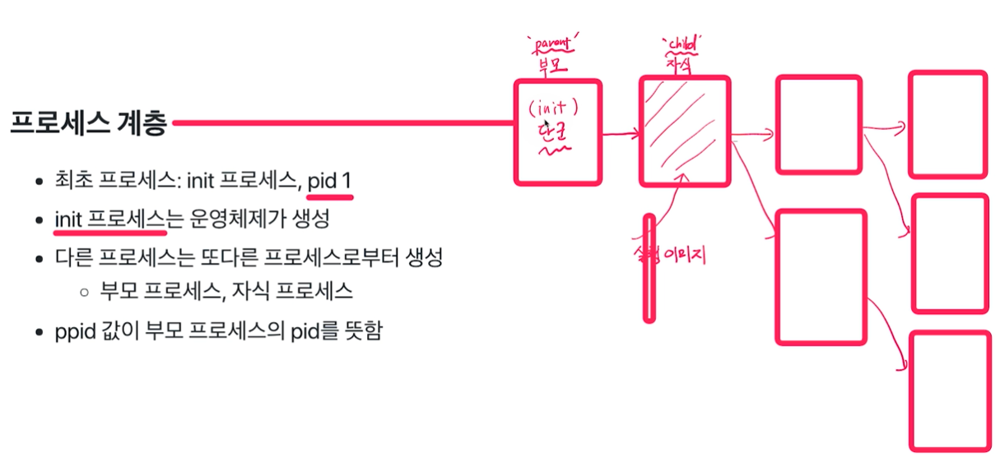

프로세스 : pid
유저: Uid
그룹 : gid

### 시스템 콜
getpid() 
getppid()

### 프로세스 생성
* 기본 프로세스 생성 과정
  * text, data, bss, heap, stack의 공간을 생성
  * 프로세스 이미지를 해당 공간에 업로드 하고, 실행 시작
* 프로세스 계층: 다른 프로세스는 또 다른 프로세스로부터 생성
  * 부모 프로세스, 자식 프로세스

### fork(), exec() 시스템 콜
* fork()
  * 새로운 프로세스 공간을 별도로 만듬
  * fork() 시스템 콜을 호출한 프로세스(부모프로세스) 공간을 모두 복사
    * 별도의 프로세스 공간을 만들고 부모 프로세스 공간의 데이터를 그대로 **복사**
* exec()
  * 현재 프로세스 공간의 text, data, bss 영역을 새로운 프로세스의 이미지로 **덮어 씌움**
    * 별도의 프로세스 공간을 만들지 않음

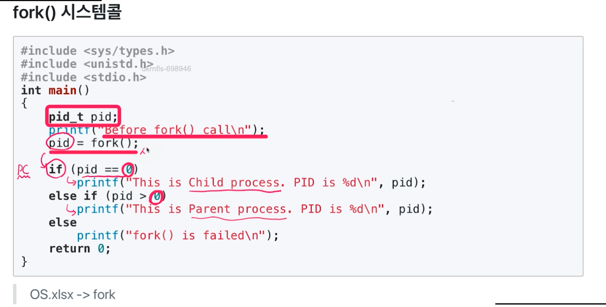

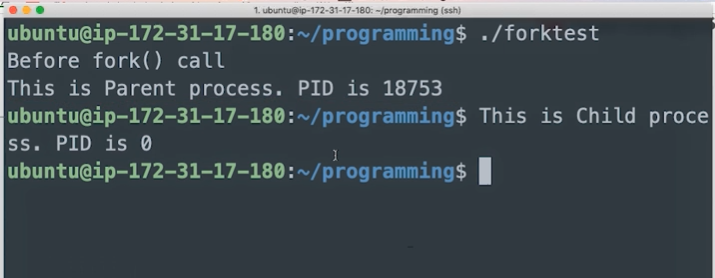
* pid = fork()를 실행한 순간부터 프로세스가 두개가 되기 때문에 결과가 두번 노출 (하나는 부모, 하나는 자식 프로세스)
* pid = fork()가 실행이 되면 동일한 자식 프로세스가 별도의 메모리 공간에 생성
* 자식 프로세스는 pid가 0으로 리턴, 부모 프로세스는 실제 pid 리턴
* 두 프로세스의 변수 및 PC(Program Counter)값은 동일
* 새로운 프로세스 공간을 별도로 만들고, fork() 시스템 콜을 호출한 프로세스(부모 프로세스) 공간을 모두 복사한 후, fork() 시스템콜 이후 코드부터 수행

### 프로세스 생성
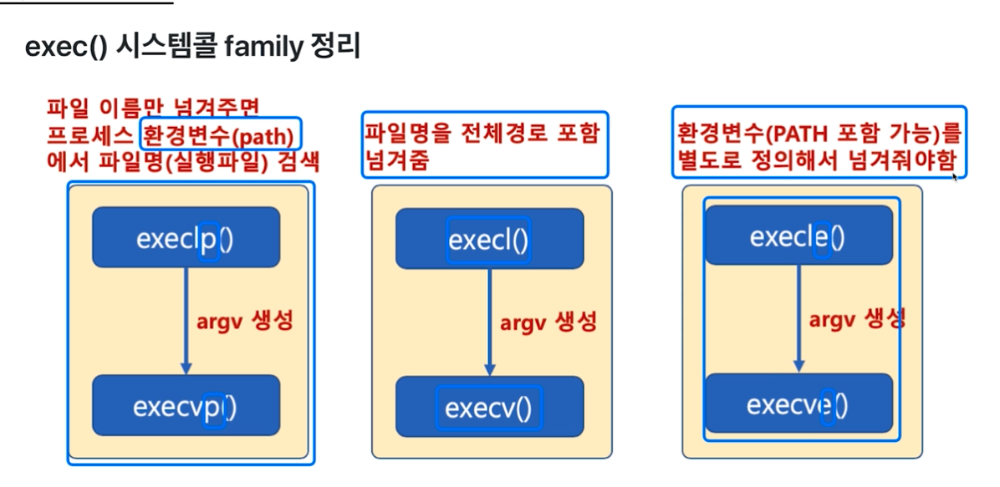

### fork()와 exec()
* 리눅스 프로세스 실행
  * 부모 프로세스로부터 새로운 프로세스 공간을 만들고 부모 프로세스 데이터 복사(fork)
  * 새로운 프로세스를 위한 바이너리를 새로운 프로세스 공간에 덮어씌움(exec)

### wait 시스템콜
  * wait 함수를 실행하면, fork 함수 호출시, 자식 프로세스가 종료할 때까지 부모 프로세스가 기다림
  * 자식 프로셋와 부모 프로세스의 동기화, 부모 프로세스가 자식 프로세스보다 먼저 죽는 경우를 막기 위해 사용(고아 프로세스)
  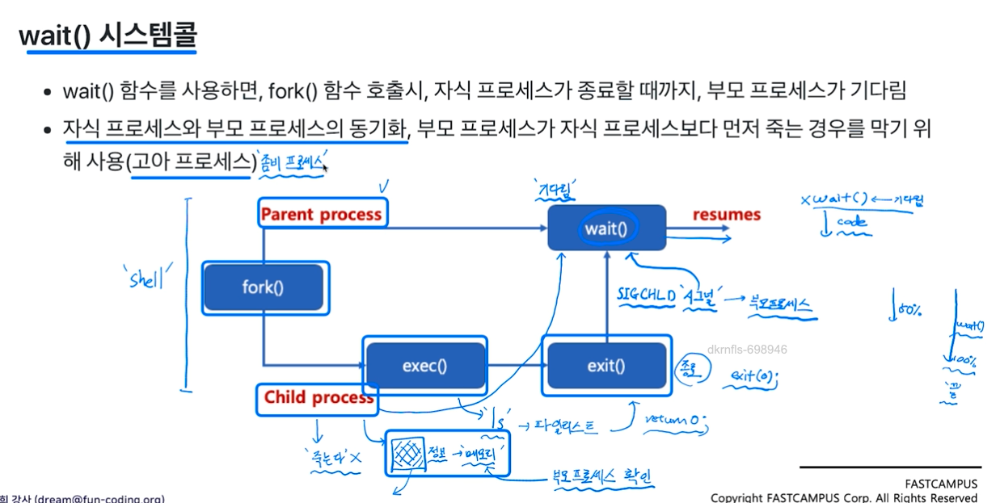

### fork, execl, wait 시스템콜
* execl만 사용하면, 부모 프로세스가 사라짐
* 이를 유지하기 위해, fork()로 새로운 프로세스 공간 복사 후, execl() 사용
* wait() 함수를 사용해서 부모 프로세스가 자식 프로세스가 끝날때까지 기다릴 수 있음
> 쉘 프로그램은 fork, exec()계열, wait 함수를 기반으로 작성 가능

* 프로세스당 4GB 가상 메모리 할당

### copy-on-write
* fork()는 새로운 프로세스 공간 생성 후, 기존 프로세스 공간 복사
> 4GB를 복사한다면, 프로세스 생성 시간이 오래 걸림

* 자식 프로세스 생성시, 부모 프로세스 페이지를 우선 사용
* 부모 또는 자식 프로세스가 해당 페이지를 읽기가 아닌 쓰기를 할때 페이지를 복사하고 분리
* 장점
  * 프로세스 생성 시간을 줄일 수 있음
  * 새로 생성된 프로세스에 새롭게 할당되어야 하는 페이지 수도 최소화
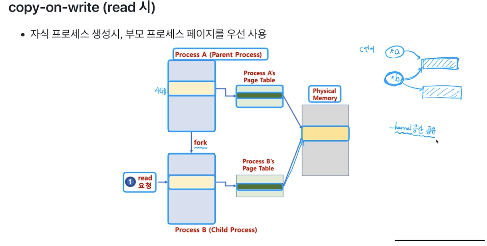

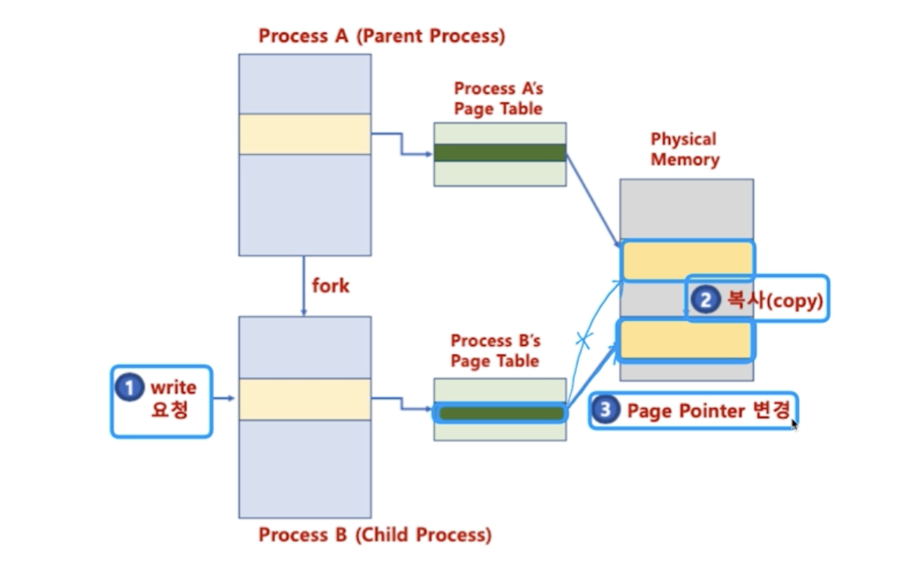

### 프로세스 종료

> void exit(int status);
exit()함수: 즉시 프로세스를 종료함(exit() 함수 다음에 있는 코드는 실행되지 않음)
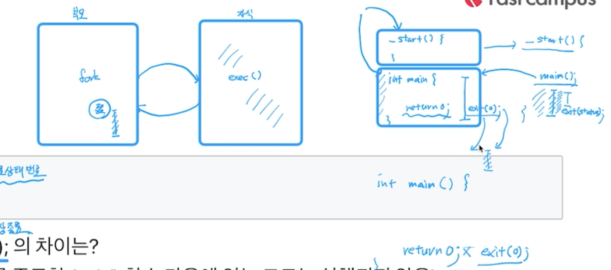

### exit 시스템 콜
* 주요동작
  * atexit()에 등록된 함수 실행
  * 열려 있는 모든 입출력 스트림 버퍼 삭제
  * 프로세스가 오픈한 파일을 모두 닫음
  * tmpfile() 함수를 통해 생성한 임시 파일 삭제

### atexit() 함수
* 프로세스 종료시 실행될 함수를 등록하기 위한 함수
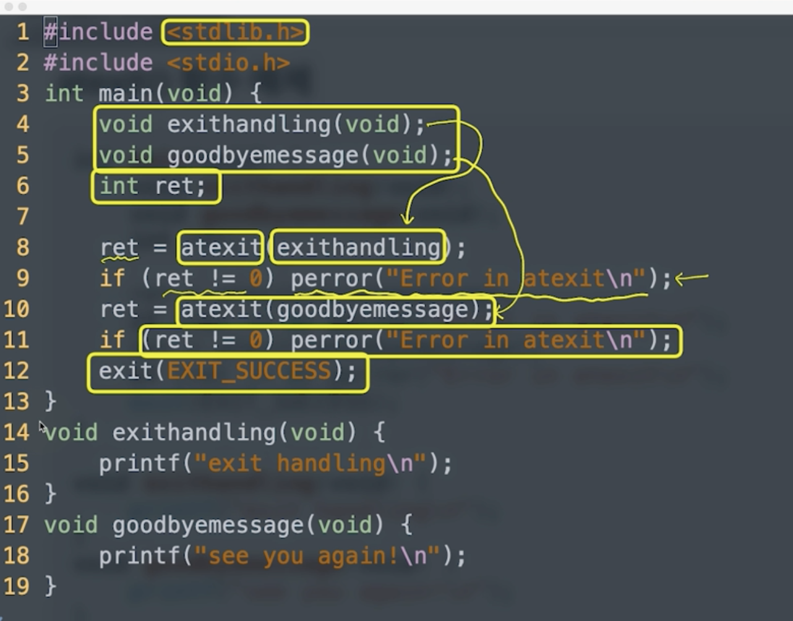

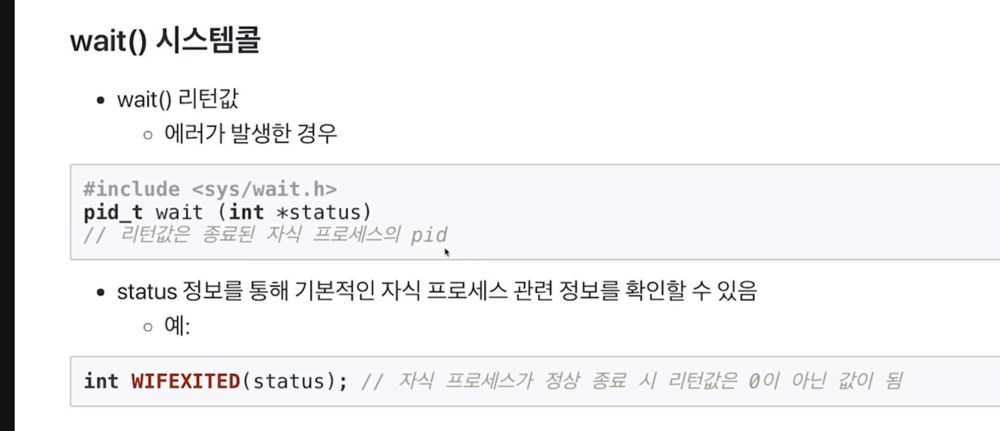

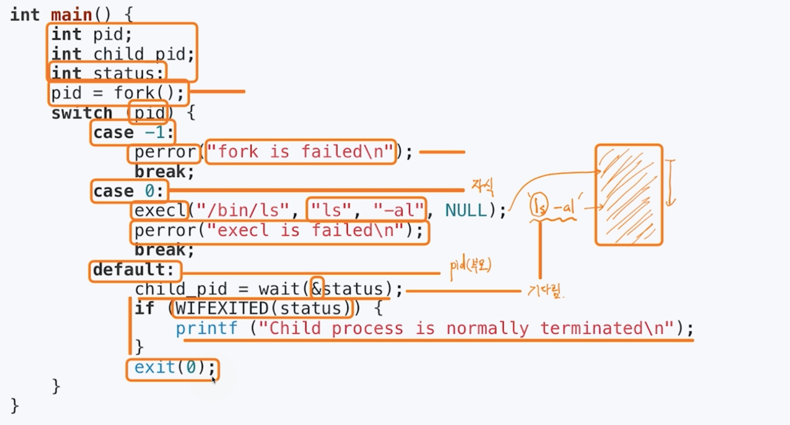

### 시스템 프로그래밍

#### 우선순위 변경하기 - nice()
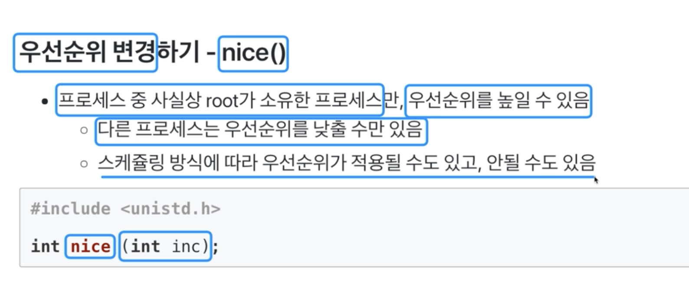

getPriority(), setPriority()

