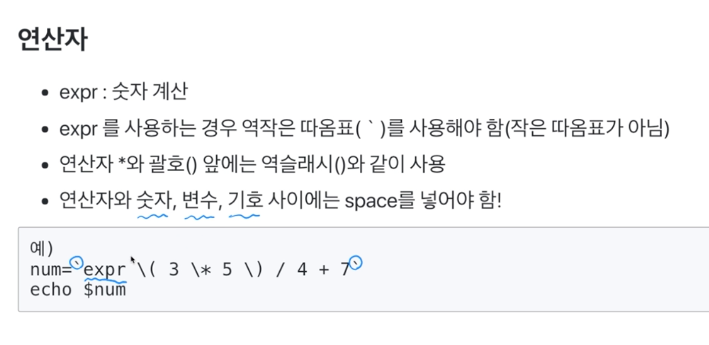
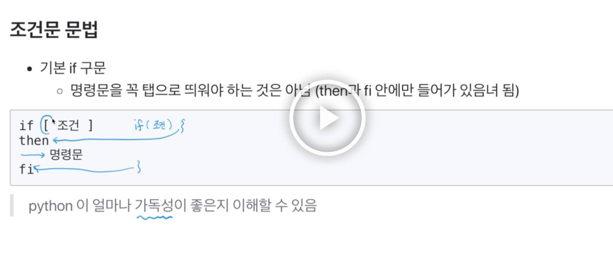
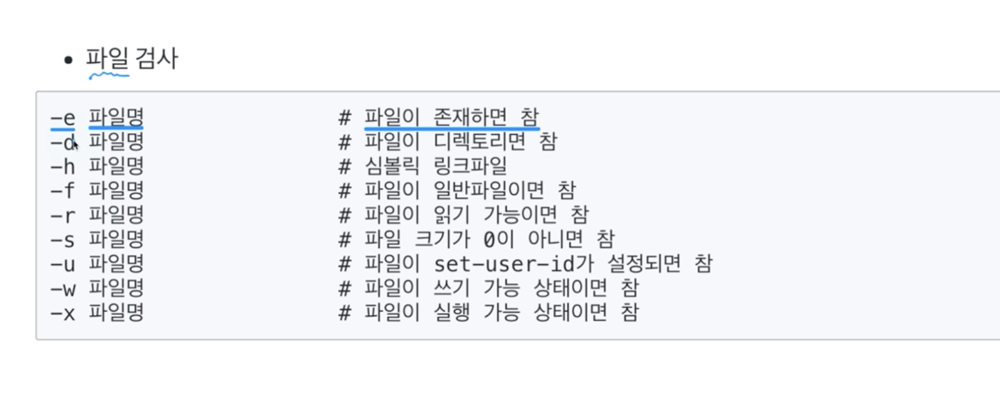
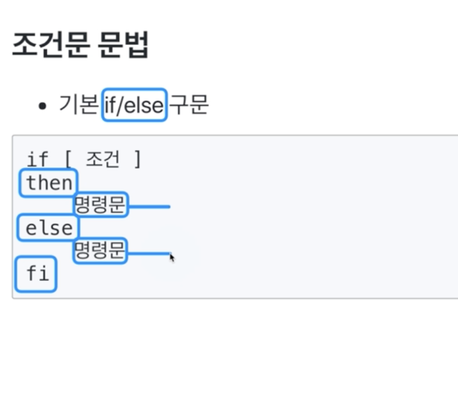
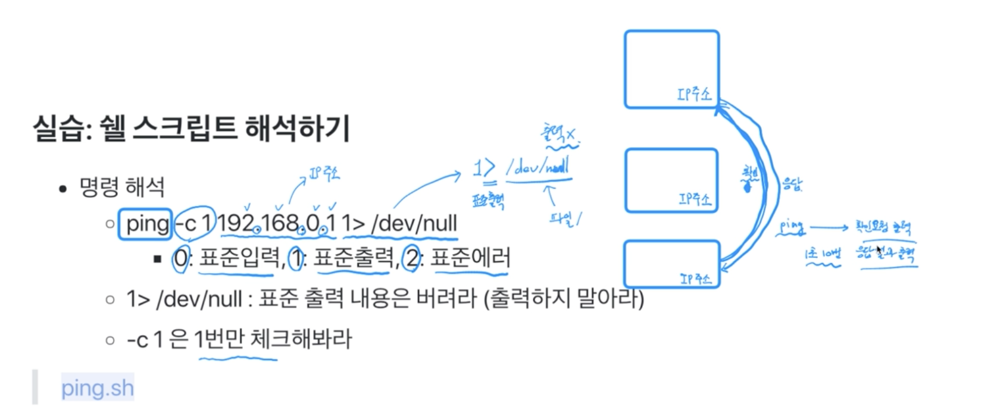
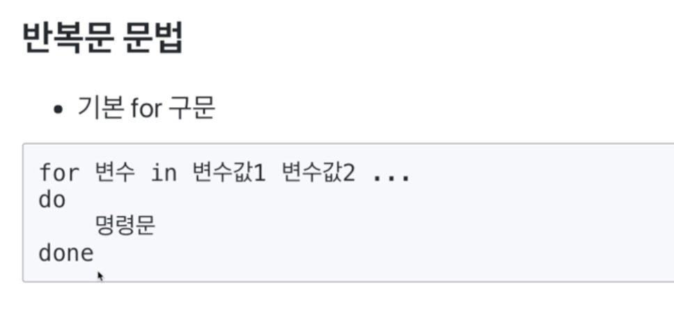
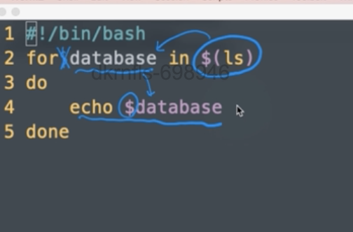
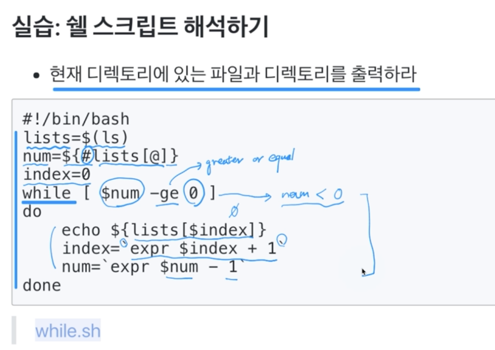
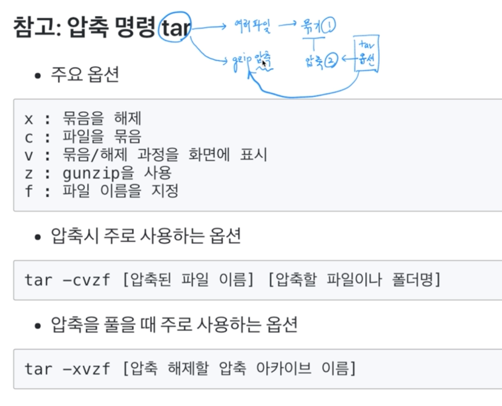

### 쉘 스크립트
* 서버 작업 자동화 및 운영을 위해 기본적으로는 익혀둘 필요가 있음

### 기본 문법
* 파일의 가장 위의 첫 라인은 '#!/bin/bash'로 시작

변수 사용하려면 $변수명

배열 mine=("Dave" 20 "IT")

### 사전에 정의된 지역 변수
```sh
$$: 쉘의 프로세스 번호
$0: 쉘스크립트 이름
$1 ~ $9: 명령줄 인수
```




-z 문자 -> 문자가 null이면 참
-n 문자 -> 문자가 null이 아니면 참









