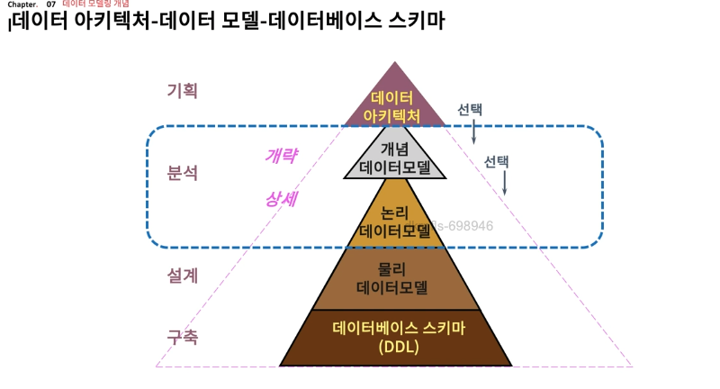
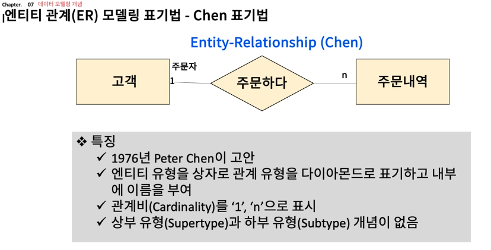
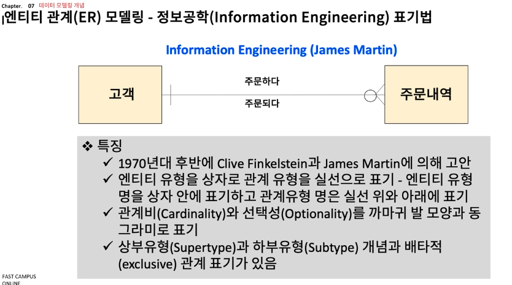
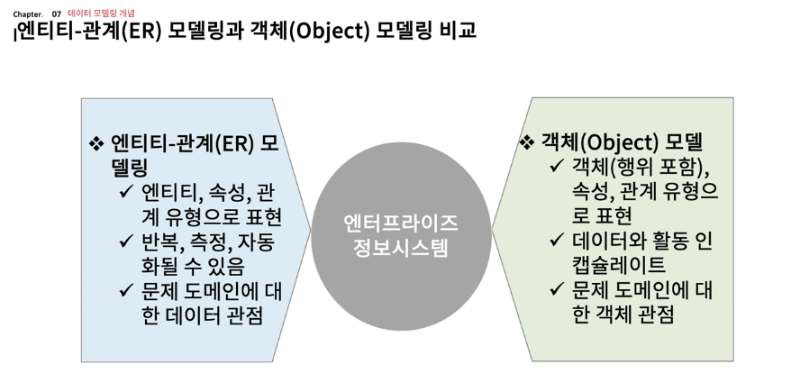
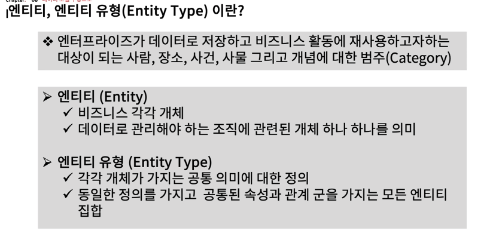
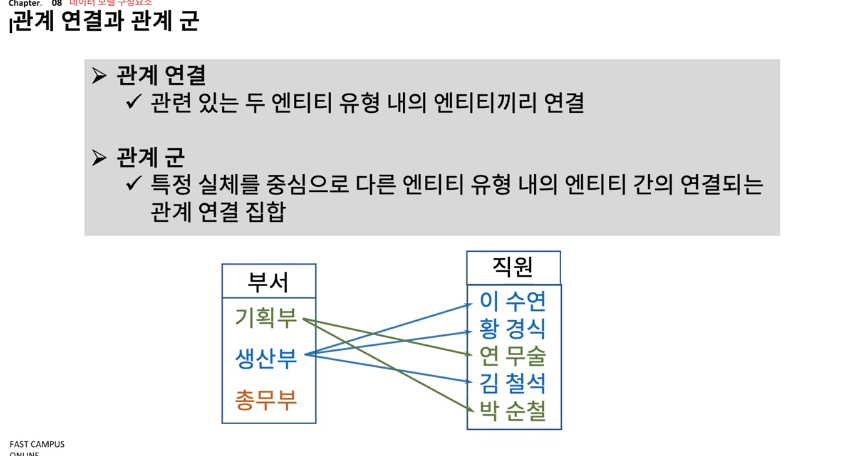
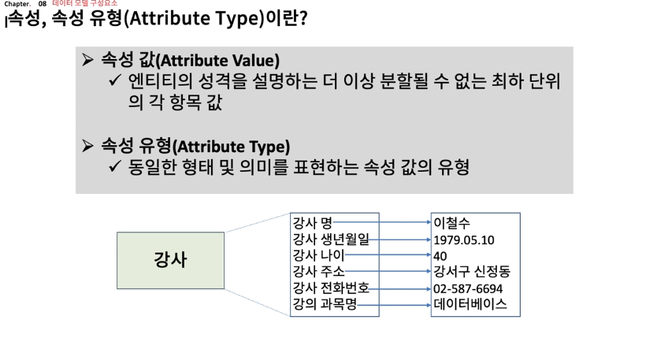
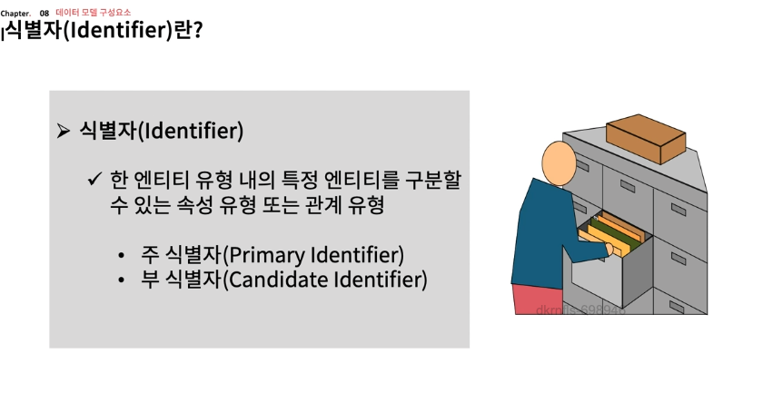
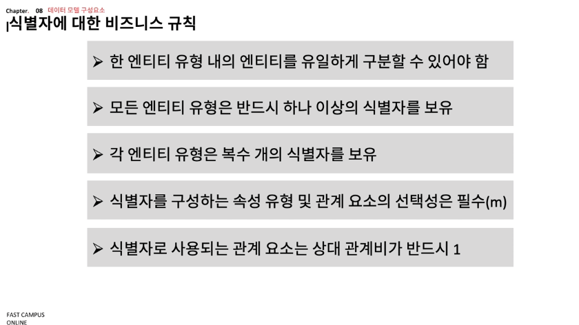

클래스
=> 구조(속성)와 행위(메서드)를 공유하는 비슷한 개념을 가진 객체 군을 표현
=> 하나의 클래스는 클래스 내부에 객체를 위한 데이터 구조와 메소드에 대한 구현 세부사항 기술

엔티티, 엔티티 유형

엔티티 => 하나의 개체
* 기업에 유용한 정보를 표현
* 서술적인 특성을 가질 것
* 다른 하나의 엔티티 유형과 연관성을 가지고 있어야 한다.
* 단수형 명사를 사용 (user, item)

관계연결, 관계군

관계군 -> 기획부, 생산부, 총무부 등등 군집화된 것

