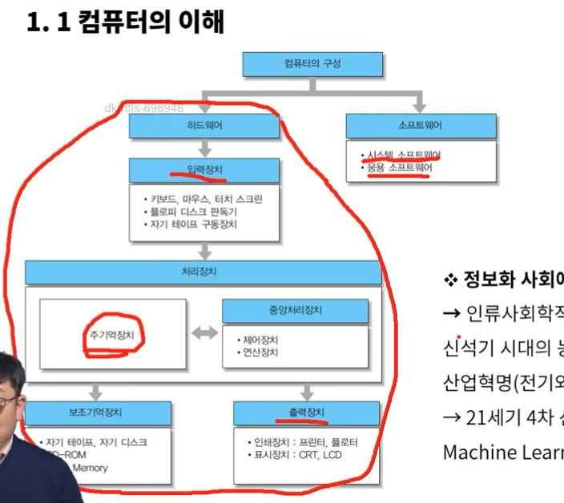
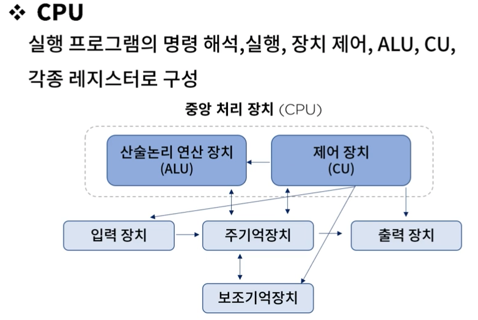
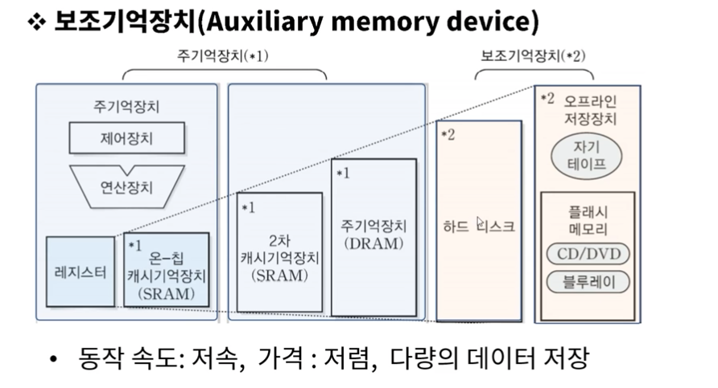
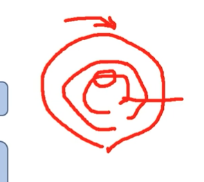

# 1. 컴퓨터 시스템의 이해

### 1.3 데이터의 표현
* 정보
  * 어떤 사물에 대한 소식이나 자료
  * 가공된 데이터
* 데이터
  * 정보의 원재료

### 1.4 데이터 표현 및 단위
* 수치 데이터 : 연산용 데이터
* 비 수치 데이터 : 입출력용 데이터

### 컴퓨터 구성요소의 인지와 기능의 조합
* 중앙처리 장치
  * cpu/mpu
  * 사물 인터넷 디바이스 H/W 플랫폼 종류(아두이노)
* 주변장치
  * 기억장치
  * 보조기억장치
  * 입/출력 장치

### 1.9 중앙처리장치
  * CPU(Central Processing Unit)
    * 마더보드 -> 데이터의 전달통로가 디자인 되어있는 메인보드
    * 
  * MPU(Micro Process Unit)
    * CPU를 LSI(고밀도 집적회로)화 한 일종의 통합 장치

### 1.10 주변장치
  * 기억장치(Memory Unit)
    * RAM(Random Access Memory)
      * DRAM(Dynamic RAM)
      * SRAM(Static RAM)
    * ROM(Read Only Memory)

* 참고사항
* 디스크의 성능과 파라미터
  1. 헤드를 해당 트랙으로 이동 : 탐색시간
  2. 데이터가 포함된 섹터가 회전되어 헤드 아래로 올때까지 대기 : 회전지연
  3. 데이터 전송 : 데이터 전송 시간
  
* 디스크 접근시간 = 탐색시나 + 회전지연 + 데이터 전송시간

