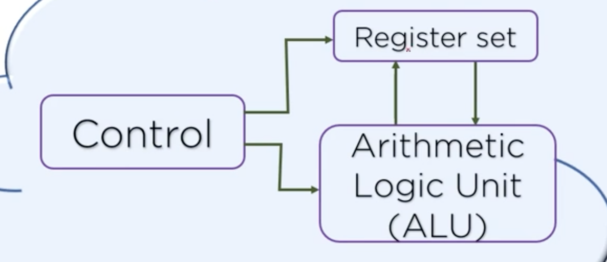
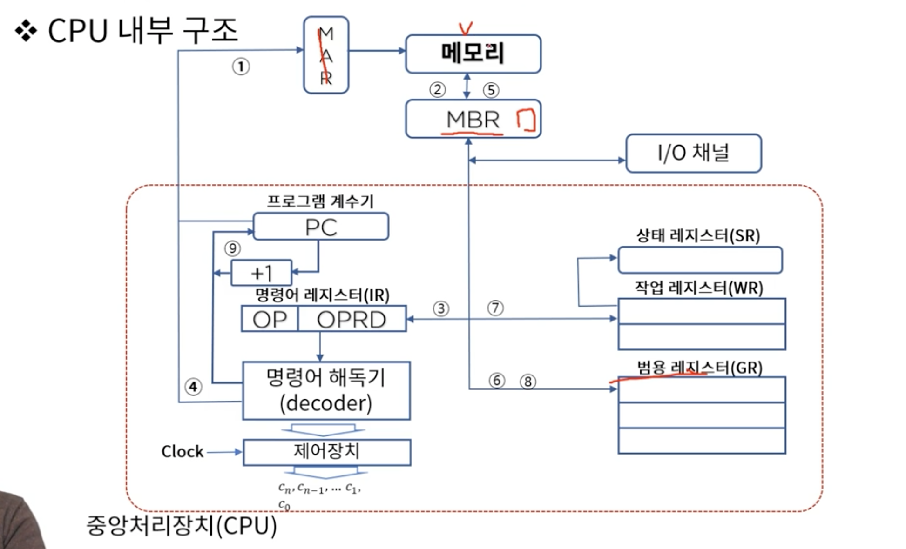
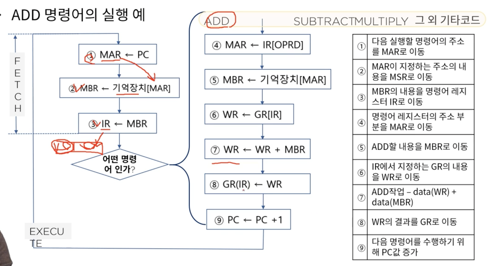
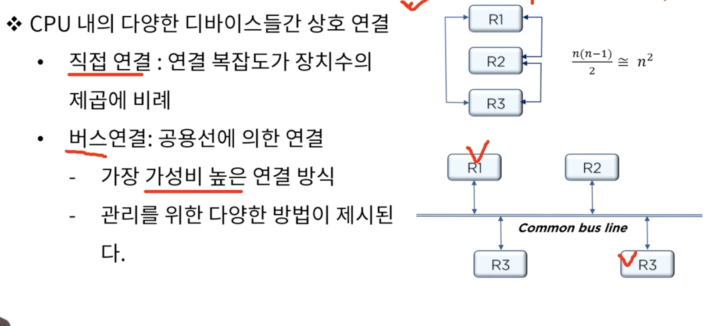
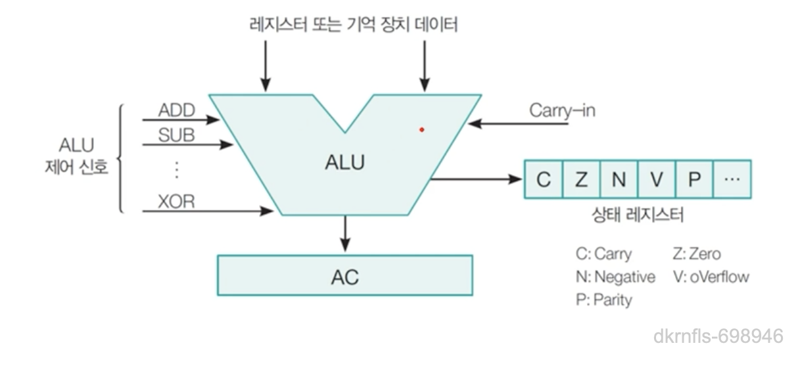

# 3. 중앙처리장치

### CPU 구성요소 
CPU = CU(Control Unit) + ALU(산술논리장치) + RS(레지스터 세트, Register set)

* 플립플롭을 여러개 묶어놓은게 레지스터
* CU: RS간 정보전송 감시, ALU에게 수행할 동작을 지시
* RS(Register Set): 명령어를 실행하는데 필요한 데이터를 보관
* ALU(Arithmetic Logic Unit) : 명령어를 실행하기 위한 마이크로 연산 수행

MAR: Memory Address Register
MBR: Memory Buffer Register

작업 레지스터 : 산술논리연산을 실행할 수 있도록 자료를 저장하고 그 결과를 저장
상태 레지스터 : 연산결과의 상태, zero, 부호, 오버플로우, 캐리(자리 올림), 인터럽트

### CPU 내부 구조와 명령어 집합

플립플롭 -> 정보를 저장(레지스토)
조합 논리회로 -> 멀티플렉서, 가산기 등등

조합 논리회로 + 플립플롭 => 순서 논리회로(cpu)

* 디지털 컴퓨터의 구조를 정의하기 위하여 논의 되어야 할 내용
  * 레지스터의 종류와 그 기능
  * 레지스터에 저장된 이진 정보를 가지고 수행되는 일련의 마이크로 연산들
  * 일련의 마이크로 동작을 온/오프 시킬 수 있는 제어기능

* CPU내의 다양한 디바이스들간 상호 연결
  * 직접연결 : 연결 복자바도가 장치수의 제곱에 비례
  * 버스연결 : 공용선에 의한 연결
    - 가장 가성비 높은 연결 방식
    - 관리를 위한 다양한 방법이 제시된다

### 마이크로 명령과 ALU

* 마이크로 연산
  * 레지스터에 저장된 데이터에 대해 수행되는 기본적인 연산(레지스터 간 데이터 전송, ADD, SUBTRACT 등등)
    - 레지스터 사이에서 이진 정보를 전송하는 레지스터 전송 마이크로 연산
    - 레지스터에 저장된 수치 데이터에 대해 산술 연산을 수행하는 산술 마이크로 연산
    - 레지스터에 저장된 비수치 데이터에 대해 비트 조작 연산을 수행하는 논리 마이크로 연산(AND, OR, NOT, XOR 등등)
    - 레지스터에 저장된 데이터에 대해 시프트 연산을 수행하는 시프트 마이크로 연산 (100 << 2)

* ALU(산술 논리 연산 장치, Arithmetic Logic Unit): 산술 연산과 논리 연산
  * 산술 연산 : 덧셈, 뺄셈, 곱셈, 나눗셈, 증가, 감소, 보수
  * 논리 연산 : AND, OR, NOT, XOR, 시프트(shift)
  

  