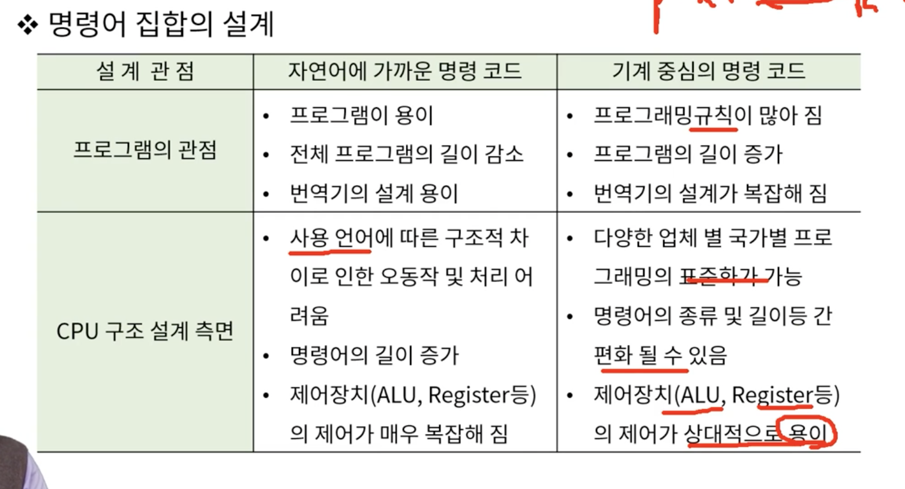
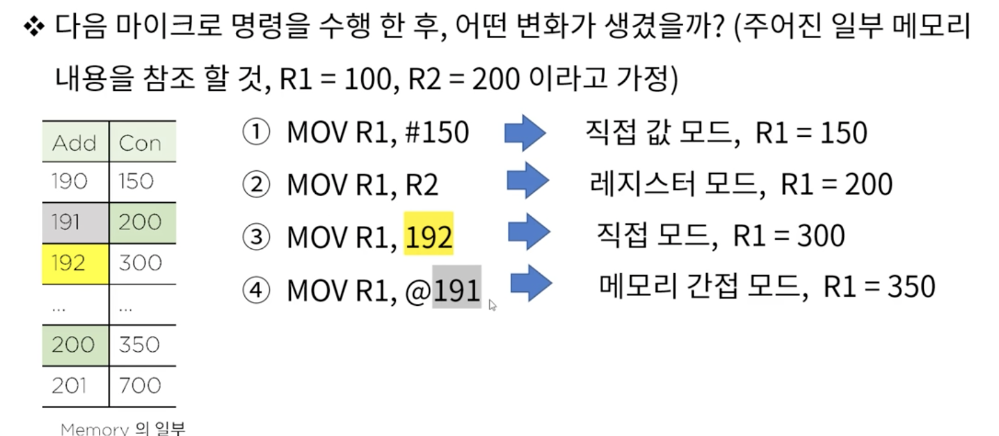
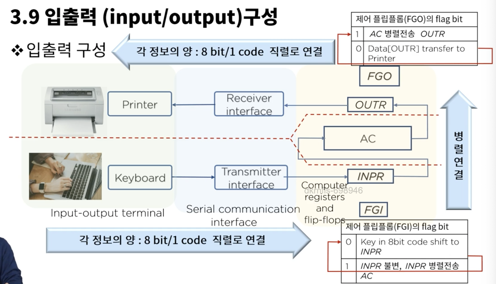
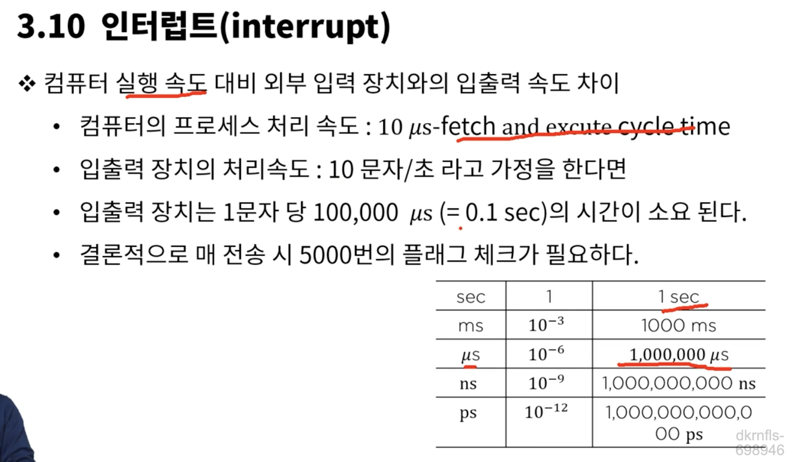
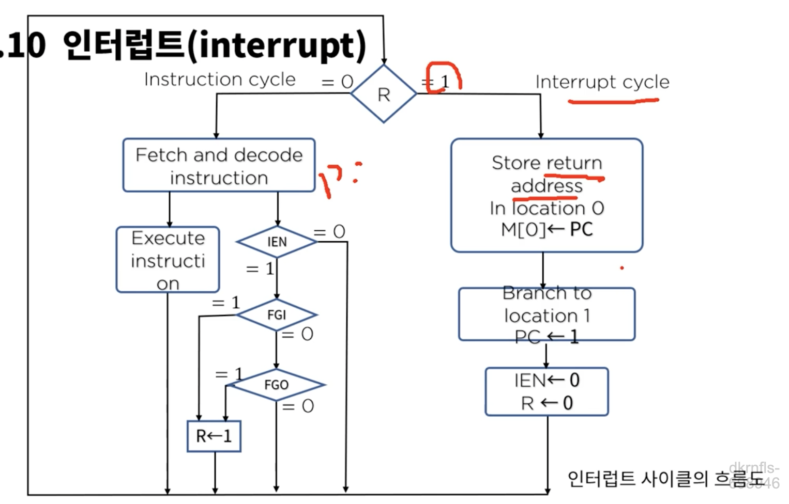
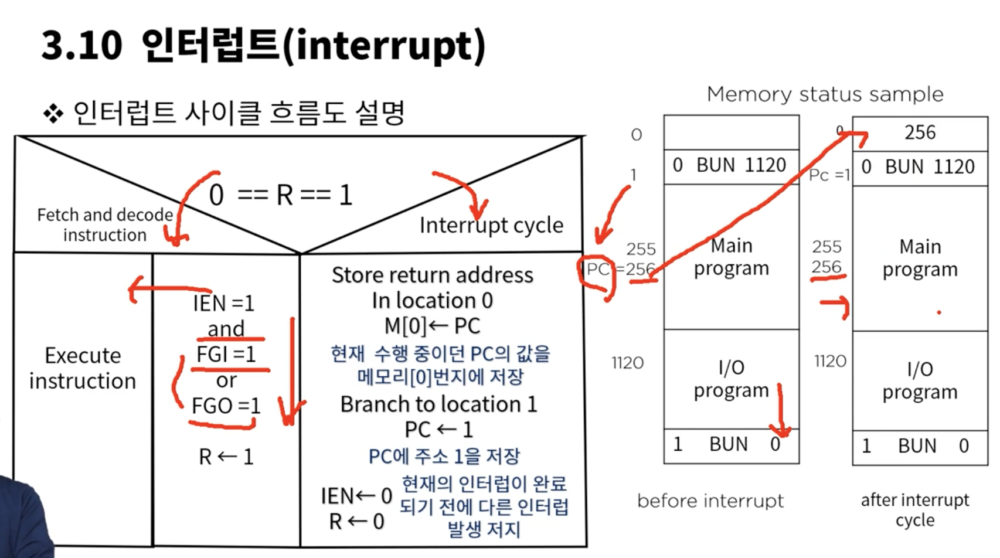
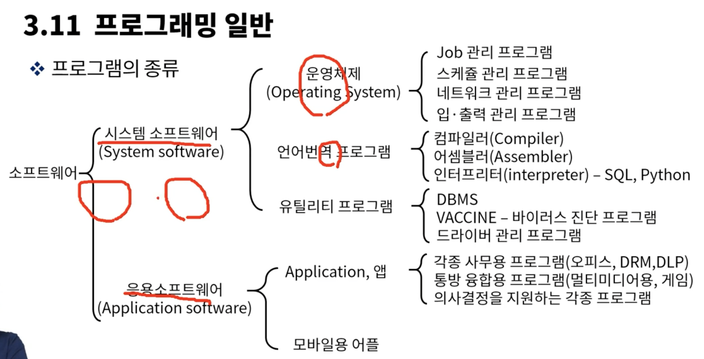
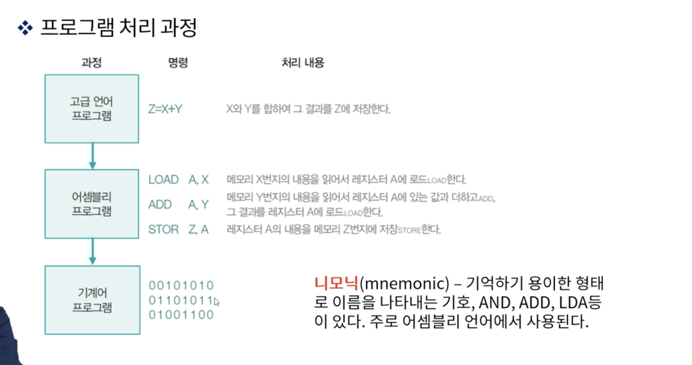

# 3. 중앙처리장치

### CPU 구성요소 
CPU = CU(Control Unit) + ALU(산술논리장치) + RS(레지스터 세트, Register set)

* 플립플롭을 여러개 묶어놓은게 레지스터
* CU: RS간 정보전송 감시, ALU에게 수행할 동작을 지시
* RS(Register Set): 명령어를 실행하는데 필요한 데이터를 보관
* ALU(Arithmetic Logic Unit) : 명령어를 실행하기 위한 마이크로 연산 수행

MAR: Memory Address Register
MBR: Memory Buffer Register

작업 레지스터 : 산술논리연산을 실행할 수 있도록 자료를 저장하고 그 결과를 저장
상태 레지스터 : 연산결과의 상태, zero, 부호, 오버플로우, 캐리(자리 올림), 인터럽트

### CPU 내부 구조와 명령어 집합

플립플롭 -> 정보를 저장(레지스토)
조합 논리회로 -> 멀티플렉서, 가산기 등등

조합 논리회로 + 플립플롭 => 순서 논리회로(cpu)

* 디지털 컴퓨터의 구조를 정의하기 위하여 논의 되어야 할 내용
  * 레지스터의 종류와 그 기능
  * 레지스터에 저장된 이진 정보를 가지고 수행되는 일련의 마이크로 연산들
  * 일련의 마이크로 동작을 온/오프 시킬 수 있는 제어기능

* CPU내의 다양한 디바이스들간 상호 연결
  * 직접연결 : 연결 복자바도가 장치수의 제곱에 비례
  * 버스연결 : 공용선에 의한 연결
    - 가장 가성비 높은 연결 방식
    - 관리를 위한 다양한 방법이 제시된다

### 마이크로 명령과 ALU

* 마이크로 연산
  * 레지스터에 저장된 데이터에 대해 수행되는 기본적인 연산(레지스터 간 데이터 전송, ADD, SUBTRACT 등등)
    - 레지스터 사이에서 이진 정보를 전송하는 레지스터 전송 마이크로 연산
    - 레지스터에 저장된 수치 데이터에 대해 산술 연산을 수행하는 산술 마이크로 연산
    - 레지스터에 저장된 비수치 데이터에 대해 비트 조작 연산을 수행하는 논리 마이크로 연산(AND, OR, NOT, XOR 등등)
    - 레지스터에 저장된 데이터에 대해 시프트 연산을 수행하는 시프트 마이크로 연산 (100 << 2)

* ALU(산술 논리 연산 장치, Arithmetic Logic Unit): 산술 연산과 논리 연산
  * 산술 연산 : 덧셈, 뺄셈, 곱셈, 나눗셈, 증가, 감소, 보수
  * 논리 연산 : AND, OR, NOT, XOR, 시프트(shift)
  
  - 뺄셈은 빼야하는 숫자의 2의보수를 더해주자 그러면 결과값을 뺄셈을 한것과 같다

### 마이크로 명령어 집합과 구성

* 실행 순서에 따른 명령어 분류
  * 순차적 실행 명령어 - 전체 실행 명령어의 70 ~ 80% 차지
  * 분기 명령어
  * 부 함수 호출 명령어
  * 복귀 명령어

### 3.8 주소 지정 모드(addressing mode)
* (ref: 명령어 구문 형식) 명령어의 구조상 자료가 저장되어 있는 장소를 지정하는 방법이 필요함. 이유는 최대한 하드웨어와 소프트웨어의 독립성을 유지하여 프로그램의 유연성(pointer, indexing, 배열등)을 가능하게 하여 명령어의 수와 길이를 줄이기 위한 세계적 표준화 기법 -> 주소 접근하고 불러와서 그 값을 바꾸고 하는 코드가 pointer로 접근해서 바로 조지는 걸로 가능해서 코드가 짧아지는 걸까

* mov R1, @191 -> 191번 주소에 접근해 있는 값의 주소에 가서 값을 할당해라 191(200) -> 200(350)

### 마이크로 명령 - 입출력과 인터럽트

FGI : 플래그가 0이면 값을 입력받을수 있고 1이면 입력을 못받는다

### 3.10 인터럽트
* 인터럽트 인 에이블 플립플롭(interrupt enable flip-flop) IEN
  -  프로그램 제어전송 대신에 외부장치가 전송 준비가 되었을 때 컴퓨터에 알리는 방법에 활용되는 플립플롭
  -  컴퓨터는 프로그램 실행 도중 플래그를 체크하지 않으며, 플래그가 세트되면 컴퓨터는 즉각 실행중이던 프로그램을 중지하고 플래그의 세트 정보를 받아들여 입출력을 실행/입출력 실행 후 즉시 원프로그램으로 복귀  => 인터럽트 (내가 알고 있던 개념은 다른 프로그램 실행중에 다른 프로세스가 중간에 신호줘서 자기꺼 처리해달라고 요청하는 것으로 알고있었음), 앰뷸런스가 뒤에서 오면 잠깐 멈춰서 보내주고 자기 갈길 가는 것과 비슷한 느낌????

* 컴퓨터의 실행속도는 매우 빠른데 외부 입력 장치의 입출력 속도는 굉장히 느리다

속도에 너무 차이가 나서 인터럽트를 두어서 처리해야 시간을 아낄수가 있다.(매번 입출력 장치의 상태를 체크할수가 없으니까), 빨리 처리해야할 작업과 늦게 처리해도 되는 작업을 나누었고 이 차이를 인터럽트로 조지고 있다.

* 인터럽트 사이클의 흐름도

### 기본 컴퓨터 프로그래밍
결국 프로그래밍은 하드웨어를 잘쓰기 위한것   
소프트웨어는 하드웨어를 이용하는 명령어의 집합   
소프트웨어는 시스템 소프트웨어 + 응용 소프트웨어   

하드웨어를 잘 동작 시킬 수 있도록 제어하고, 지시하는 모든 종류의 프로그램을 소프트웨어라고 한다.

* 프로그램 처리 과정
  * 고급 언어 -> 어셈블리어 -> 기계어

### 프로그래밍 언어의 실행
1. 구조적 기법
2. 객체지향 기법
   1. 객체 = 데이터 + 처리 기능(메소드)을 단위화 하여 캡슐화 시키고 각 기능의 상속으로 기능의 재사용이 가능, 다형성, 재사용이 핵심 (붕어빵, 붕어빵 틀)
3. 컴포넌트 기법
   1. 외부와 interface를 통하여 동작 구현 및 시스템의 단순성을 높임
4. 분산객체 프레임 워크
   1. 분산객체 프레임 워크 이종의 분산환경에서 여러 종류의 application을 쉽게 통합하기 위한 통합 방식

