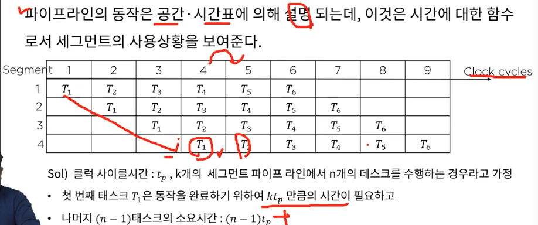
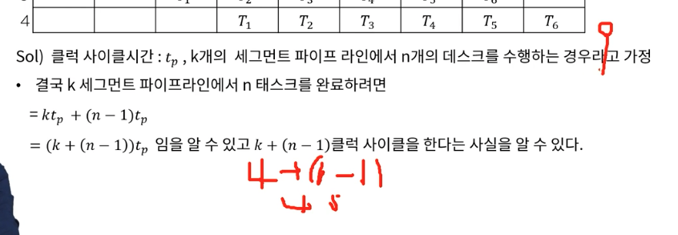
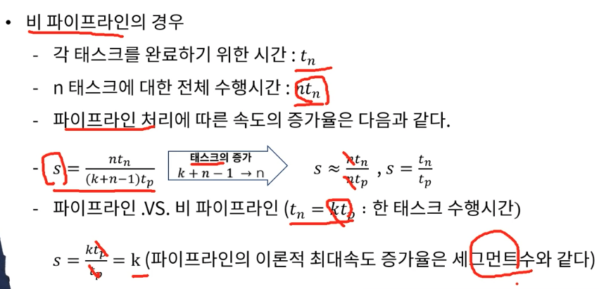
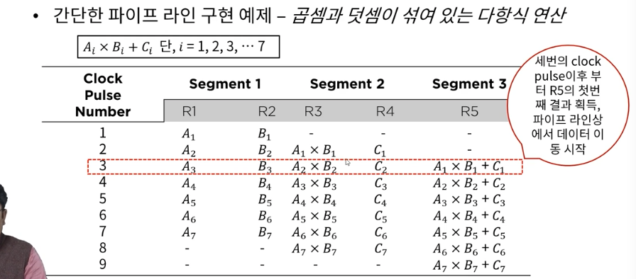
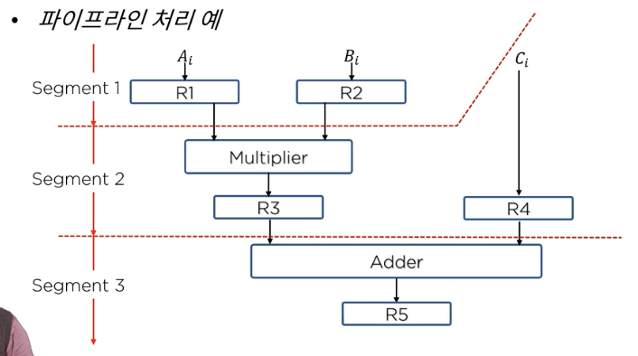
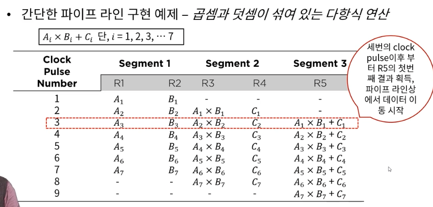
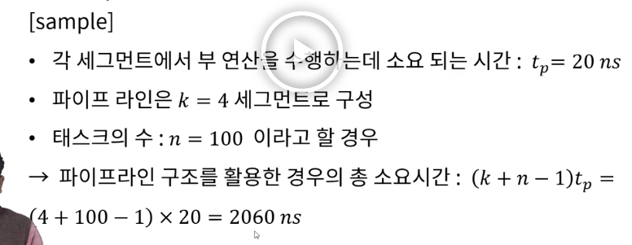
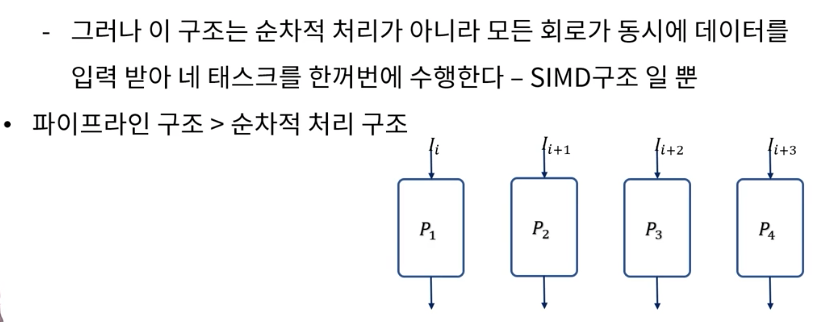
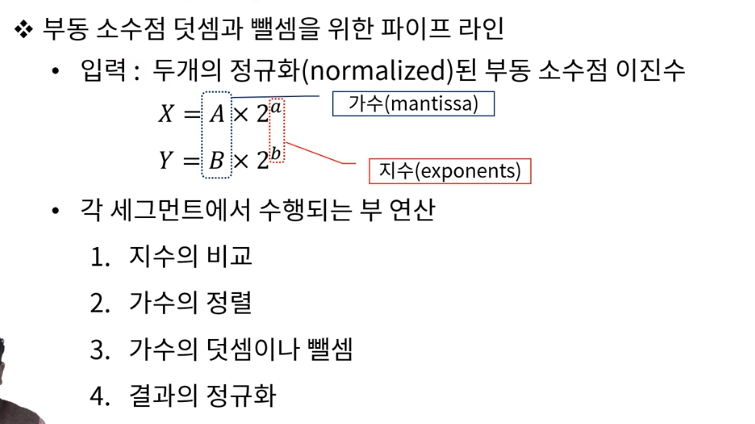
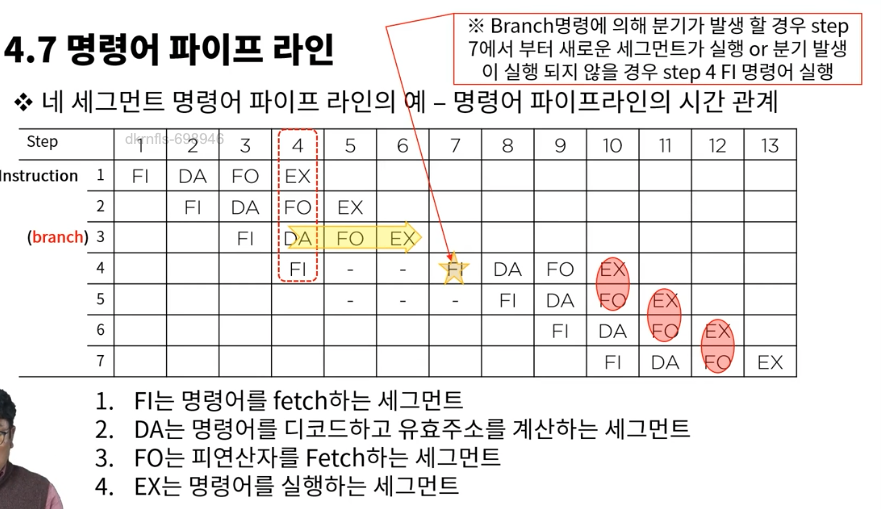

# 4. 파이프라인과 벡터처리

### 4.1 병렬 처리
* 컴퓨터 시스템 계산 속도 향상 목적
* 동시 데이터 처리기능 제공

### 4.2 파이프 라인
* 파이프라인 구조의 성능

=> s는 속도의 증가율
=> 파이프라인의 최대속도 증가율은 세그먼트 수와 같다. 그걸 증명한 수식이 저 사진

파이프 라인 -> 데이터 처리 단계의 출력이 다음 단계의 입력으로 이러지는 형태로 연결된 구조, 여러 단계가 동시에 또는 병렬적으로 수행 될수 있음, 입출력을 중계하기 위해 버퍼 사용될 수 있음

멀티 프로세스를 효율적으로 적용한 시스템이 파이프라인 시스템이라 한다.
검표를 여러 알바가 동시에 하는 느낌

아래 그림이 핵심이네!!! 

중간 결과를 다음 세그먼트에 어떻게 넘겨줄까가 핵심이 였는데 세그먼트마다 레지스터 두어서 해결하였다.
각 세그먼트마다 레지스터를 두고 거기에 시그널(클락펄스)을 준다, 시그널 받으면 다음 레지스터에 값을 넘겨준다.

i 값만 바뀌면서 계속 값을 입력받는것을 볼수 있다.   
아래 그림과 같이 보면 이해 잘됨

파이프 라인은 무조건 좋을까????
* 동일한 복잡도의 부연산들로 나뉘어지는 어떠한 연산 동작도 파이프라인 프로세서에 의해 구현 될 수 있다.
* 파이프라인 기술은 매번 다른 데이터 집합을 동일한 테스크에 적용시켜 여러 번 반복하는 응용에 효과적이다. -> 반복적인 작업에 최적화

자 위의 사진을 보자 s는 세그먼트 r은 레지스터, 클락펄스가 발생하면 앞의 레지스터 값이 뒤로 이동   
세그먼트들의 업무 복잡도가 거의 동일해야 한다.    
하나의 세그먼트가 업무가 너무 복잡해져버리면 클락 펄스가 그 세그먼트의 작업 완료시간에 맞춰지므로 다른 세그먼트들은 놀고 있을수 있다.   
클락 펄스는(공동) 버스 라인으로 동일하게 들어감

파이프 라인 Vs 비파이프 라인

## 산술/명령어 파이프라인 구조

### 현실적 파이프라인 구조
파이프라인은 프로세스를 세그먼트 단위로 나눠서 조져버리는 것, 비파이프라인보다 훨씬 효율적이다

* 실제 파이프라인 구조가 이론적인 최대 속도를 구현하지 못하는 잉유
  - 각 세그먼트 들이 부연산을 수행하는 시간이 서로 다르다.
  - 각 레지스터를 제어하는 클럭 사이클은 최대 작업시간의 세그먼트와 싱크를 맞춰야 한다.

* 병렬적인 다중 기능 장치를 고려 할 수 있다.
  - 각 p 회로는 전체 파이프라인 회로에서와 같이 동일하게 테스크 수행(파이프라인이 여러개라 보면 될듯?)

simd -> single input multi data

### 파이프 라인 구조가 적용되는 컴퓨터 설계
* 산술 파이프 라인
  - 산술 연산들을 부연산으로 나누어 파이프 라인의 세그먼트에서 수행(큰걸 작은거로 쪼개서 처리하는 듯)
* 명령어 파이프 라인
  - 명령어 사이클의 Fetch, 디 코드, 실행 단계를 중첩 시킴으로 명령어 흐름에 동작???

### 명령어 실행 과 파이프 라인 구조
* 명령어 파이프라인은 이전 명령어가 다른 세그먼트에서 실행되고있는 동안 메모리에 연속적으로 저장되어 있는 다음 명령어를 읽어 옴으로서 fetch와 실행이 중첩되어 동시에 수행되는 구조.
* 분기가 발생할 경우(가장 큰 취약점) - 현재의 파이프라인은 모두 비워져야 하고, 분기명령 이후에 메모리에서 읽어온 명령어는 모두 무시 되어야 한다.

=> 명령어 fetch 장치 / 명령어 실행 장치로 파이프라인을 나누자
- 명령어 fetch 장치 -> FIFO에 의한 queue로 구성되어 queuing 기법에 의한 메모리 참조에 의해 평균 메모리 접근 시간을 효과적으로 줄여 준다.
- 명령어 파이프라인이 수행되는데 있어 발생하는 애로사항
  - 세그먼트의 수행시간이 서로 다름(실행되지 않는 세그먼트도 있을 수 있음)
  - 두 개 이상의 세그먼트에 의해 동일한 주소 공간이 참조되는 경우(데드락 발생 가능)

### 파이프라인 CPU의 성능 분석

### 4.8 파이프라인 분기 예측
* 자원 충돌
  - 두 세그먼트가 동시에 한 주소를 참조하는 경우 -> 명령어 메모리와 데이터 메모리를 분리함으로써 대부분 해결
* 데이터 의존성
  - 어떤 명령어가 이전 명령어의 결과에 의존할때 이전 명령어의 결과가 아직 준비되지 않은 경우
  * 해결방법
    - 하드웨어 인터락 : 어떤 명령어의 연산자가 파이프라인에서 앞서간 명령어의 목적지와 일치하는지를 검사하는 회로 -> 감지되면 중간에 충분한 클럭 사이클을 두어 지연시킨다.
    - 오퍼랜드 포워딩 : 충돌을 감지하는 경우 특별한 통로를 통해 직접 파이프라인 세그먼트에 전달
* 분기 곤란
  - 분기 명령어 같이 PC(Program Counter)의 값을 변경시키려는 명령어에 의해 발생
  * 해결방법
    - 순차적으로 처리될 명령어를 분기의 목표가 되는 명령어와 함께 저장하는 방법
    - 분기예측 (그다지 효율적이진 않음, 예측 실패시에는 패널티(시간 지연) 발생

### 4.9 RISC Processor
* RISC 프로세서의 설계목표
  * 실행 명령어 수는 증가 하더라도 작업 처리 시간의 감소가 가능하다
  * 명령어당 실행 클록 수 와 클록 주기를 파이프라인 구조를 이용하여 감소시킬 수 있다.
* RISC 프로세서의 구조적 특징
  * 명령어의 1 사이클 실행을 위한 파이프라인 구조, 메모리 참조를 위한 온칩 캐쉬(cpu내 메모리 구현, 명령어 캐쉬, 자료 캐쉬로 구성)
  * 간단한 명령 코드와 주소 지정 모드 및 하드와이어 적 제어 장치
  * 실수 연산의 별도 처리를 위한 코프로세서

-> 파이프라인에 최적화된 cpu가 있다 정도로 알면 될듯????

### 4.10 파이프라인 CPU 성능 분석
이론 -> 명령어 세그먼트가 늘어나면 파이프라인의 최대속도도 증가할것이다 -> 현실은 녹록치 않지

아래는 그 제약조건

* 모든 명령어는 동일한 처리과정(세그먼트의 적용)으로 처리되어야 한다.
* 파이프라인을 구성하는 각 단계의 처리시간이 일정해야 한다.
* 모든 명령어는 작성된 순서에 따라 순차적으로 실행되어야 한다(분기 명령, 함수 호출, 반환 명령 등에 의해 순차성이 깨짐)
* 사용 명령어들 사이에는 상호 의존성이 없어야 한다.
* 명령어들 처리 시 공유 자원의 충돌이 없어야 한다.

