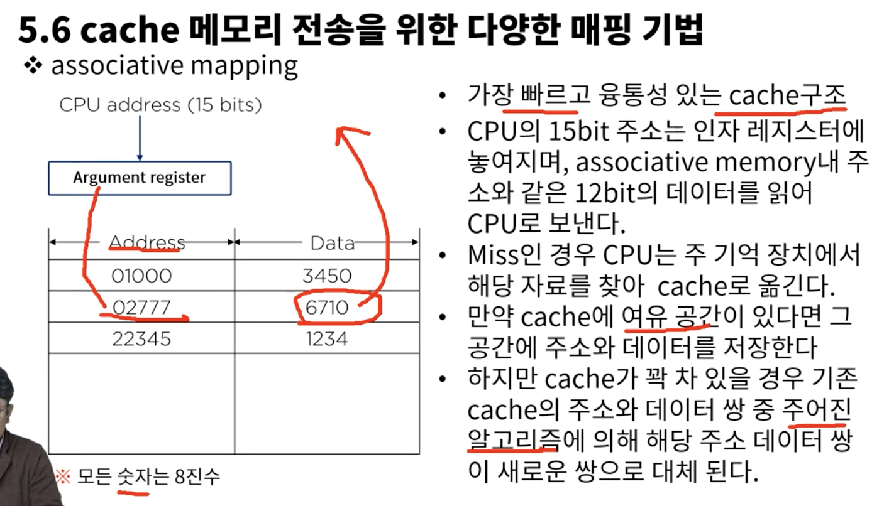
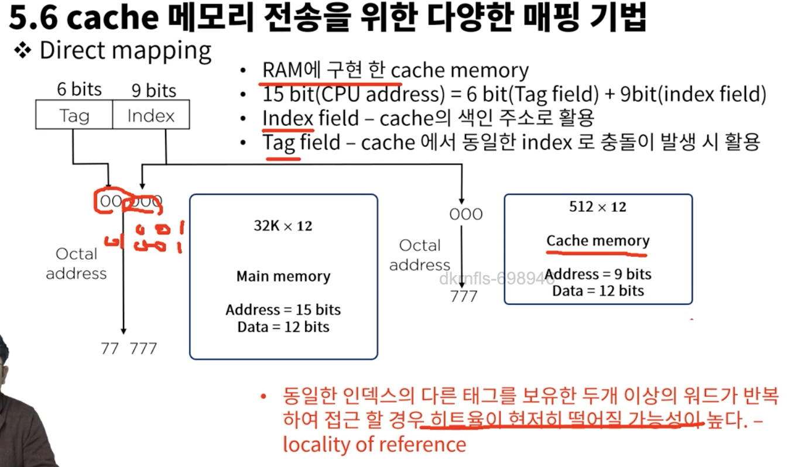

# 5. 메모리 구조

### 5.1 메모리 계층
* 기억장치는 cpu에 의하여 시행될 프로그램이 저장되는 곳
  * 주 기억장치
    * 마더보드에 장착됨 - RAM(비교적 대용량, 고속의 속도를 지님, 휘발성), ROM
  * 보조 기억장치
    * 비교적 저속, 대용량의 자료보관이 가능
    * 보조기억내 데이터는 필요한 경우 주 기억장치로 옮겨져야 한다
    * Magnetic Tape, USB, SD card
  * 캐쉬메모리
    * 주기억장치 접근 시간 > 프로세스 논리회로 => MMS & CPU 버퍼
    * 현재 진행되고 있는 프로그램의 일부 또는 사용빈도가 높은 임시 데이터 저장

* 지역성 -> 사용하고 있는 명령어, 주소는 거의 몇개 없음, 지역성에 기반

메모리의 256GB이런거는 ns로 클락펄스를 발생시킬수 있다는 거고 이건 주파수 인거고 메모리의 용량이 크다는건 클락 펄스를 더 자주 발생시킬수 있다는 거고 ns가 작아질수록 분모의 값이 작아지니까 용량이 커지겠네
클락펄스를 발생시켜야 레지스터가 시그널을 받아들여 이후의 동작을 수행할 수 있는 거고

### 5.2 주 기억장치
* RAM
  * SRAM
  * DRAM
* ROM

MAR: Memory Address Register
MBR: Memory Buffer Register

### 5.3 보조기억장치

* 접근시간 : 메모리내의 기억장소에 도달하여 그 내용을 얻는데 요구되는 평균시간 의미
  * 시크타임 : read/write head가 지정된 기억장소에 도달하는데 소요 되는 시간
  * 트랜스퍼 타임 : 추출된 데이터를 장치내 또는 장치 밖 필요한 곳으로 전송하는데 요구되는 시간
  * 레코드 : 일반적으로 데이터가 기록되는 단위, 시크 타임을 체크하게 되는 기준
  * 전송률 : 장치가 레코드의 시작점에 위치한 다음 단위 시간에 전송 할수 있는 문자나 위드의 수

### cache 메모리 전송을 위한 다양한 매핑 기법
* Associative mapping
  
  - 먼저 캐시에 있는지 확인하고 없으면 RAM 접근
  - RAM에서 가져와서 다시 캐시에 넣음
* Direct mapping
  
  - sram에 구현한 캐시 메모리
* Set-associative mapping

### 가상 메모리

### 메모리 관리 하드웨어
