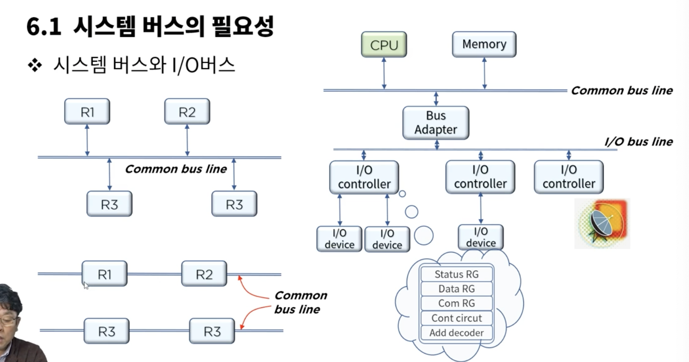
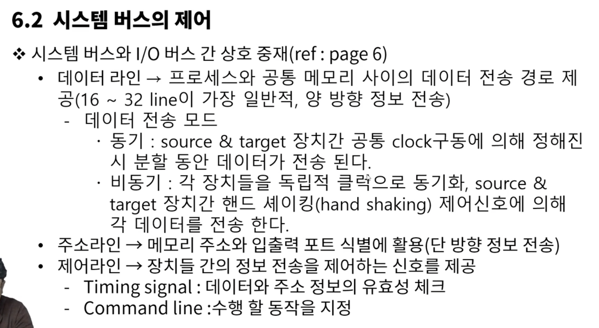
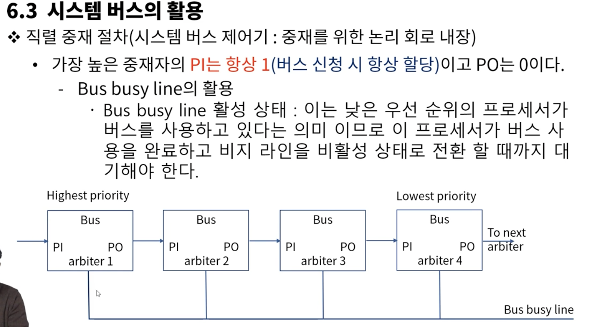
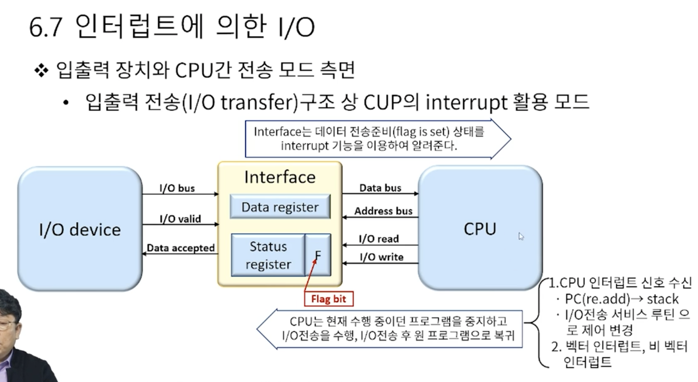
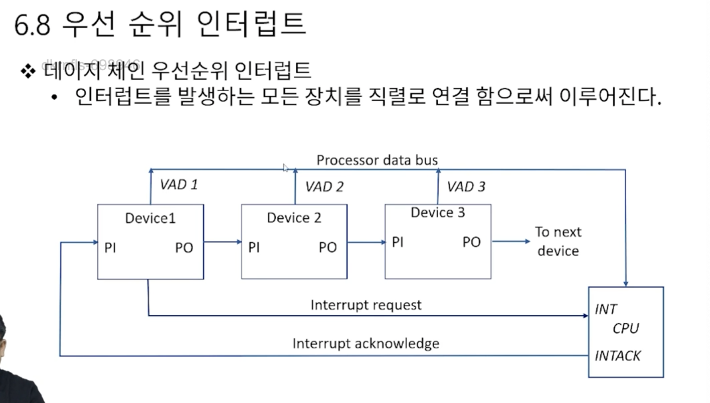
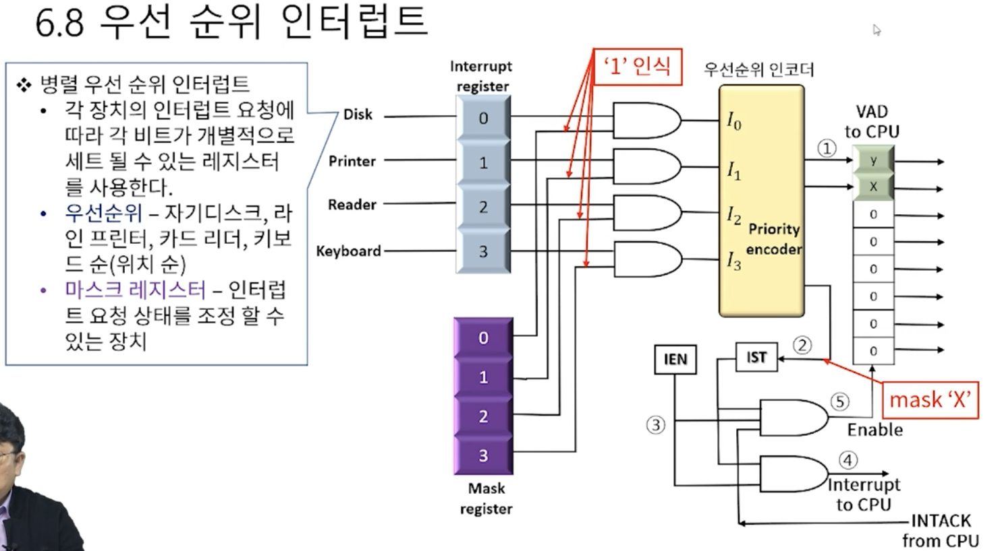

# 6. 입출력 구조

### 시스템 버스의 필요성
* 버스와 메모리 전송
  * 많은 레지스터와 레지스터들 사이의 정보전송을 위한 경로를 가져야 한다.
  * 시스템은 이를 위해 각 레지스터들을 연결하는 대신 공통의 버스 시스템이라는 효율적 방법을 사용한다.
  

  시스템 bus와 I/O 버스는 따로 존재, 둘 사이에 어댑터가 존재해서 중재해줌

  -> 다양한 단계의 여러 bus가 존재
  - 메모리 버스 -> 데이터, 주소, 그리고 읽기/쓰기 정보 전송
  - I/O 버스 -> 입출력 장치로 정보를 주고 받는데 사용

  * 공유 메모리 멀티 프로세서 시스템에서 프로세서는 시스템 버스를 통하여 공유 자원에 대한 접근을 요구함
    - 공유 자원 사용 되고 있지 않을때 -> 바로 승인
    - 공유 자원 사용되고 있을때 -> 선점 프로세스 끝날때까지 대기
    - 동시에 시스템 버스를 요구 하는 경우 -> 중재 동작 필요 

### 시스템 버스의 제어
  
  

### 시스템 버스의 활용
- 직렬 중재 논리
- 병렬 중재 논리

### 입출력 주소 지정
하나의 입력장치에 주소 할당이 다양하게 되어야 한다. 키보드 여기에 입력, 저기에 입력
- 메모리 맵 입출력(memory mapped I/O) -> 메모리에 부여된 주소 공간의 일부를 입출력 주소 공간으로 활용
- 입출력 맵 입출력(I/O mapped I/O) -> 독립된 메모리 주소 공간과 입출력 주소 공간을 구분하여 할당한다.

### 입출력 버스 할당
* 중앙 제어 버스 vs 분산 제어 버스
  * 중앙제어 버스 시스템 -> 구현 및 관리가 용이, 제어기 이상 생기면 큰일남
  * 분산 제어 버스 시스템 -> 버스상의 모든 장치가 제어 기능을 나누어 실행

  I/O 버스 -> 중앙 제어 버스 시스템 적용
  시스템 버스 -> 분산 제어 버스 시스템 선호

### 입출력 수행의 분류
- 동기 버스에 의한 수행
  - 매 버스 클럭시에마다 데이터 전솟ㅇ
- 비동기 버스에 의한 수행
  - 버스 수요 발생하면 해당 장치 awake 확인하고 데이터 전송 해야함

### 인터럽트에 의한 I/O
* 입출력 장치와 CPU간 전송모드 측면
  - 입출력 전송 구조상 CPU의 인터럽트 활용 모드
  - cpu는 현재 수행중이던 프로그램을 중지하고 I/O전송을 수행, I/O전송후 원 프로그램으로 복귀

  - 입출력 소프트웨어는 시스템에 인터럽트 제어를 발 할 수 있어야 하며, 이를 실행 할 주변장치에 커맨드를 발 하여야 한다.

### 우선순위 인터럽트
* 입출력 장치와 CPU간 interrupt 논리
  * cpu와 I/O장치 사이의 데이터 전송은 cpu에 의해 시작된다
  * 수 많은 장치중 동시에 발생한 다수개의 인터럽트의 경우 우선순위 문제가 발생(동시성)
  * 우선 순위 인터럽트 등장
    - 우선 순위 결정은 소프트웨어 * 하드웨어적으로 처리
    - 소프트웨어 적으로 인터럽트 우선 순위를 결정 하는 방법 -> 폴링
      - 모든 인터럽트를 위한 서비스 프로그램 -> 소요시간이 길어질수 있다 -> H/W 적으로 해결

