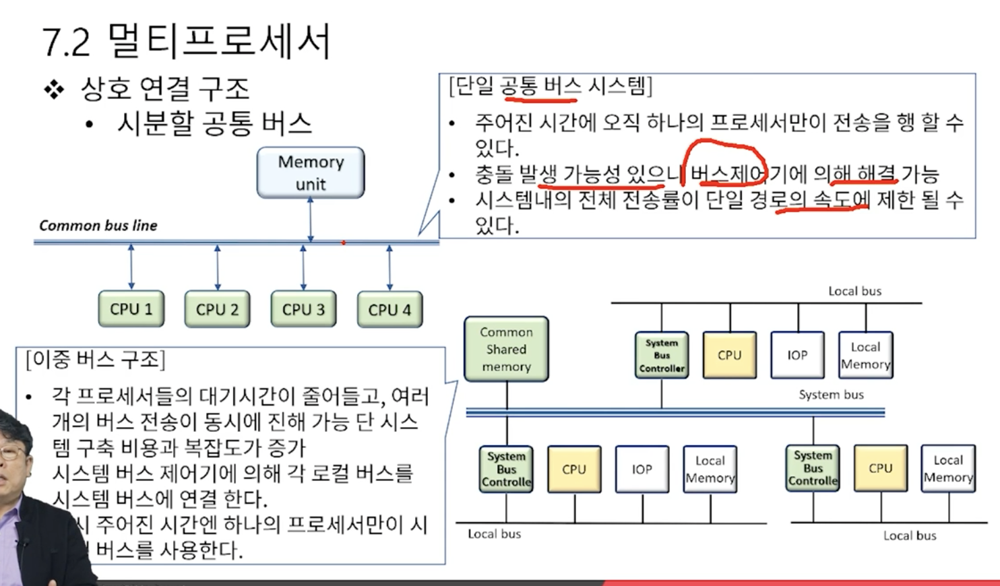
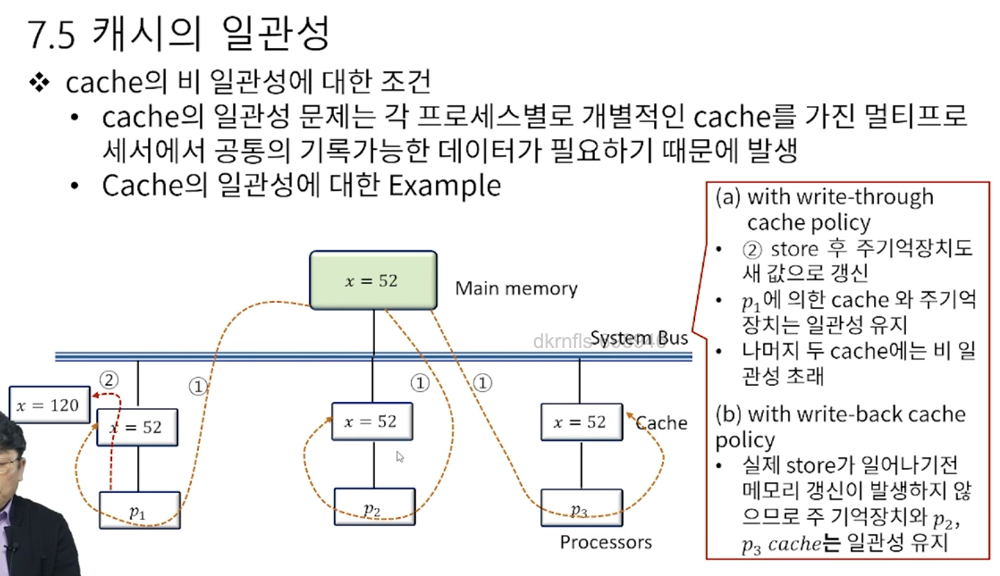

# 7. 병렬 컴퓨터 구조와 성능 분석

### 병렬 처리
* Serial Process system
  * cpu가 하나 뿐인 시스템
  * 기계적, 논리적 프로세싱으로는 가장 효율적이다
* Parallel Process system
  * 동시에 여러 명령을 수행 할 수 있는 병렬처리 시스템
  * 병렬처리 시스템이 가능한 시스템을 병렬 구조라 한다.
  - 다중 장치 구조
    - 다수의 CPU로 동시에 여러 개의 작업을 병렬로 처리 할 수 있는 시스템
    - 공간적 병렬성
  - 파이프라인 구조(일을 쪼개서 cpu의 쉬는 시간을 최소한으로 해서 작업하게 하는 구조)
    - 다수의 작업을 각기 다른 실행 단계에서(세그먼트) 병렬로 처리 할 수 있도록 지원되는 구조
    - 시간적 병렬성

### 멀티프로세서
* 멀티 프로세서의 특징
  * 메모리와 I/O 장치를 공유하는 두 개 이상의 CPU를 갖는 시스템
  * 하나의 운영체제에 의해 프로세서와 시스템의 다른 요소들 사이의 상호 동작이 제어, 동일한 문제의 해결을 위해 모든 요소들이 협력한다.
  * 멀티 프로세서의 동작 원리(시스템의 신뢰성 향상)
    - 다수의 독립적인 작업들이 병렬적으로 처리 될 수 있다.
    - 하나의 작업이 여러 부분으로 나뉘어 각각이 병렬적으로 처리 될 수 있다.
  * 사용자가 명시적으로 병렬 실행이 가능한 작업을 선언
  * 멀티프로세서의 분류
    - 공유 메모리
    - Distributed memory
    - Loosely coupled

  

## 시스템 성능 분석과 개선

**시스템의 중복사용, 중재가 가장 중요한 사항이고 이걸 시스템 적으로, 하드웨어 적으로 어떻게 풀것 이냐가 가장 관건**

### 프로세서간 중재
* 시스템 버스 vs 로컬 버스
  * 컴퓨터 시스템에는 각 요소들 사이의 정보 전송을 위한 다양한 단계의 여러 버스가 존재, cpu내에서도 레지스터와 ALU사이의 정보 전송을 위한 여러 내부 버스가 존재
  * **시스템 버스** -> CPU, IOP(I/O Processor), Memory와 같은 주요 요소를 연결하는 연결 체계
  * **로컬 버스** -> 메모리 버스(데이터, 주소 그리고 읽기/쓰기 정보 전송), I/O 버스(입출력 장치로 정보 전송), 통신 전용버스(특정 포트 정보, 해당 프로토콜 정보 등을 송/수신) 
  * **공유 메모리 멀티프로세서 시스템**에서 각 자원의 효율적 분배와 상호 충돌을 배재할 수 있는 중재 프로세스는 전체 시스템 성능 향상에 무조건 필요

### 프로세서간 통신과 동기화
* 프로세서간 통신
  * 멀티 프로세서 시스템에 있는 다양한 프로세서들은 공통의 입출력 채널을 통하여 서로 통신
  * 공통 메모리의 역할
    * 메모리의 일부를 모든 프로세서가 접근 할 수 있도록 할당한 공간(커널 영역)
    * 프로세서들 사이에서 오가는 메시지의 집중지 역할을 함
    * 인터럽트 신호를 통하여 송신 프로세서 -> 수신 프로세서
  * 멀티 프로세서를 위한 운영체제의 종류
    - 주종 모드
      - 주 프로세서 <- 종 프로세서는 필요에 의한 인터럽트 요청
    - 분리 운영체제
      - 모든 프로세서가 자신의 운영체제를 가지고 운영됨
    - 분산 운영체제
      - 운영체제가 여러 프로세서에 분산되어 있는 형태
  * 프로세서 간 동기화
    * 프로세서와의 통신과 동기화를 구현하는 기본 명령어가 포함됨
    * 동기화의 필요성
      * 처리될 작업들간 정확한 순서를 유지
      * 기록가능한 변수에 대한 상호배제(mutual exclusive)적 접근 보장
    * 자원의 동기화를 위해 가장 많이 활용되는 기법은 하드웨어적 접근 방법인 이진 세마포(semaphore)를 이용하는 방법

### 캐시의 일관성
* Cache관련 정책
  * Cache의 일관성
    - 각 프로세서는 로컬 메모리(일부 or 전부 cache)를 운영한다.
    - 이상의 경우 여러 개의 동일한 내용이 주기억장치나 각 로컬 메모리에 복사본으로 중복되어 저장되는 경우가 발생할 수 있고 정확한 메모리 동작을 위해 이 내용들이 모두 동일하게 유지 되어야 한다는 정책
  * 메모리에 쓰기 동작 시 메모리 갱신 정책
    - write-through 정책
      * 쓰기동작의 발생 시 cache와 주 기억 장치 모두를 갱신
    - write-back 정책
      * Cache만 갱신하고 다음에 메모리로 전달 할 수 있도록 위치를 표시

cache 메모리는 일반적으로 sram
우리가 아는 Ram과 같은 메모리는 일반적으로 dram