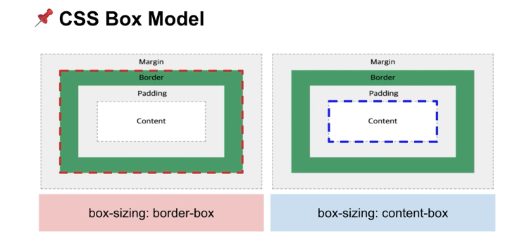
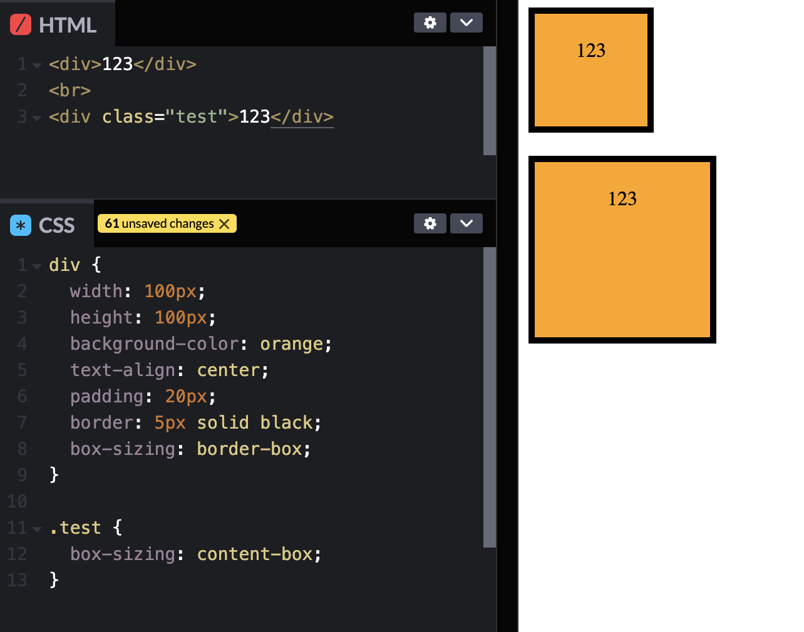
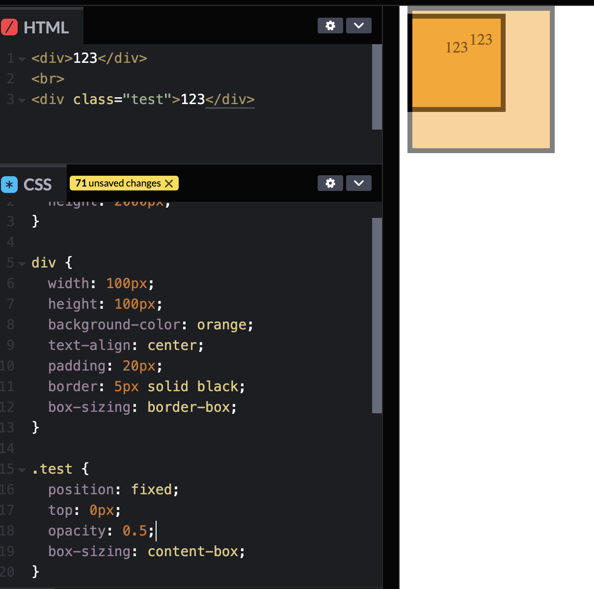
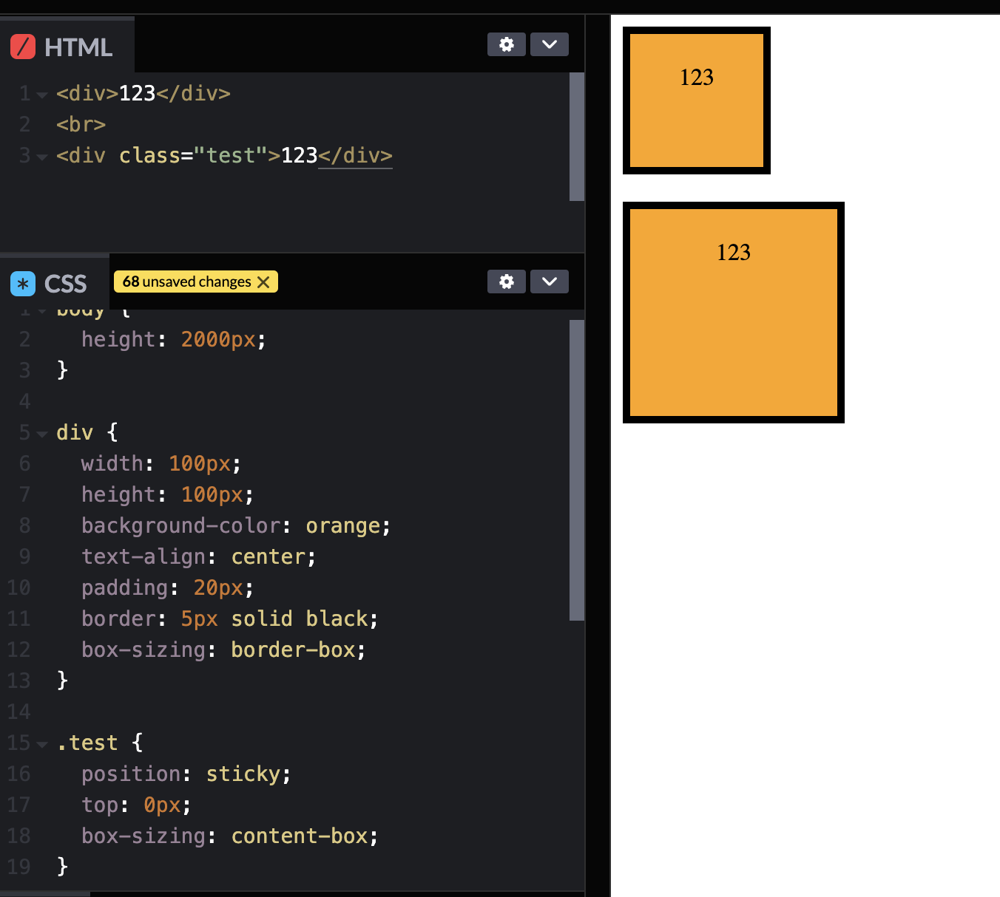
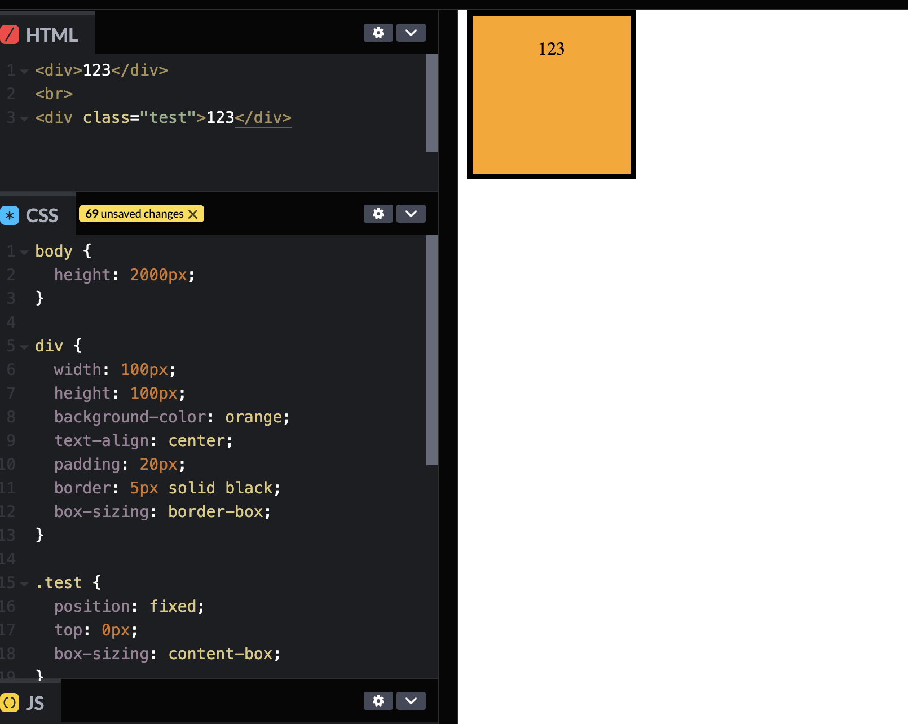

# 핵심 CSS

box-sizing을 border-box로 주는것은 필수!!   
주지 않으면 padding, border들의 속성을 변경할때마다 width를 매번 계산해주어야 하니까!!   

position: fixed면 보이는 화면에서 위치가 정의된다.
position: sticky면 스크롤시에 top으로 지정한 위치에 들어간다.

### 가상 클래스 선택자
:checked, :focus, :focus-visible, :hover, :active, :disabled, :not()

### 가상 요소 선택자
::before, ::after, ::placeholder

