# 데이터 링크 계층 과 스위치

### 데이터 링크 계층이란 
* OSI 2계층, 네트워크 노드끼리 데이터를 전송하는 기능, 절차 제공
* 물리 계층에서 발생할 수 있는 오류를 감지, 수정
* 대표적 프로토콜 : 이더넷
* 장비: 스위치

#### 2개의 부계층으로 구성
* MAC(Media Access Control) + LLC(Logical Link control)
* MAC => 물리적인 부분, 매체 간의 연결방식 제어, 1계층과 연결
* LLC => 논리적인 부분, Frame 생성, 3계층과 연결

* MAC 주소 : 고유번호이다, 회사의 번호와 회사내에서의 식별번호로 구성
* Framing :
  * 데이터그램을 캡슐화 화여 프레임 단위로 만듬, 헤더, 트레일러 추가
  * 헤더 : 목적지, 출발지 주소, 데이터 내용
  * 트레일러: 비트 에러 감지

* 회선 제어
  * 신호간의 충돌 발생하지 않게 제어

* 흐름제어
  * 송신자와 수신자의 데이터 처리 속도 차이를 해결하기 위한 제어
  * Sliding window
    * ack 응답 없이 여러 개의 프레임이 연속으로 전송 가능
    * Window size는 전송과 수신측의 데이터가 저장되는 버퍼 크기

* 오류 제어
  * 전송중에 오류나 손실 발생 시 수신측은 에러를 탐지 및 재전송

[https://mintnlatte.tistory.com/356]
### 이더넷 프레임 구조
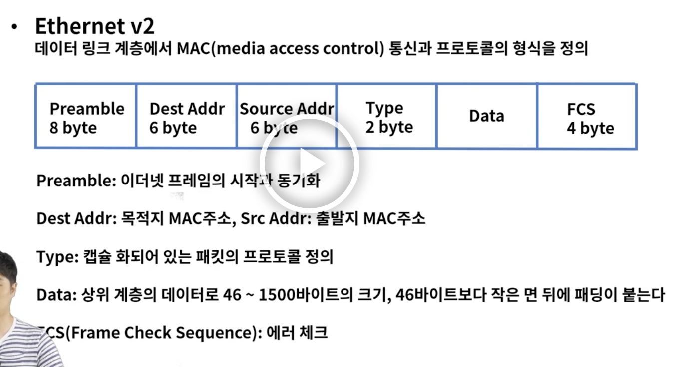

### L2 스위치
* Mac주소 기반 통신
* 허브의 단점을 보완 
  * (half duplex -> full duplex) => 무전기에서 전화기로 변경된 느낌
* 라우팅 기능이 있는 스위치를 L3 스위치라고 부른다

* 동작 방식
  - 목적지 주소를 MAC 주소 테이블에서 확인하여 연결된 포트로 프레임 전달

  1. Learning
    - 출발지 주소가 MAC 주소 테이블에 없으면 해당 주소를 저장
  2. Flooding - Broadcasting
    - 목적지 주소가 MAC 주소 테이블에 없으면 전체 포트로 전달
  3. Forwarding
    - 목적지 주소가 MAC 주소 테이블에 있으면 해당 포트로 전달
  4. Filtering - Collision Domain
    - 출발지 주소랑 목적지 주소가 같으면 전달하지 않음
  5. Aging
    - MAC 주소 테이블의 각 주소는 일정 시간 이후에 삭제

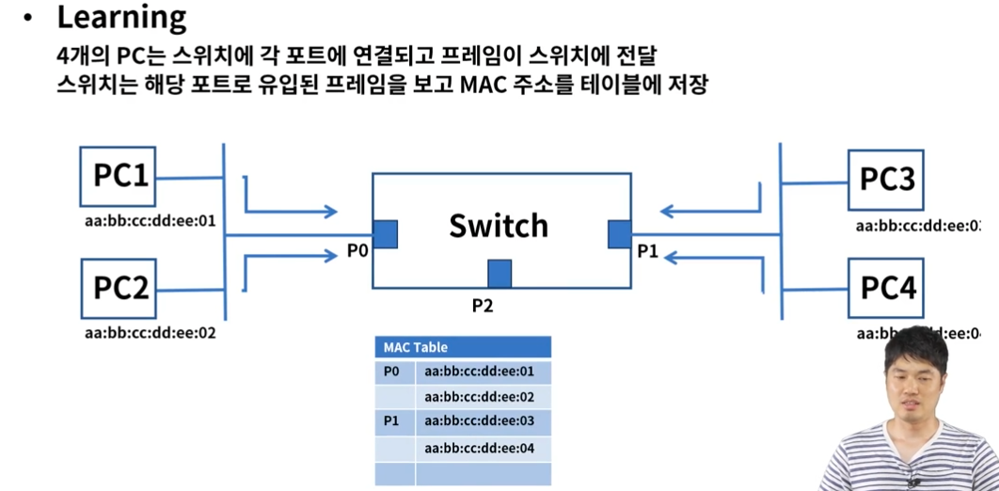
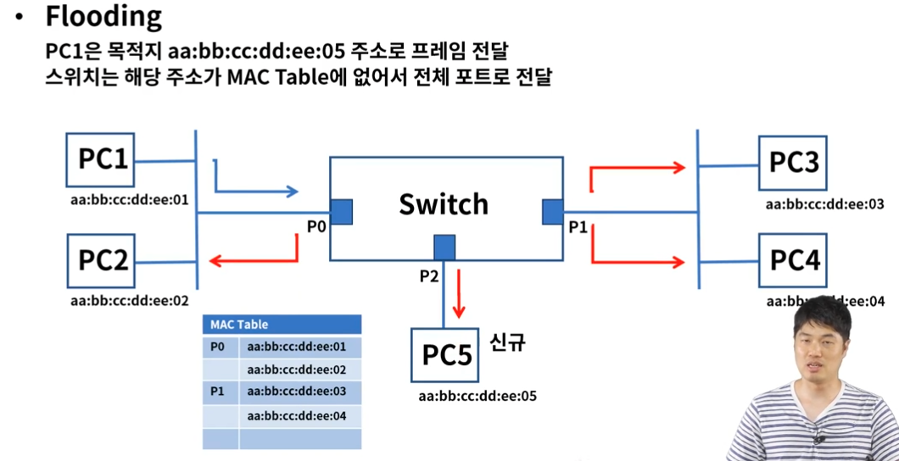
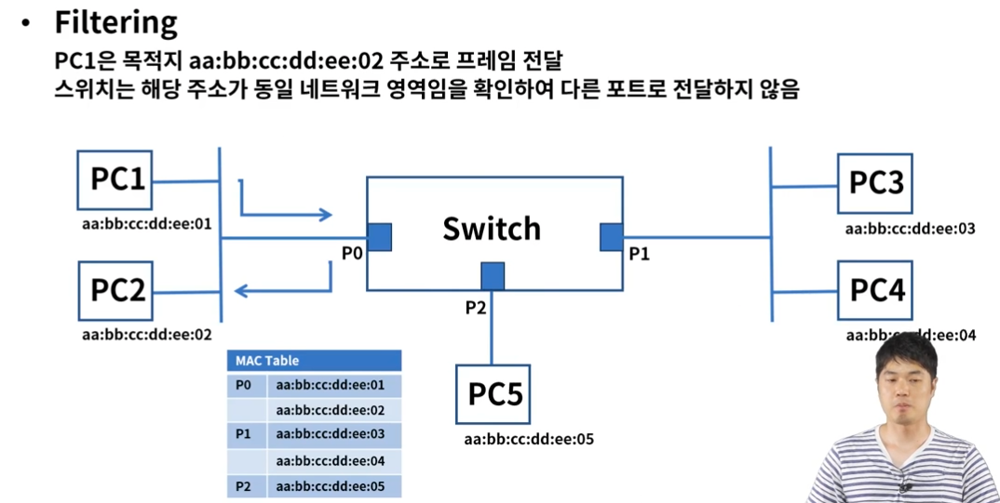

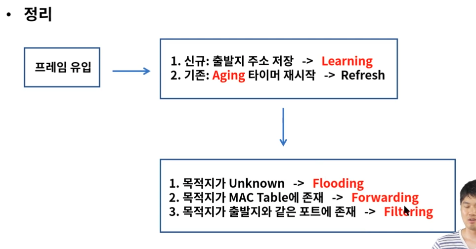

### ARP(Address Resolution Protocol)
* 역할
  * IP주소를 통해서 MAC 주소를 알려주는 프로토콜
  컴퓨터 A가 컴퓨터 B에게 IP통신을 시도하고 통신을 수행하기 위해 목적지 MAC 주소를 알아야 한다.
  목적지 IP에 해당되는 MAC 주소를 알려주는 역할을 ARP가 한다.

pc1이 pc2의 MAC어드레스를 모를때 ARP 프로토콜을 이용해서 PC2의 MAC 주소를 알아내는것

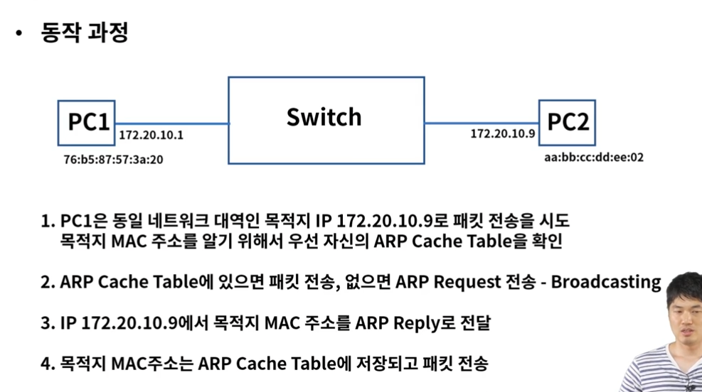

### Looping
* 같은 네트워크 대역 에서 스위치에 연결된 경로가 2개 이상인 경우에 발생
PC가 브로드캐스팅 패킷을 스위치들에게 전달하고 전달받은 스위치들은 다시 Flooding을 한다.
스위치들끼리 Flooding된 프레임을 서로 계속 전달하여 네트워크에 문제를 일으킨다.
- 회선 및 스위치 이중화 등으로 인하여 발생
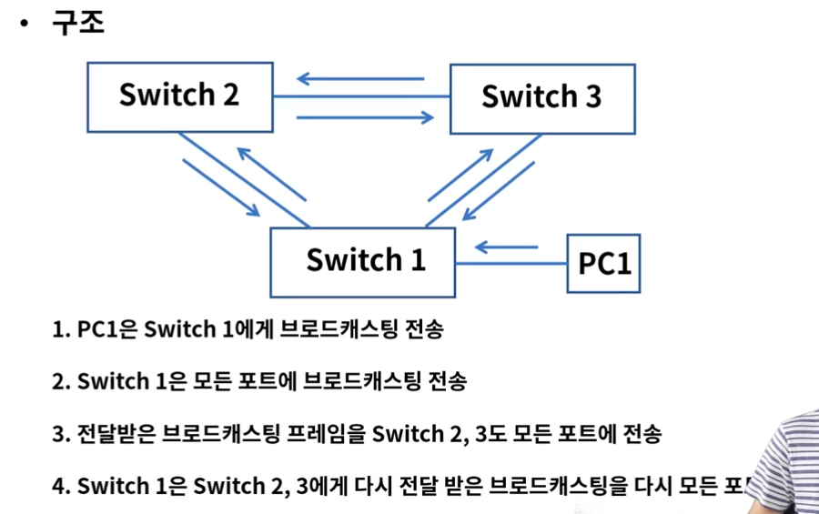

### STP(Spanning Tree Protocol)
* looping을 해결해보자!

두 가지 개념
1. BridgeID
   - 스위치의 우선순위를 정해둠, 낮을수록 우선순위 높음
2. Path Cost
   - 링크의 속도(대역폭), 1000/링크 속도로 계산되며 낮을 수록 우선순위가 높다

* 요소
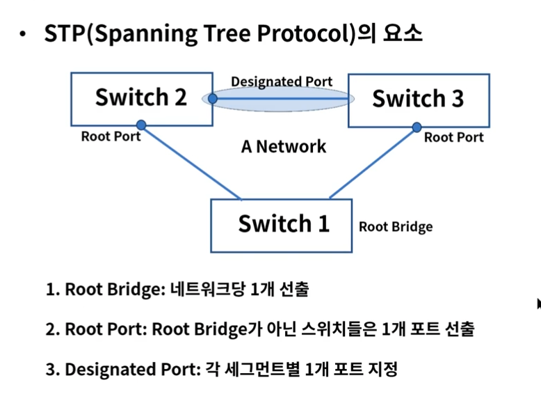

### RSTP & MSP
* RSTP(Rapid Spanning Tree Protocol) -> STP 빨라진것
* MSP(Multiple Spanning Tree) -> 여러개의 STP 그룹들을 묶어서 효율적으로 관리

### VLAN(Virtual Local Area Network)
* 물리적 구성이 아닌 논리적인 가상의 LAN을 구성하는 기술
* 불필요한 데이터 차단: 호스트의 물리적인 이동 없이 LAN 그룹 변경이 가능
* 비용 절감 : 새로운 LAN 추가시 물리적 스위치 구매 필요 없음

=> 스위치 내부에 가상 범위를 만들어서 하나의 스위치로 여러개 처럼 동작하게 하는 기술 인듯

* 종류
1. Port 기반 VLAN
=> 여러개의 VLAN을 설정하고 각각의 LAN에 물리적인 포트를 지정
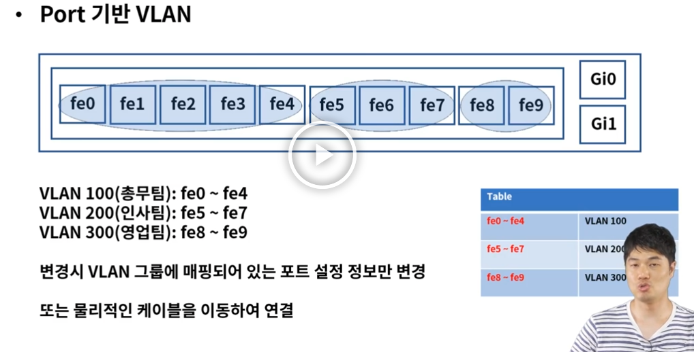

2. MAC 주소 기반 VLAN
=> 각 호스트, 네트워크 장비의 MAC 주소를 각각의 VLAN에 정의
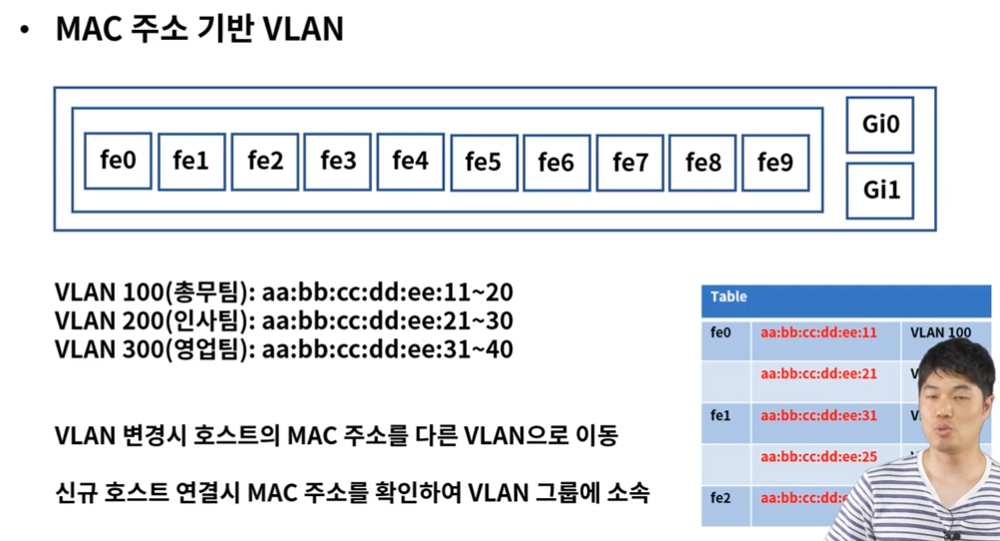

3. IP 주소 기반 VLAN
=> IP주소 서브넷 기반으로 VLAN을 나누는 방법
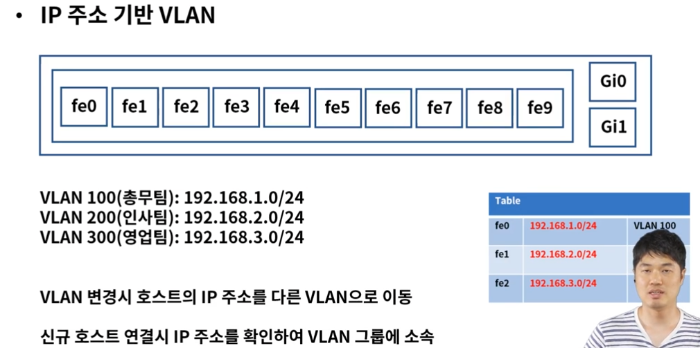

### Trunk
* 물리적 스위치간 VLAN 연결 시 하나의 물리적 연결로 VLAN 그룹들 공유
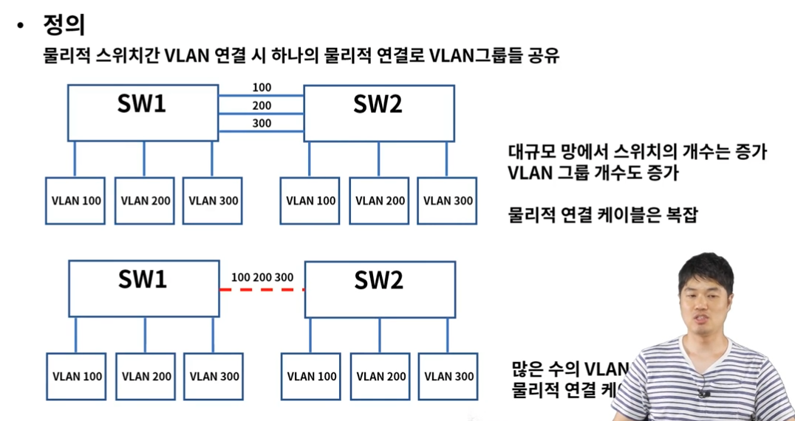

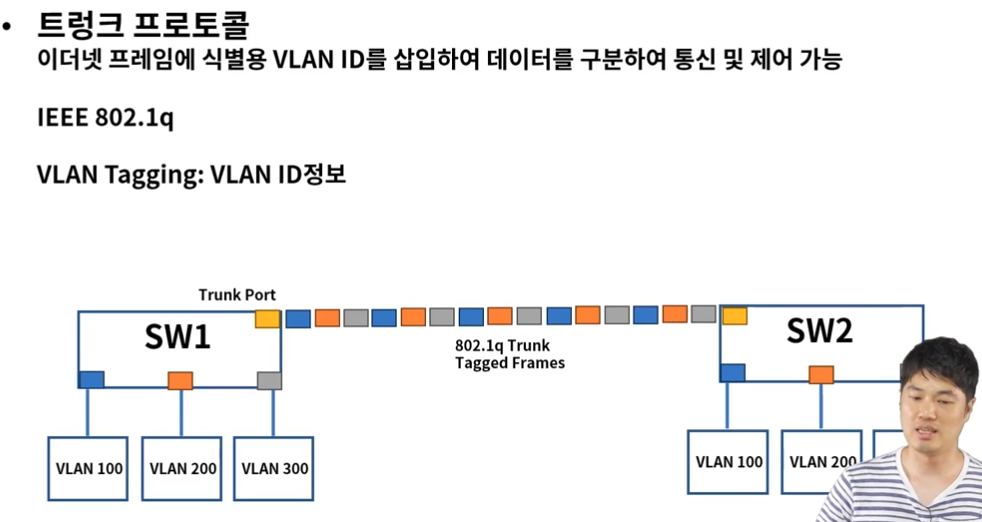
=> 태깅된 정보들로 구분을 해서 조지네, debounce에서 id값 있는지 판단하는것과 같은건가

### VLAN 구성