# 동적 라우팅

### 라우팅 프로토콜
=> 정적, 동적으로 구분

정적 라우팅 : 경로 정보를 라우터에 미리 저장, 패킷 전송
동적 라우팅 : 경로 정보가 네트워크 상황에 따라 더 빠른 경로로 변경되어 패킷 전송

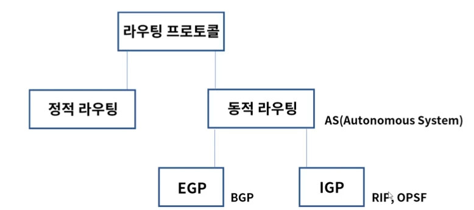

### 라우팅 알고리즘
* 목적지 까지의 최적 경로 계산, 라우팅 테이블 업데이트
* 동적으로 라우팅 테이블을 유지 및 관리하는 알고리즘

Distance Vector
* 분산 업데이트
* 각 라우터들에 의해 최소 비용 경로 계산 -> 인접 노드와 교환
* 소규모 네트워크
* 주기적, 비동기 방식

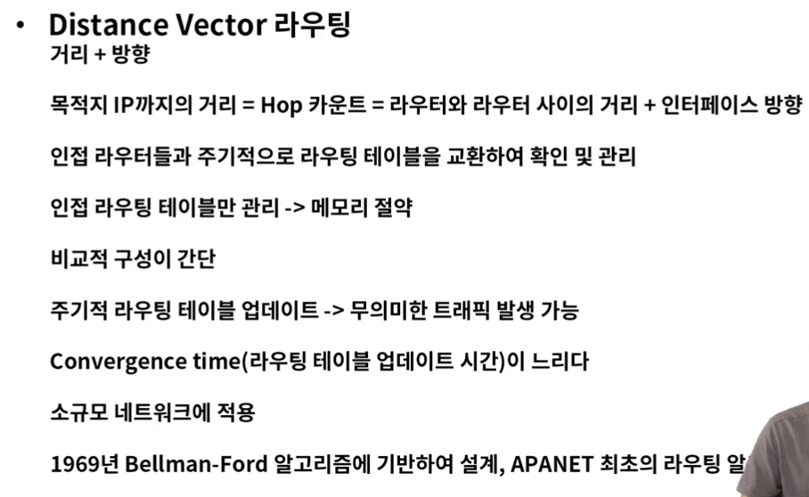

* Bellman-Ford 알고리즘 
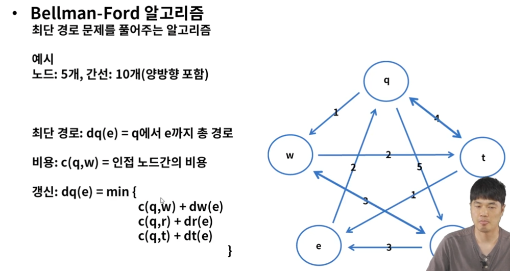

Link State
* 중앙 집중형 업데이트
* 네트워크 전체 정보 가지고 최소 비용 경로 계산
* 대규모 네트워크에 적합
* 이벤트 기반 라우팅 테이블 관리

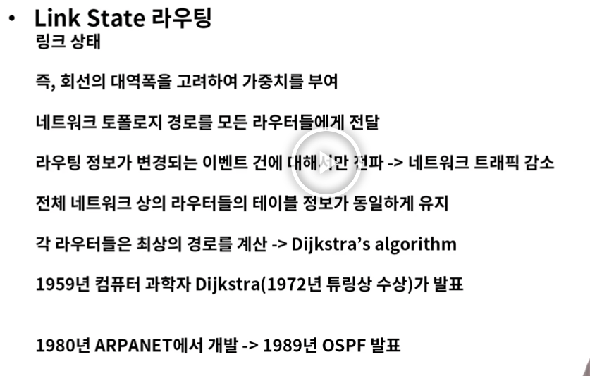

* Dijkstra 알고리즘

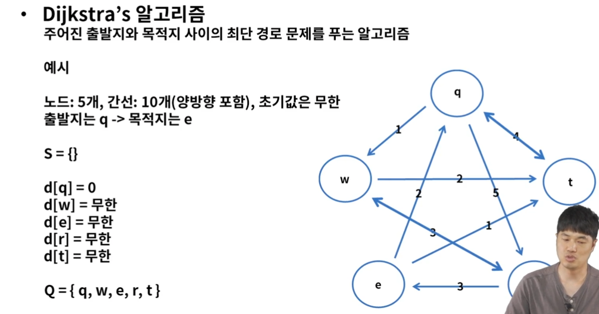

### 동적 라우팅 구분
AS(Autonomous System)에 따라 구분 => 성격이 같은 클러스터 집단이라고 생각하면 될듯   
IGP(Interior Gateway Protocol) -> AS 내에서 동작하는 라우팅 프로토콜 (RIP, OSPF)    
EGP(Exterior Gateway Protocol) -> AS 와 AS간의 라우팅 프로토콜 (BGP)

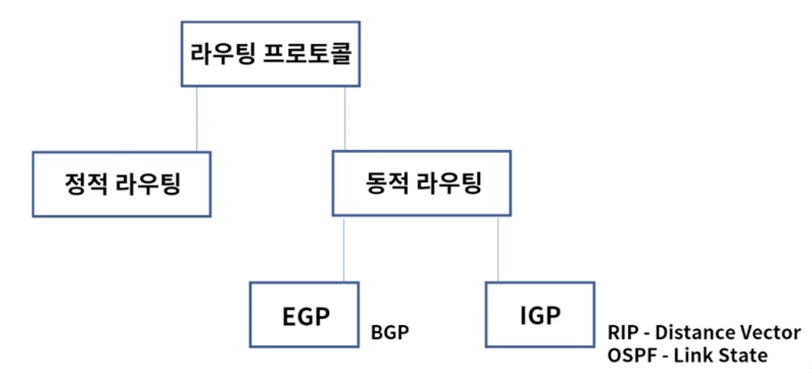

### EGP - BGP(Border Gateway Protocol)
* 현재 인터넷에서 쓰이는 가장 대표적인 EGP 라우팅 프로토콜
* ISP to ISP 연결간 사용
* 경로 벡터 라우팅 프로토콜을 사용 - 루핑 방지
* 변경 또는 추가 된 부분만 업데이트
* 빠른 속도 보다는 조직 또는 단체간 맺어진 정책에 의거하여 최적 경로 결정

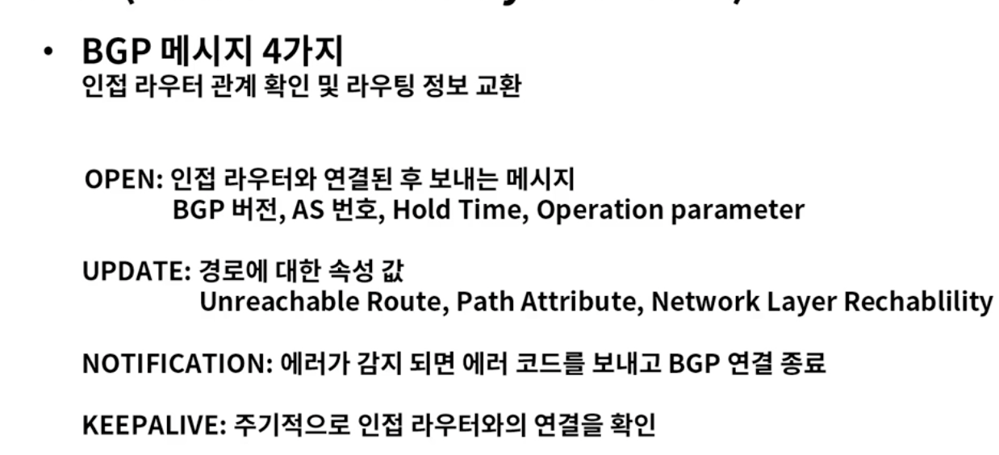
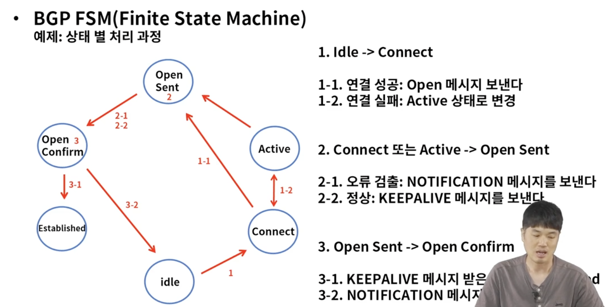

### IGP - RIP(Routing Information Protocol)
* Distance Vector 기반의 IGP용 라우팅 프로토콜
* 속도가 아닌 거리(라우터의 홉)기반 경로 선택
* 주기적으로 전체 라우팅 테이블 업데이트 - 30초
* 최대 홉 카운트는 15
* 구성 간단, 적은 메모리 사용, 소규모 네트워크에서 사용

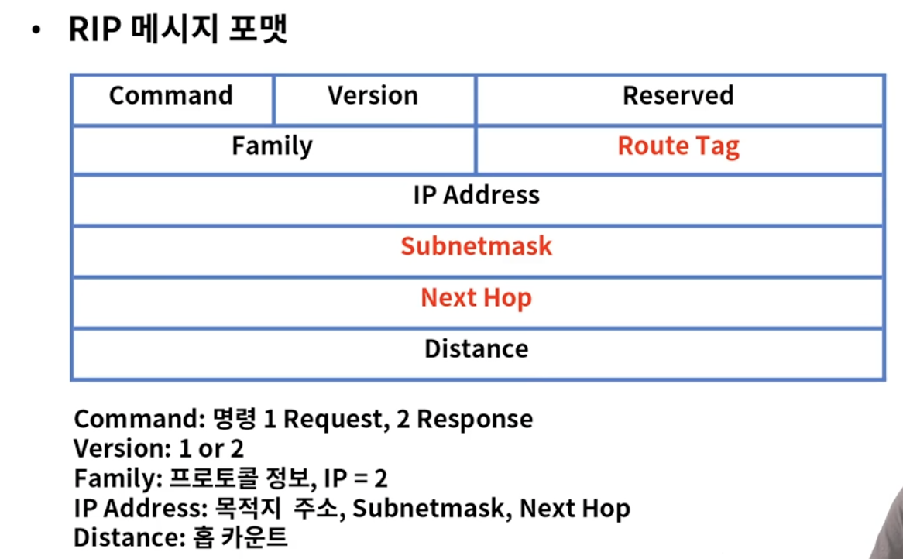
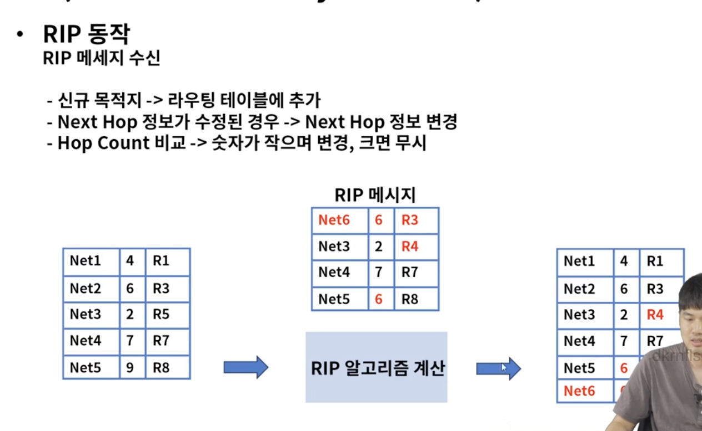

### IGP - OSPF(Open Shortest Path First)
* 링크 스테이트 알고리즘을 사용하는 IGP용 라우팅 프로토콜
* 홉 카운트의 제한이 없음
* 변경된 정보만 전파, 적은 양의 라우팅 트래픽 유발

Backbone Router: As내에 여러 Area를 모두 연결, OSPF 도메인 내에서 모든 링크 상태 정보 연결
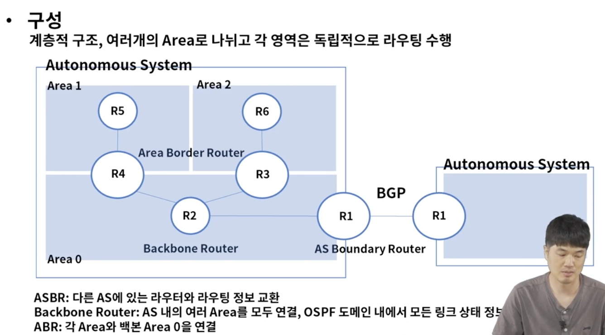
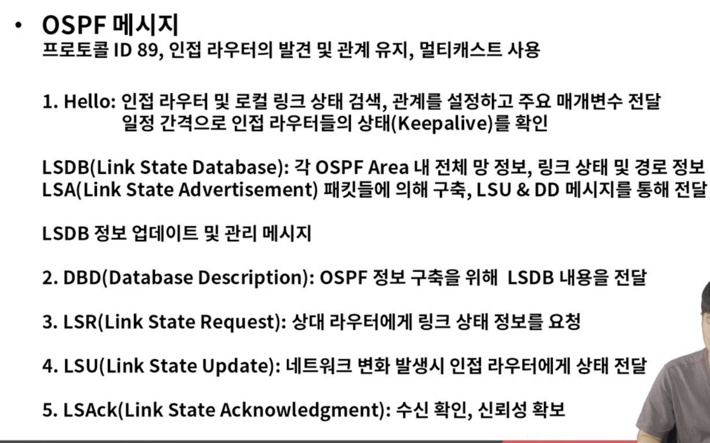
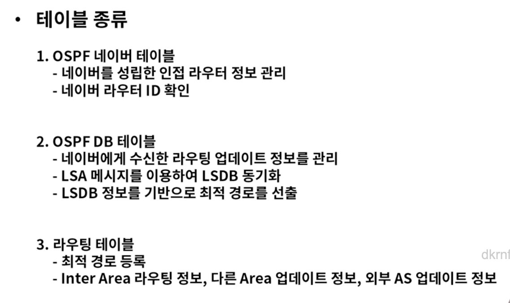
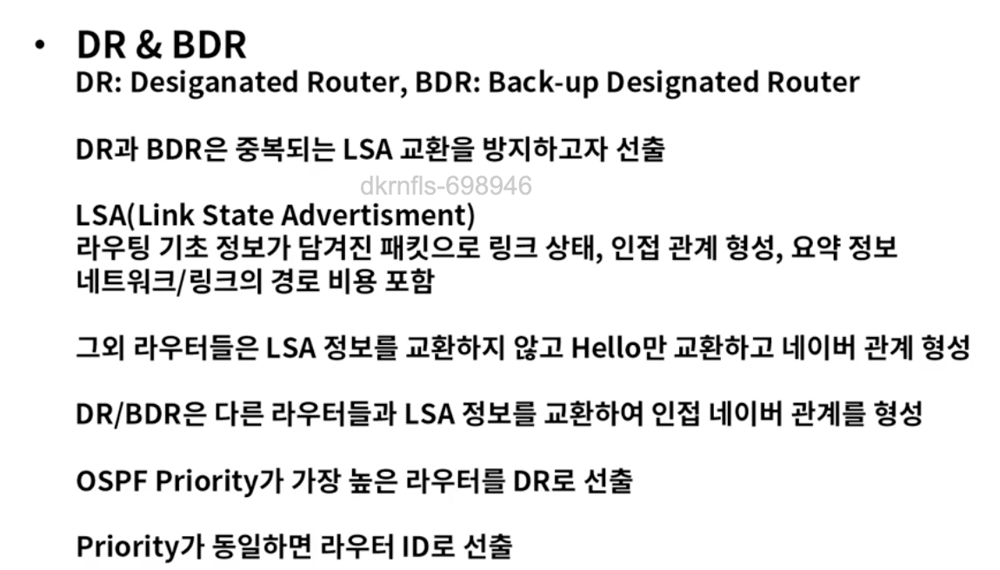

