# TCP && UDP

### Transport 계층
* End to End 서비스, 커넥션(연결)을 관리
* TCP & UDP, 소켓을 통한 프로세스별 통신

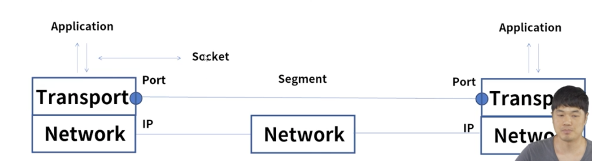

* Port 
=> 전송 계층에서 사용, 특정 프로세스를 구분하는 단위
0 ~ 65535
0 ~ 1023 : well-known port(보통 사용 안함)
1024 ~ 49151:registered port 

웹 TCP 80, FTP TCP 21
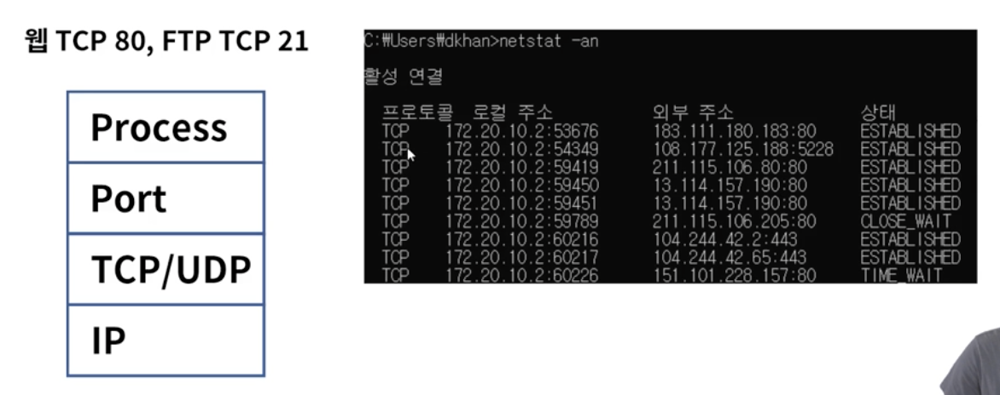

### TCP(Transmission Control Protocol)
* 정의 
=> 인터넷을 구성하는 핵심 프로토콜
신뢰성 기반, 데이터를 에러없이 전송, 1:1 통신
연결지향, connection-oriented, 패킷의 상태 정보를 확인하고 유지
에러 발생시 재전송 요청, 에러 복구 
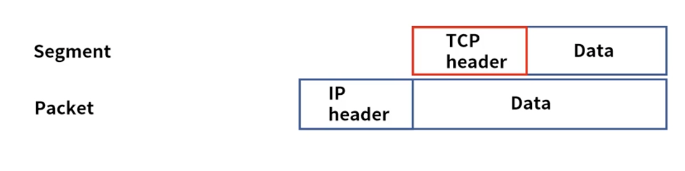

```
4계층 세그먼트 => TCP header + data
3계층 패킷 => Ip header + data
2계층 데이터 프레임 => header + data + trailer
```
* 헤더 포맷
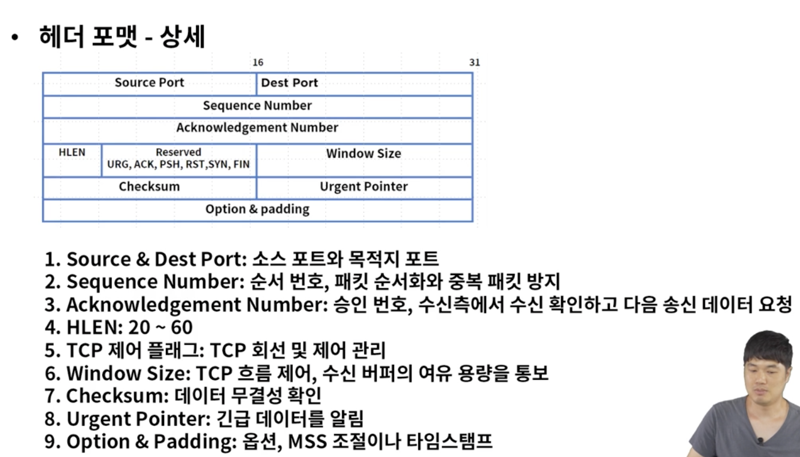
HLEN => 최소 20바이트에서 최대 60바이트 의미

* TCP 제어 플래그
=> 6가지로 구성 활성화 되는 비트 '1'로 표현
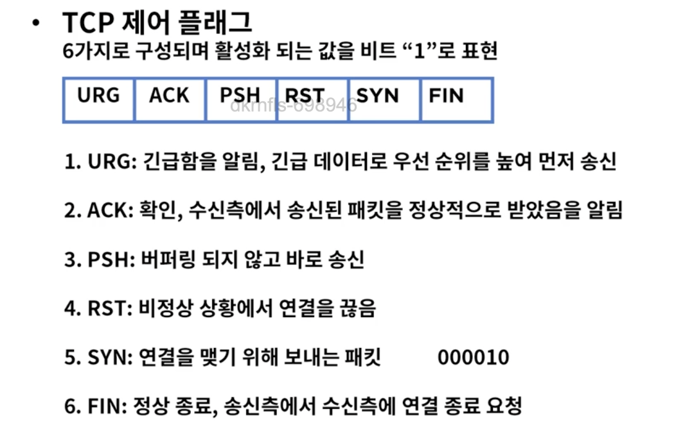

### UDP(User Datagram Protocol)
* 신뢰성이 낮음, 데이터 전송이 빠름
* 송신측은 데이터를 보내고 확인 안함, 1:n 통신
* connectionless, 재전송 불가, 실시간 데이터 전송(동영상, 스트리밍 등등)
* 스트리밍 서비스의 경우 재전송 보다는 실시간 데이터 전송이 중요

```
segment   UDP header + data
packet    IP header + data
```

* 헤더 포맷
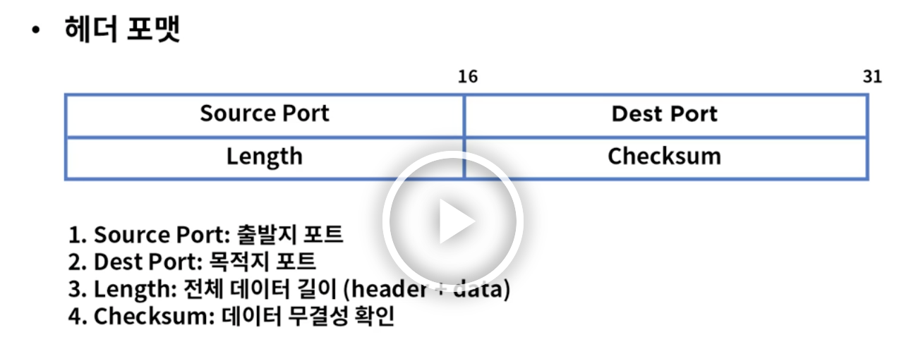

* TCP & UDP
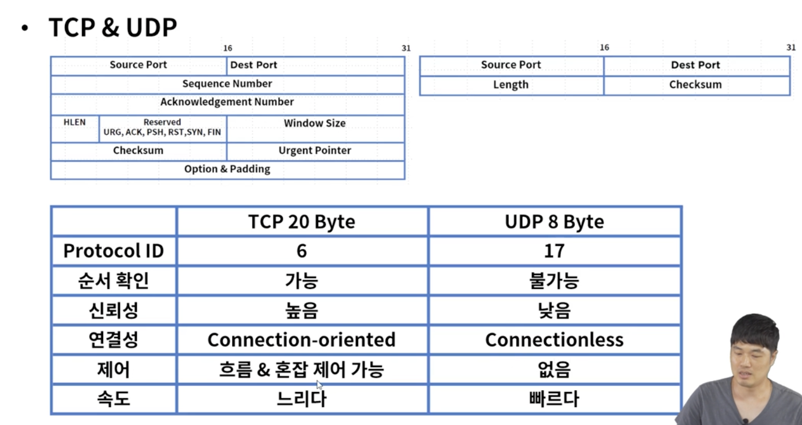

### TCP 통신 과정 
* 3 way handshake
TCP는 연결지향, 두 호스트가 통신하기 전에 연결을 위한 관계를 수립
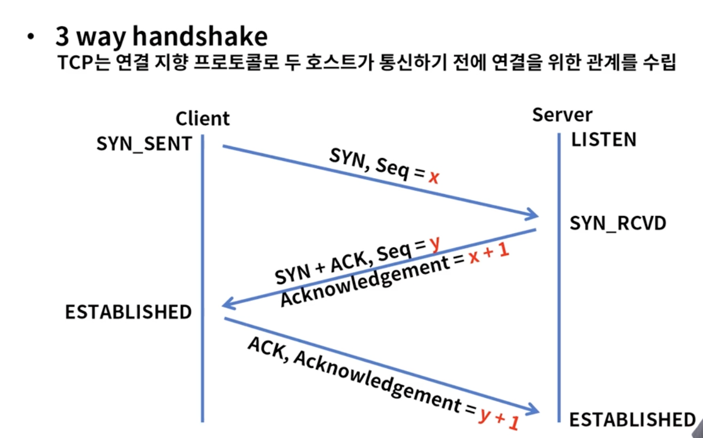

* 4 way handshake
연결을 종료
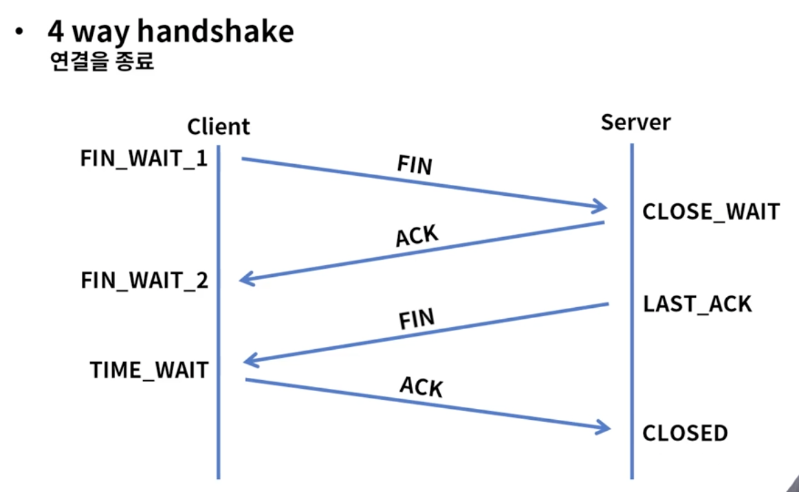
연결을 끊는 주체는 서버이다.

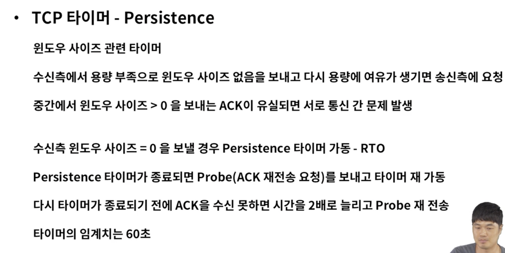
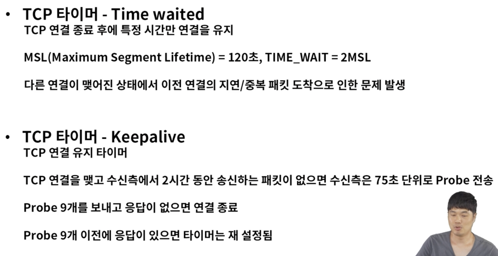

* TCP 타이머는 Retransmission, Persistence, Time waited, Keepalive가 있다.

### 흐름 제어
* 송신과 수신측의 데이터 처리 속도 차이를 해결
* Sliding Window 기법, Window = 데이터 전송을 위한 버퍼
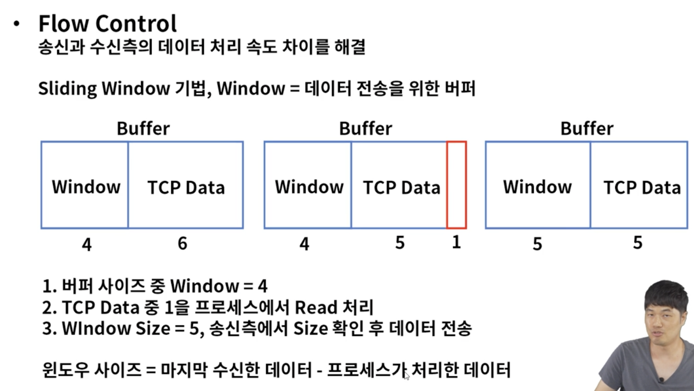

### 혼잡 제어
* 수신측으로 유입되는 트래픽의 양이 정해진 대역폭을 넘어가지 않도록 제어
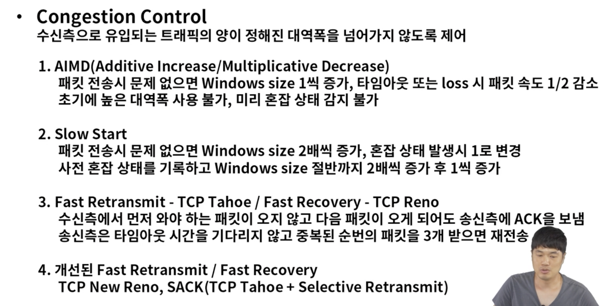

# NAT

### 공인 IP & 사설 IP
* 공인 IP
공인기관에서 인정하는 IP 주소, 인터넷을 통한 외부망에서 식별되고 통신 가능한 IP

* 사설 IP
내부망에서 사용 및 식별 가능한 IP, IPv4 개수의 한계


LAN에서 사용하는 건 사설 IP, WAN에서 사용하는 건 공인 IP

### NAT(Network Address Translation) 개요
* 네트워크 주소 변환
* 사설 IP 네트워크를 인터넷으로 연결 -> 라우팅 가능한 공인 IP로 변환
* 보안 : 내부 IP 주소를 외부에 공개하지 않음
* 유연성 : 공인 IP 대역은 영향을 주지않고 내부 네트워크 구성 변경이 가능, 기존 사용하던 외부 공개된 공인 IP 주소는 변경되지 않으나 내부 IP만 변경
* 비용 : 공인 IP 할당 비용 감소
* L3 이상의 장비 또는 방화벽에서 NAT 가능

### NAT 종류
* Static NAT
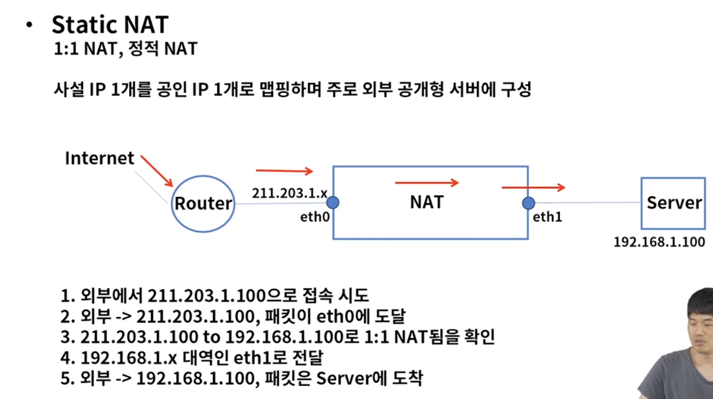

* Dynamic NAT
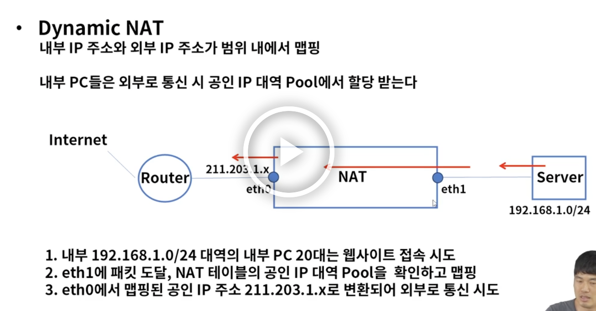

* PAT(Port Address Translation)
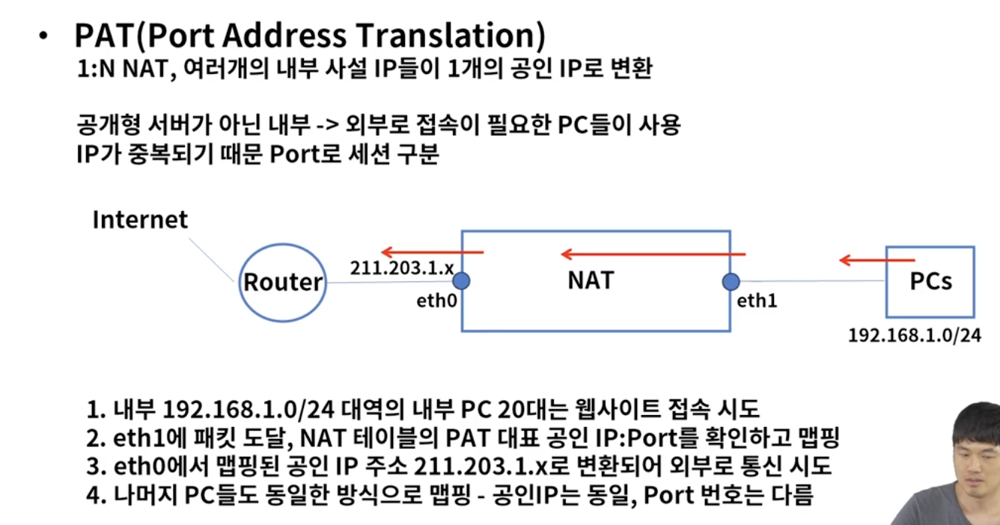

* Port Forwarding
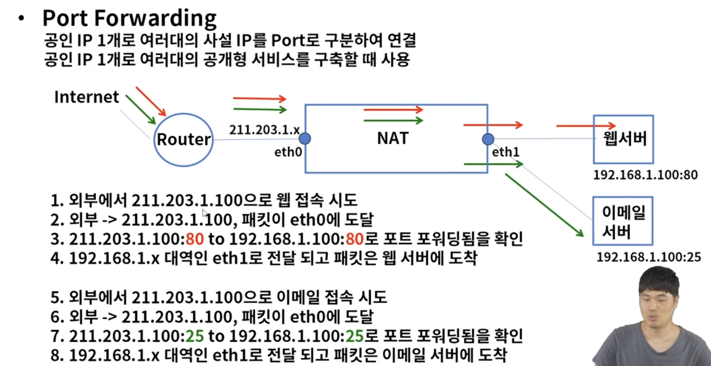


### Hairpin NAT
* NAT 이슈
동일 사설 네트워크 내 공인 IP로 목적지 서버에 접속 하는 경우
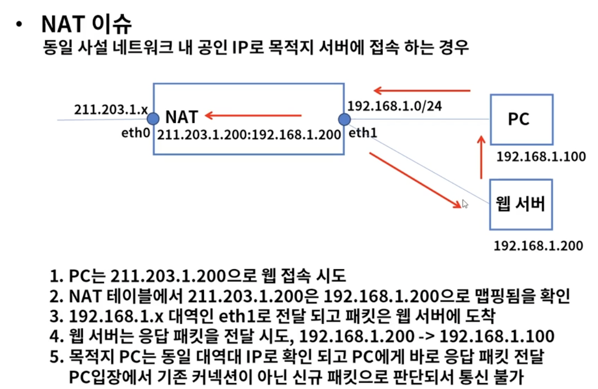

위의 이슈를 해결하는게 Hairpin NAT
중간에 NAT에서 목적지 주소를 NAT 테이블로 변경해줌
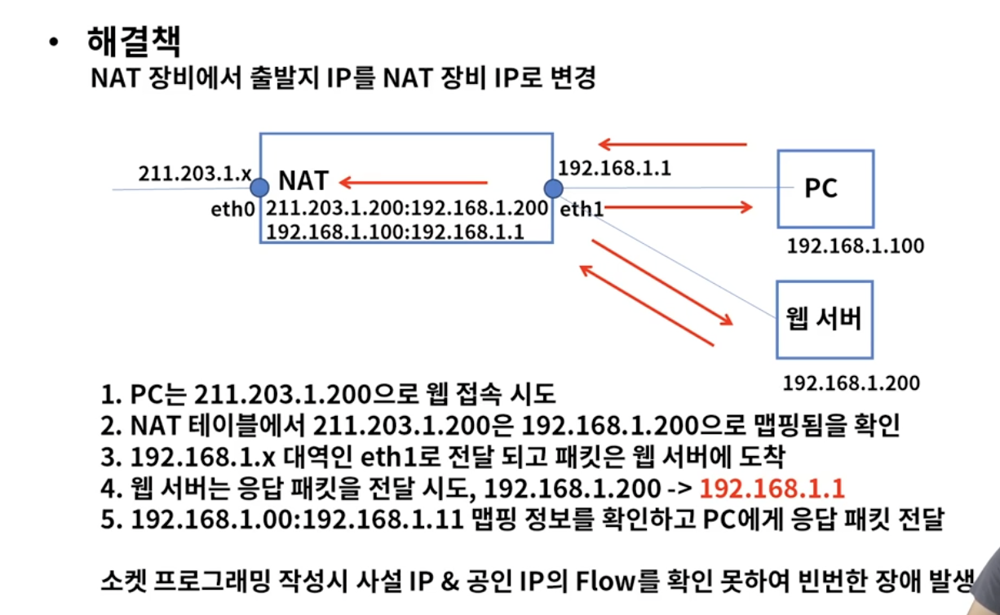

=> 동일 사설 네트워크 내에 목적지 서버를 공인 IP로 접속시(매핑 되어있으므로 사설 네트워크로 요청을 보내버림) 생기는 이슈를 해결하는 방법


### TELNET
* 원격지 호스트 컴퓨터에 접속하기 위해 사용되는 프로토콜
* TCP 23번 사용
* 장비 관리 또는 서버 접속 시 사용 - Shell

* 기능
NVT(Network Virtual Terminals) 지원 : 데이터 변환 가상 장치
협상 가능한 옵션
프로세스와 터미널의 1:1 symmetric 관계

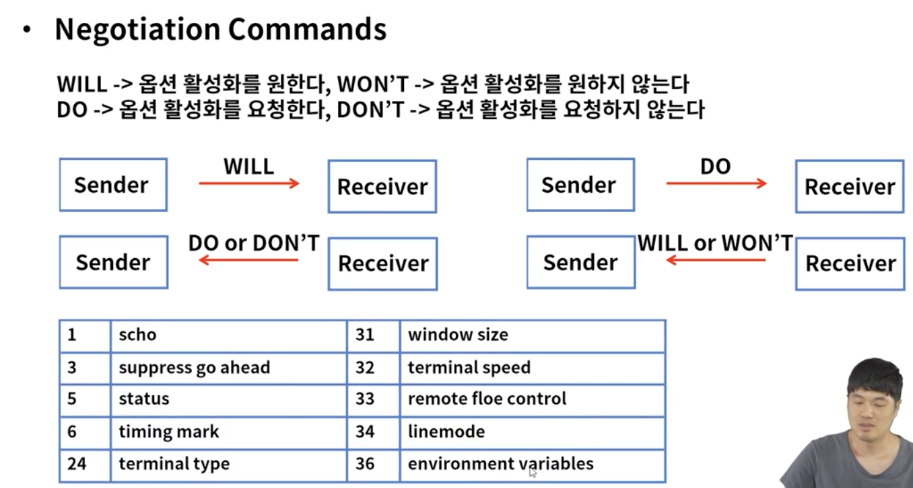

### SSH
* 역할
=> Secure Shell 
원격지에 있는 컴퓨터를 명령어를 통해 제어
강력한 인증 방법 및 암호화 통신을 제공, TCP 22

* 특징
인증: 사용자가 서버 접속시 패스워드 또는 공개키 기반의 인증 방식을 지원
암호화: 대칭키 방식 사용
무결성: 데이터 위변조 방지
압축, 다중화 통신

대칭키: 동일한 키로 암복호화를 동시에 할 수 있는 방식
공개키(공개키 + 개인키) 방식
공개키 암호화 -> 데이터 보안, 서버의 공개키로 데이터를 암호화 -> 서버의 개인키로 복호화
개인키 암호화 -> 인증 보안, 개인키 소유자가 개인키로 암호화를 하고 공개키를 함께 전달 -> 암호화 데이터 + 공개키로 신원 확인 -> 전자서명 방법

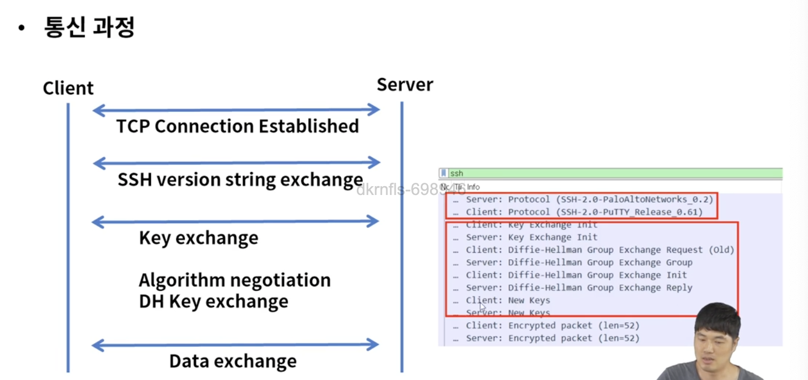

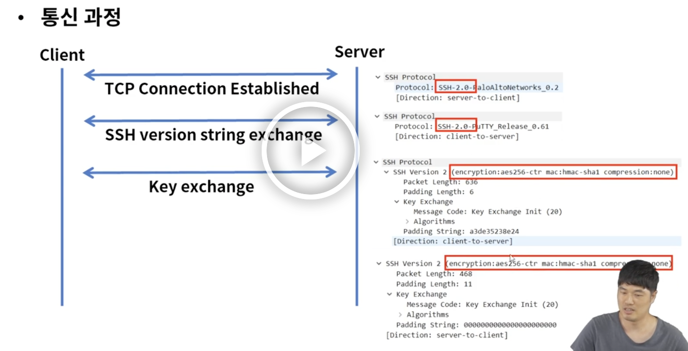
알고리즘 리스트를 가지고 있음, 그 중에서 암호화 알고리즘을 선택

ssh 순서
1. tcp 연결 체크
2. ssh version 체크
3. 키 교환
4. 알고리즘 협상
5. dh 키 교환(diffie-hellman key exchange)
6. 정보 교환

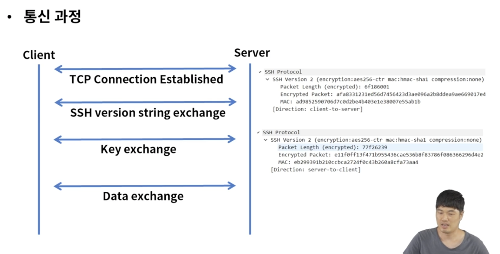
우측에서 패킷이 암호화 되어서 보이는것을 확인할 수 있다.
telnet을 이용하면 plain text로 노출되어버림
