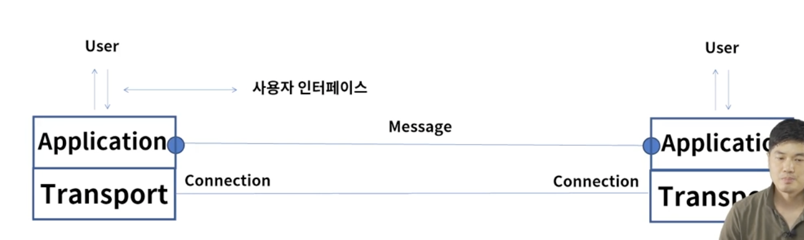
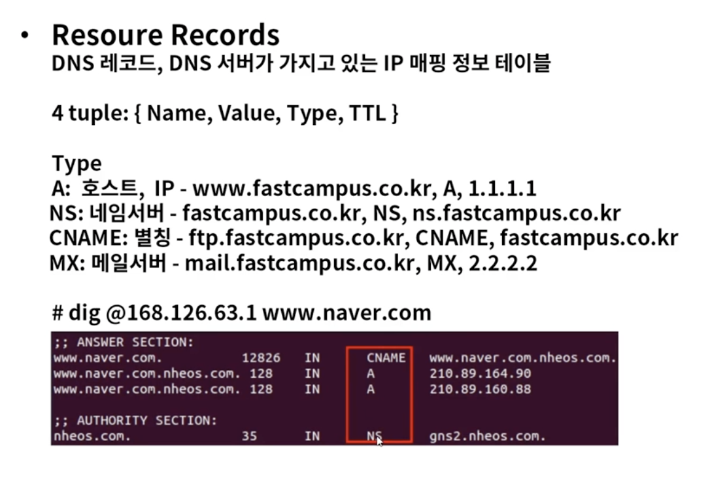
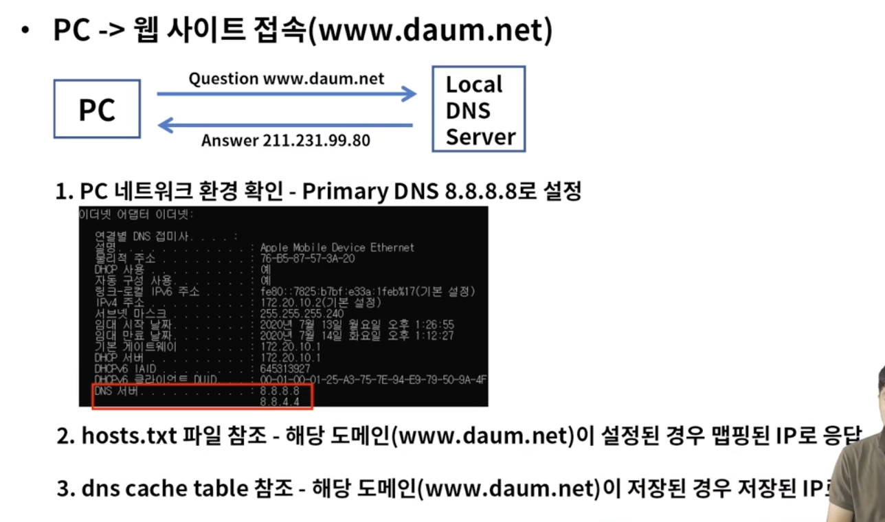
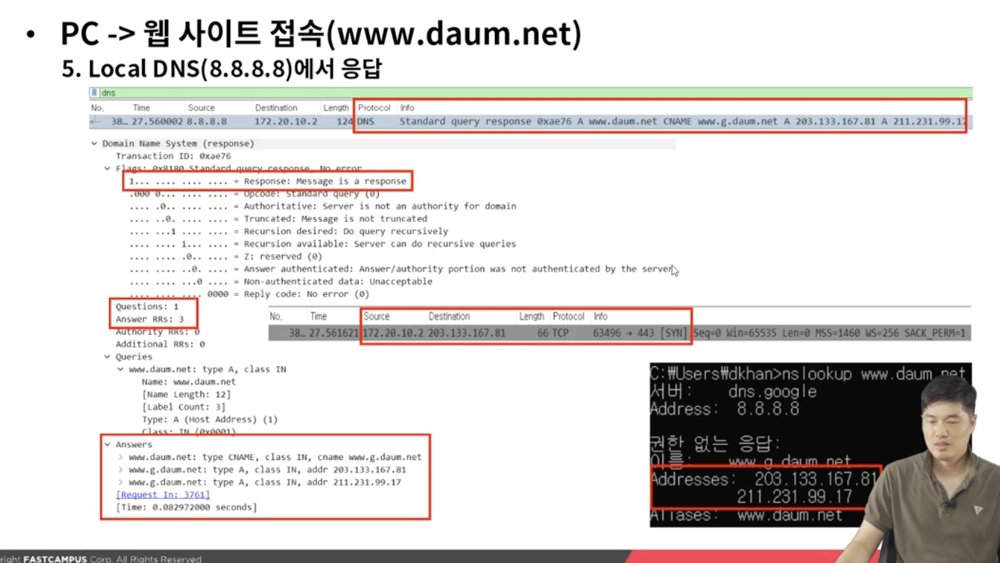
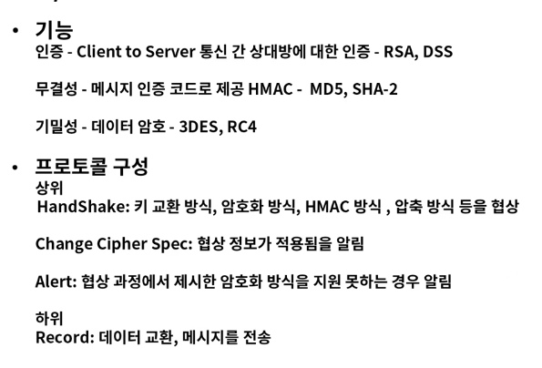
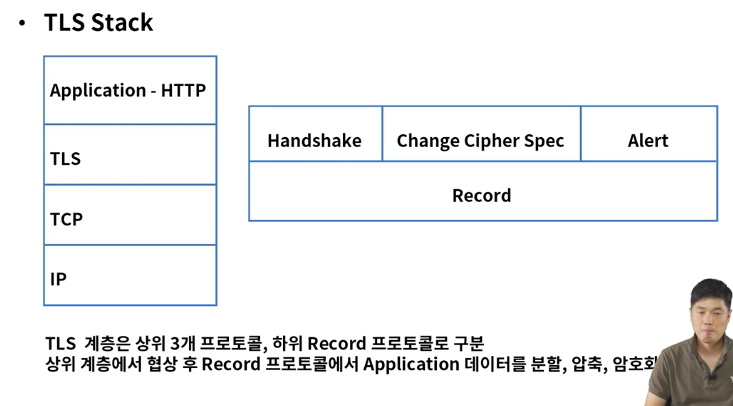
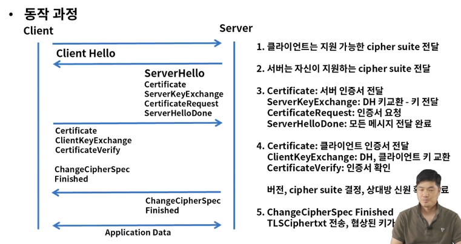

# 애플리케이션 서비스

### 애플리케이션 계층
* 역할
TCP/IP 모델에서 최상위 계층으로 사용자와 가장 가까운 소프트웨어
여러 프로토콜 개체들의 서비스에 대한 사용자 인터페이스 제공
HTTP, DNS, SMTP, SSH, BGP, DHCP 등이 이 범주에 속함

### DNS 개요
호스트 이름을 IP주소로 변환 - port 53
웹 사이트 접속 또는 이메일 전송시 *.google.com 등의 도메인 이름으로 접속

ARP(Address Resolution Protocol) 
=> IP 주소를 통해서 MAC 주소를 알려주는 프로토콜
  컴퓨터 A가 컴퓨터 B에게 IP통신을 시도하고 통신을 수행하기 위해 목적지 MAC 주소를 알아야 한다.
  목적지 IP에 해당되는 MAC 주소를 알려주는 역할을 ARP가 한다.

Host.txt => 호스트 이름과 IP 주소가 맵핑되어 저장된 파일
Local DNS로 쿼리 전에 우선 참조 하는 파일

### DNS 동작 과정

### HTTP의 개요
* URL(Uniform Resource Locator)
=> 웹 페이지를 찾기위한 주소

* HTML
=> 웹 페이지 언어

### HTTP Request
Head(+Start Line), Body로 구성

Start Line
HTTP Method / Request target / HTTP version

Head
Accept: 클라이언트가 허용 가능한 파일 형식
USER-AGENT: 클라이언트의 OS, 브라우저 정보
HOST: 서버의 도메인 네임

503 에러는 : 서버에 부하가 걸려 가용이 안된다는 상황, 서버에는 버퍼가 있어서 응답을 수용하고 대기시킬수 있는데 이게 터졌다는 의미

### HTTP 속성
* Stateless 
=> 통신이 끝나면 상태 정보를 유지 하지 않는다, 서버는 응답을 보내고 접속을 끊어 커넥션 리소스 비용을 줄임
클라이언트가 새로운 페이지를 접속할때마다 서버가 신원을 알수 없다.(로그인 했는데 이후에 요청하면 로그인이 끊겨버리는 상황 같은 경우) => 쿠키랑 세션 등장

### HTTP Cookie
브라우저 로컬에 저장되는 키와 값이 들어 있는 파일
헤더에 담김

세션: 서버에서 세션 ID를 발급하고 이걸 쿠키로 전달 다음 요청부터 세션 ID로 들어옴 (rails devise)

쿠키는 사용자 로컬에 정보 저장 - 유출, 조작 가능
세션은 서버에 정보를 저장(안전) - 인증에 세션을 사용 - 세션 하이재킹

### SSL/TLS
SSL(Secure Socket Layer)/TLS(Transport Layer Security)
=> TCP/IP 네트워크 통신간 보안을 제공하는 프로토콜

HTTPS(HyperText Transfer Protocol Secure) => HTTP over TLS

TLS Stack

### email 개요
smtp(simple mail transfer protocol): 메일 발신
pop3, imtp

### 동작 과정
