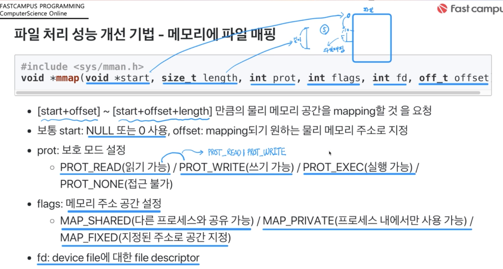
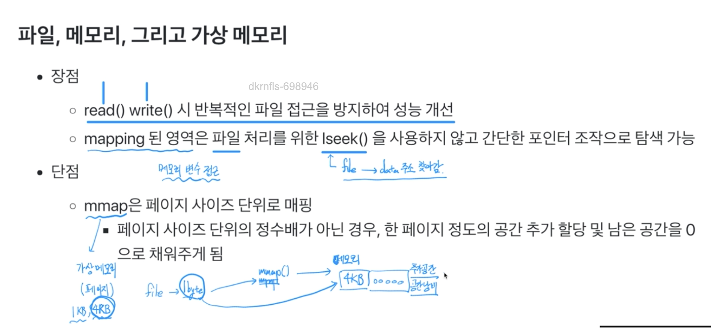
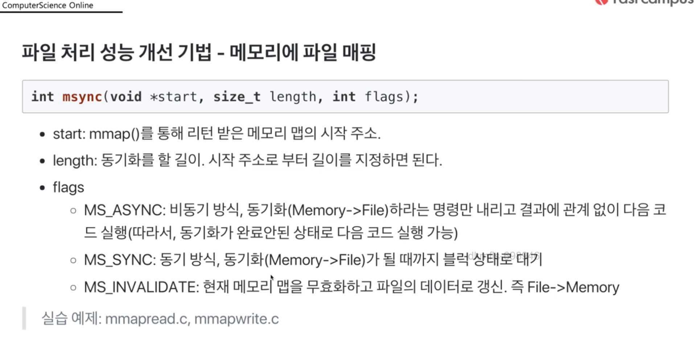
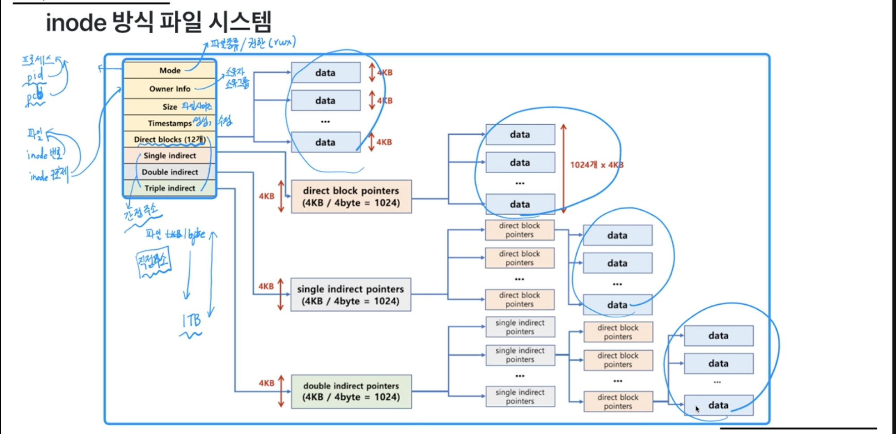
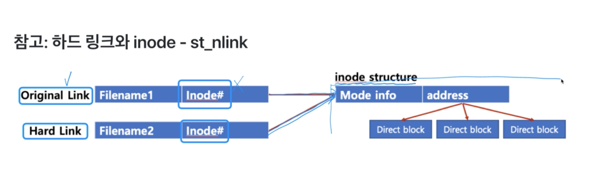
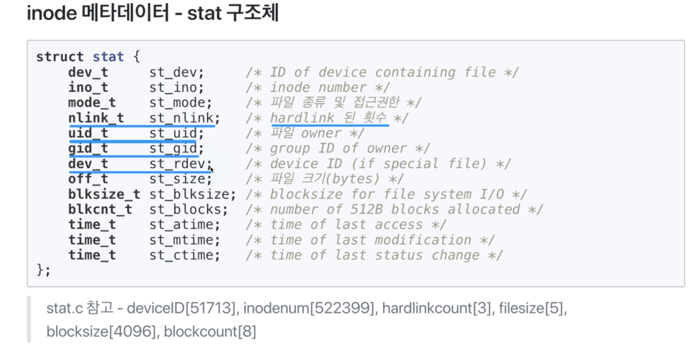

# 메모리와 파일 시스템 관련

* heap 영역에 생성 - malloc 함수

### 파일 접근의 어려움
프로세스에서 파일을 접근하려면 
시스템콜 발생, 스케줄러 스탑, 인터럽트 발생, 파일은 메모리가 아닌 저장매체에 위치해 있으므로 접근에 드는 시간등 시간이 오래걸리게 된다.
그래서 파일의 특정영역을 메모리에 올려놓고 프로세스에서 접근하게 할수 있게 하자 해서 Mmap이 등장

### 파일, 메모리, 그리고 가상 메모리
* 장점
  * read() write()시 반복적인 파일 접근을 방지하여 성능 개선
  * mapping된 영역은 파일 처리를 위한 lseek()을 사용하지 않고 간단한 포인터 조작으로 탐색 가능

* 단점
  * mmap은 페이지 사이즈 단위로 매핑
    * 페이지 사이즈 단위의 정수배가 아닌 경우, 한 페이지 정도의 공간 추가 할당 및 남은 공간을 0으로 채워주게 됨

### Standard Stream(표준 입출력)과 파일 시스템콜
* command로 실행되는 프로세스는 세 가지 스트림을 가지고 있음
  * 표준 입력 스트림(Standard Input Stream) - stdin
  * 표준 출력 스트림(Standard Output Stream) - stdout
  * 오류 출력 스트림(Standard Error Stream) - stderr
* 모든 스트림은 일반적인 Plain text로 console에 출력하도록 되어 있음

