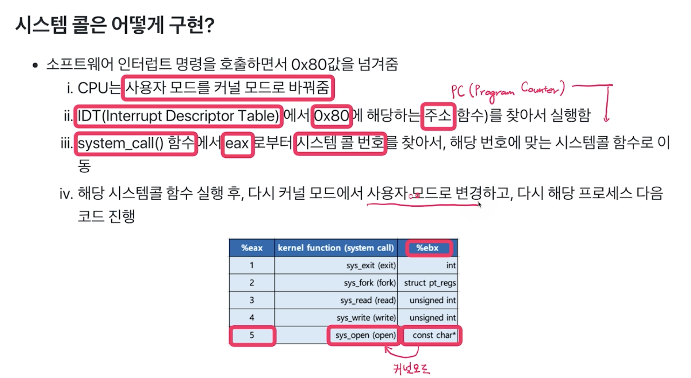

# 시스템 프로그래밍의 기반 요소
  * 시스템 콜
  * C 라이브러리
  * C 컴파일러

### 시스템 콜은 어떻게 구현?
  * eax 레지스터에 시스템 콜 번호를 넣고
  * ebx 레지스터에는 시스템 콜에 해당하는 인자값을 넣고
  * 소프트웨어 인터럽트 명령을 호출하면서 0x80값을 넘겨줌
  ```
    mov eax, 1
    mov ebx, 0
    int 0x80 // 소프트웨어 인터럽트 명령
  ```
  

### API
  * 응용 프로그램과 분리된 하위 호환 인터페이스

### ABI
  * 응용 프로그램 바이너리 인터페이스
  * 함수 실행 방식, 레지스터 활용, 시스템 콜 실행, 라이브러리 링크 방식등
  * ABI가 호환되면 재컴파일없이 동작
  * 컴파일러, 링커(라이브러리 링크), 툴체인(컴파일러를 만드는 프로그램)에서 제공

### POSIX
  * 유닉스 시스템 프로그래밍 인터페이스 표준