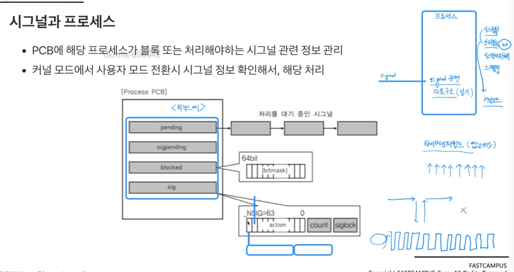

# 시그널
* 커널 또는 프로세스에서 다른 프로세스에 어떤 이벤트가 발생되었는지를 알려주는 기법

### 주요 시그널
* 시그널 종류와 각 시그널에 따른 기본 동작이 미리 있다
  * SIGKILL : 프로세스 죽여라
  * SIGALARM : 알람 발생
  * SIGSTP : 프로세스 멈춰라 (ctrl + z)
  * SIGCONT : 멈춰진 프로세스를 실행해라
  * SIGINT : 프로세스에 인터럽트를 보내서 프로세스를 죽여라(ctrl + c)
  * SIGSEGV : 프로세스가 다른 메모리 영역을 침법했다.

### 시그널 동작
* 프로그램에서 특정 시그널의 기본 동작 대신 다른 동작을 하도록 구현 가능

### 시그널과 프로세스
* PCB에 해당 프로세스가 블록 또는 처리해야하는 시그널 관련 정보 관리
* 커널 모드에서 사용자 모드 전환시 시그널 정보 확인해서, 해당 처리
* 프로세스는 수시로 커널모드를 왔다갔다 한다.

