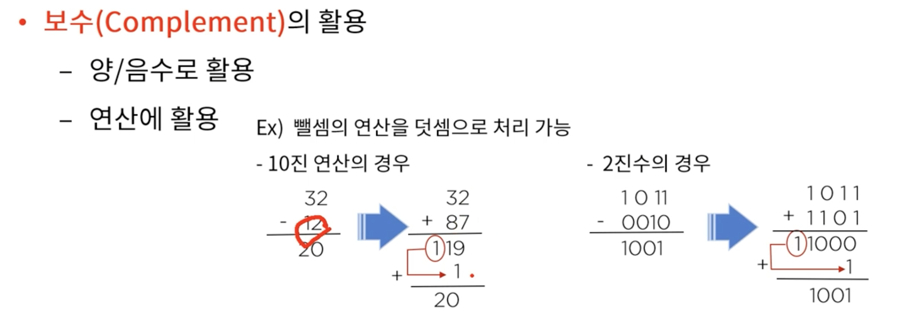
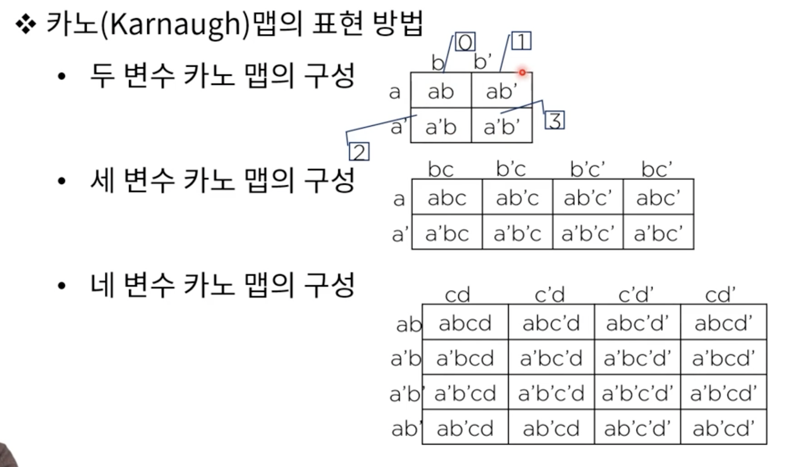
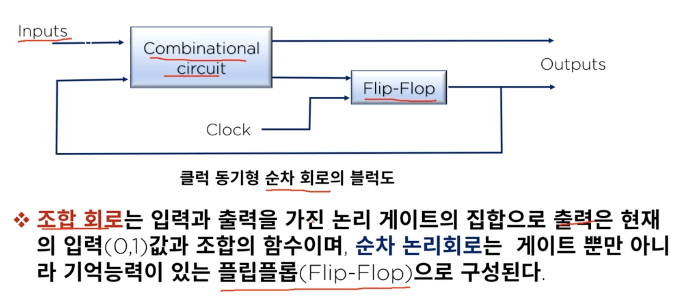
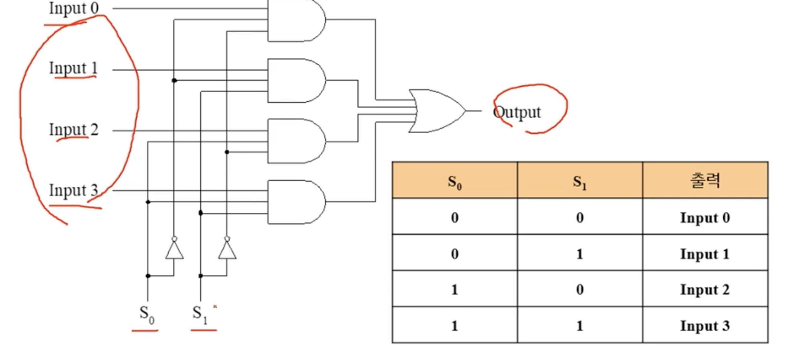
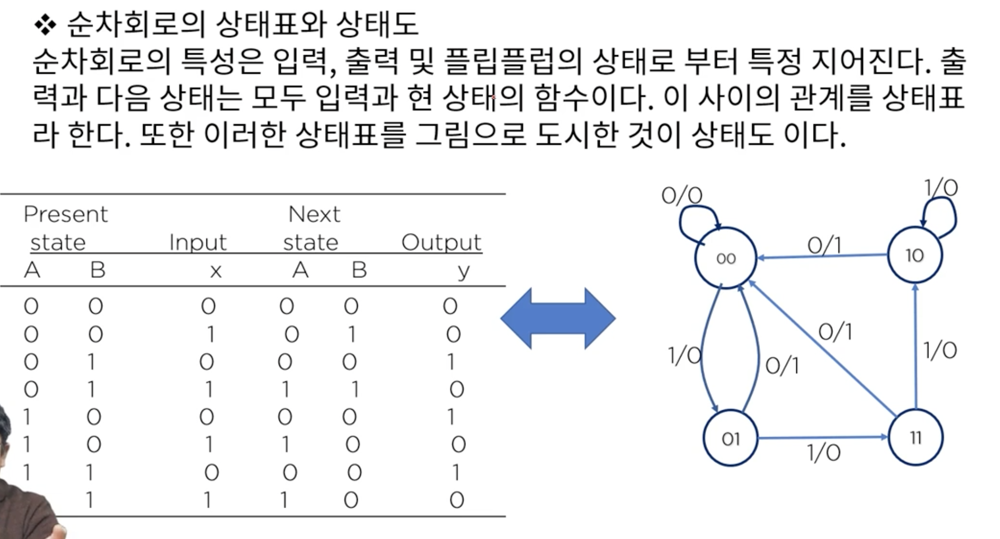

# 2. 데이터의 표현

### 2.1 진법과 진법 변환
* 디지털 정보의 단위
  * 1byte = 1문자(character)

* 보수
  * 최대값(해당 bit에서 가장 큰 표현형)을 형성하는데 서로 보완 관계에 있는 두수 사이의 관계를 one's COMPLEMENT라고 한다.
  * MODULUS(최대 표현 자리 수)를 형성하는데 서로 보완관계에 있는 두수사이의 관계를 two's COMPLEMEN라 한다.
  ex) 10 진수 에서의 보수
  - 1진 보수(ONE'S COMPLEMENT): A+B = 9, A+B=99
  - 2진 보수(TWO'S COMPLEMENT): A+B = 10, A+B=100

진리표를 만들고 -> 회로를 만들고 -> cpu를 만들고

드모르강의 정리 a' + b' = a'*b'

카노맵

순차회로

멀티플렉서 : 다수의 입력 선 중 하나만을 선별적으로 출력 가능하게 해주는 조합논리 회로

