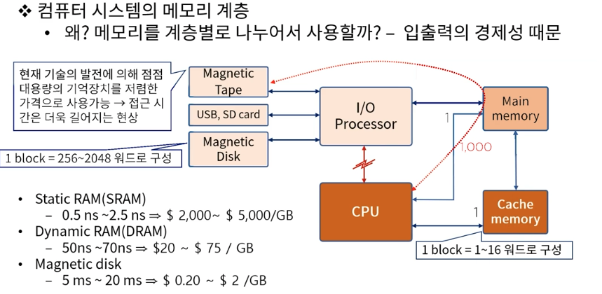
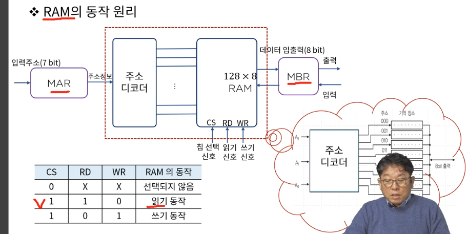
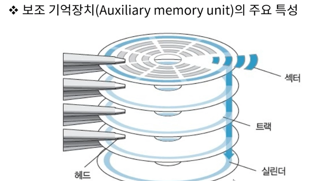
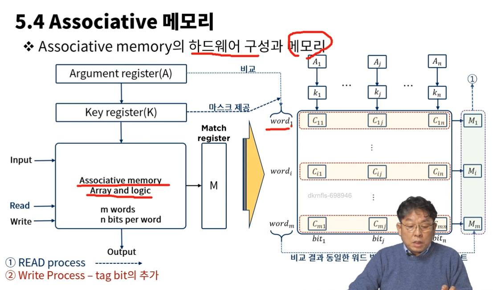
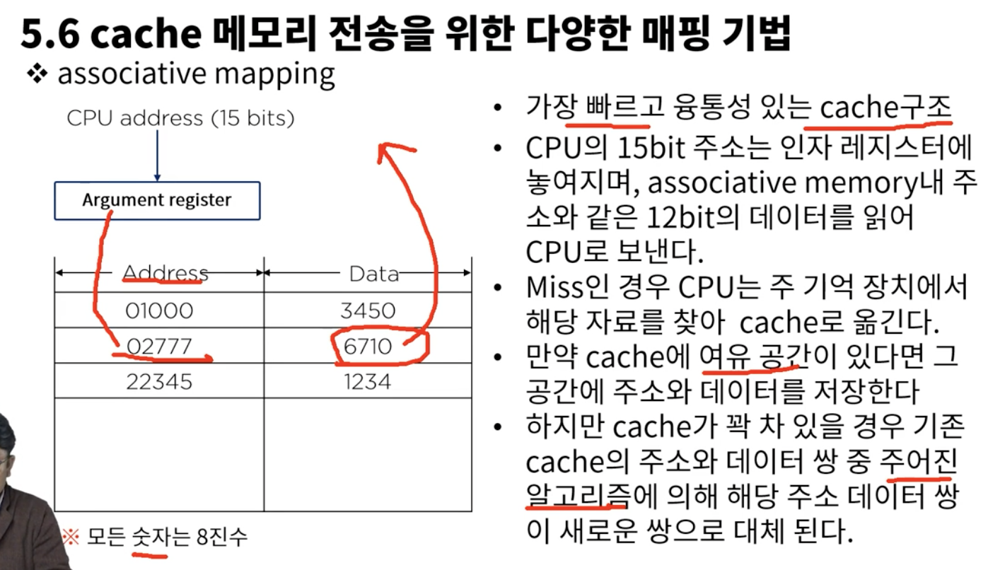
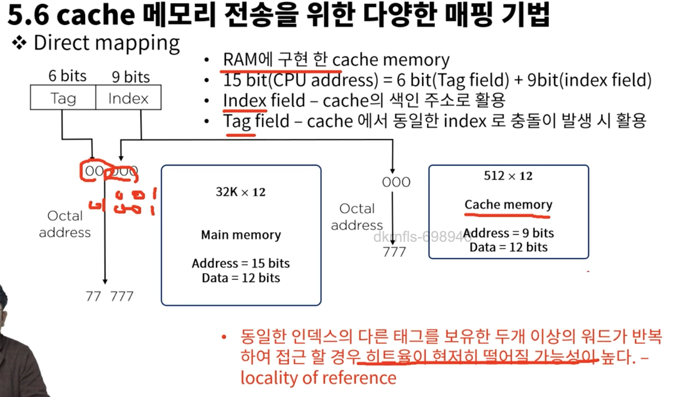
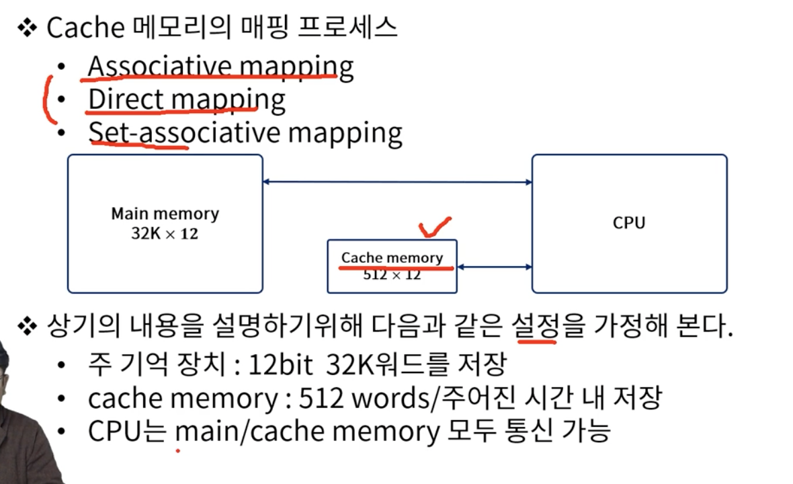
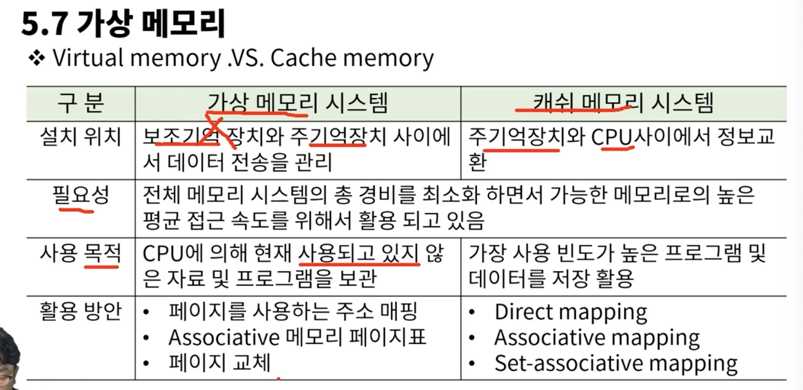
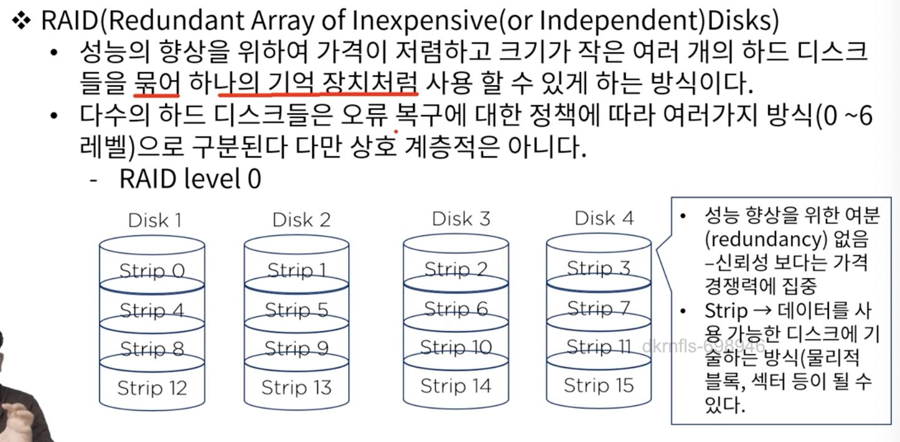

# 5. 메모리 구조

### 5.1 메모리 계층
* 기억장치는 cpu에 의하여 시행될 프로그램이 저장되는 곳
  * 주 기억장치
    * 마더보드에 장착됨 - RAM(비교적 대용량, 고속의 속도를 지님, 휘발성), ROM
  * 보조 기억장치
    * 비교적 저속, 대용량의 자료보관이 가능
    * 보조기억내 데이터는 필요한 경우 주 기억장치로 옮겨져야 한다
    * Magnetic Tape, USB, SD card
  * 캐쉬메모리
    * 주기억장치 접근 시간 > 프로세스 논리회로 => MMS & CPU 버퍼
    * 현재 진행되고 있는 프로그램의 일부 또는 사용빈도가 높은 임시 데이터 저장

* 지역성 -> 사용하고 있는 명령어, 주소는 거의 몇개 없음, 지역성에 기반

메모리의 256GB이런거는 ns로 클락펄스를 발생시킬수 있다는 거고 이건 주파수 인거고 메모리의 용량이 크다는건 클락 펄스를 더 자주 발생시킬수 있다는 거고 ns가 작아질수록 분모의 값이 작아지니까 용량이 커지겠네
클락펄스를 발생시켜야 레지스터가 시그널을 받아들여 이후의 동작을 수행할 수 있는 거고

### 5.2 주 기억장치
* RAM
  * SRAM
  * DRAM
* ROM

MAR: Memory Address Register
MBR: Memory Buffer Register

### 5.3 보조기억장치

* 접근시간 : 메모리내의 기억장소에 도달하여 그 내용을 얻는데 요구되는 평균시간 의미
  * 시크타임 : read/write head가 지정된 기억장소에 도달하는데 소요 되는 시간
  * 트랜스퍼 타임 : 추출된 데이터를 장치내 또는 장치 밖 필요한 곳으로 전송하는데 요구되는 시간
  * 레코드 : 일반적으로 데이터가 기록되는 단위, 시크 타임을 체크하게 되는 기준
  * 전송률 : 장치가 레코드의 시작점에 위치한 다음 단위 시간에 전송 할수 있는 문자나 위드의 수

### Associative 메모리
* 내용에 의해 접근하는 메모리 장치??를 이르는 용어이다.
  - 메모리장치(Memory device)(Ram이 아닌듯)란 자료(data)의 저장(store)과 접근(access)을 용이하게 하기위해 필요로 하는 장치이다.
  - cpu는 필요한 자료를 얻기 위해 메모리 장치에 탐색(search)를 하게 될 수 밖에 없고
  - 좀 더 효율적 탐색이 가능 할 수 있는 저장 공간의 필요에 의해 만들어진 저장 형태를 우리는 associative 메모리라 한다. 
  - 데이터의 내용으로 병렬 탐색!!!을 하기에 적합한 방식으로 구성되어 있다.!!!

### Cache 메모리
* 참조의 국한성
  * 프로그램이 수행되는 동안 메모리 참조는 국한된 영역에서만 이루어지는 경향이 있다(지역성)
    - 프로그램 루프와 서브루틴의 빈번한 활용
    - 순차적 프로그램의 실행
    - 데이터 메모리 참조에서도 동일한 경향이 있을을 확인 할 수 있다.
      - 테이블 룩업 절차
      - 공통 메모리와 배열 사용 예
* 캐쉬 메모리
  - 이와 같이 참조의 국한성을 이용하여 속도는 빠르고, 조그마한 메모리를 이용하여 자주 사용하는 것들을 이 조그마한 메모리에 넣어버리자. 이 조그만 메모리를 캐쉬 메모리라고 함

* 캐쉬 메모리의 동작과 성능
  - Cache의 기본 동작(cpu가 메모리에 접근 할 필요가 있을 경우)
    - Cache를 체크
    - 워드가 Cache에서 발견되면(hit) 읽어 들이고 아닐경우(miss) 주기억장치에 접근한다.
    - miss일경우 그 데이터를 캐시로 전송한다.

### cache 메모리 전송을 위한 다양한 매핑 기법
* Associative mapping
  
  - 먼저 캐시에 있는지 확인하고 없으면 RAM 접근
  - RAM에서 가져와서 다시 캐시에 넣음
  - 주소와 내용까지 확인할수 있어서 고가다

* Direct mapping
  
  - sram!!!!에 구현한 캐시 메모리
  - 하나의 버퍼 안에 하나씩 밖에 저장이 안된다
  - 가장 저렴

* Set-associative mapping

### 가상 메모리
* Virtual memory vs Cache memory
 필요성 => 전체 메모리 시스템의 총 경비를 최소화 하면서 가능한 메모리로의 높은 평균 접근 속도를 위해서 활용 되고 있음

 가상 메모리
  - 보조기억 장치와 주기억장치 사이에서 데이터 전송을 관리
  - cpu에 의해 현재 사용되고 있지 않은 자료 및 프로그램을 보관
  - 페이지를 사용하는 주소 매핑, Associative 메모리 페이지표, 페이지 교체
 
 캐시 메모리
  - 주기억장치와 cpu사이에서 정보교환
  - 가장 사용빈도가 높은 프로그램 및 데이터를 저장 활용
  - Direct mapping, Associative mapping, Set-associative mapping

### 메모리 관리 하드웨어
* 메모리의 광역화(가상 메모리+캐쉬 메모리)와 멀티 프로그램의 발달로 인한 시스템내 상호 간접도 시스템 기능 저하요인의 중요한 부분이다.
* 동시성, 데이터 흐름, 사용메모리의 양 조절등 이슈가 많이 발생 됨
* 메모리 관리 시스템의 필요성이 대두 -> 운영체제의 일부

* 메모리 관리 하드웨어
  * 논리 메모리 참조를 물리 메모리 주소로 변환하는 동적 저장장소 재배치를 위한 기능 -> cr3 레지스터??, mmu????
  * 메모리내에서 서로 다른 사용자가 하나의 프로그램을 같이 사용하기위한 편의
  * 사용자 간의 허락되지 않은 접근을 방지하고 사용자가 OS의 기능을 변경하지 못하도록 하는 정보의 보호

### 주 기억장치
- SDR
- DDR

### 보조 기억장치
- SSD -> 안에 회로가 들어가 있다, 구동 부(모터)가 없다(소음 감소, 소모 전력, 발열이 낮다)
- RAID(Redundant Array of Inexpensive Disks) -> 가격이 저렴하고 크기가 작은 여러 개의 하드 디스크들을 묶어 하나의 기억 장치처럼 사용 할 수 있게 하는 방식

- 
