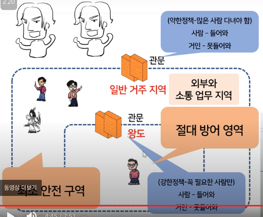
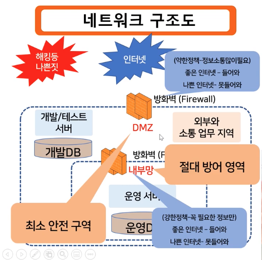
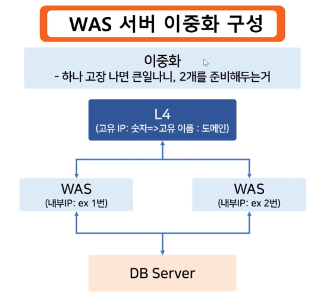
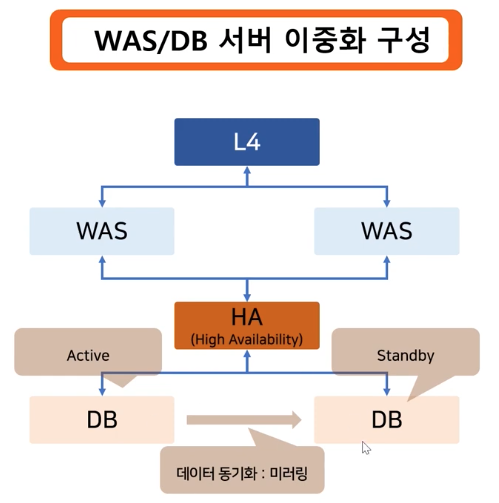
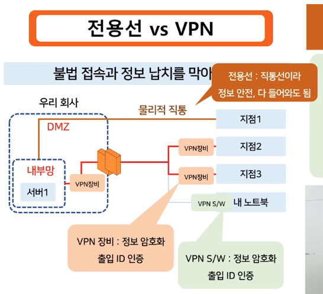

진격의 거인의 성의 구조로 
방화벽, dmz, 내부망을 설명

방화벽은 문의 역할

L4 장비(L4 스위치) - 로드밸런싱
WAS(Web Application Server) - 웹 프로그램이 돌아가는 서버
HA(High Availability) 장비
DB Server - Data를 관리하는 서버

HA 는 효율화 장비
DB 서버들간에 미러링을 효율적으로 담당해주는 친구

Public IP -> 내 집주소
private IP -> 내 집 안의 주소(안방, 화장실, 작은방 등등) -> 택배 배송지에 안방이라고 적으면 배달 못받음!!!!

public Ip 가져오는 법은 인터넷에 내 ip검색
private IP 가져오는 법은 cli에서 getip

vpn 장비 사용하면 앞단의 Vpn을 통해서 복호화가 되지 않으면 중간에 채가도 해석 불가

트랜젝션 -> All or nothing
트랜잭션의 대표적 예시 
-> 출금을 하고 있느데 돈을 뽑으려고 했는데 갑자기 문제가 생겼다. 
나는 돈을 뽑지 않았는데 계좌에서는 1000원이 줄어 있다!!!! 이래서 트랜잭션 도입!!

