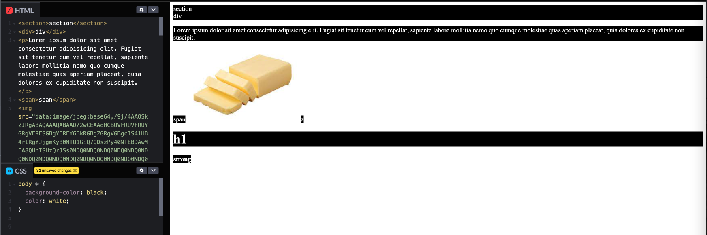

# 핵심 HTML

컨텐츠가 태그에 포함되어 있는 경우 닫는 태그가 없다!
=> 그 동안 input, img 하고 /> 를 붙였었는데.....,   
컨텐츠가 내부에 포함되어야 한다 => value값을 의미하는 것 같다!!

```html

<input type="text" placeholder="입력하세요">
```

label은 input의 id와 연결이 된다. label클릭하면 id에 focusing 잡힘
radio input끼리는 name이 같아야 같은 범주안에 들어가서 하나씩 체크가 가능
```html
<label for="name">이름</label>
<input type="text" id="name">

<input type="radio" name="gender" id="female">
<label for="female">여자</label>
<input type="radio" name="gender" id="female">
<label for="male">남자</label>
```

### Block vs Inline

#### Block
* 부모 요소의 전체 공간을 차지하여 '블록'을 만듬
* 상자를 쌓는것과 같음
* 좌우 양쪽으로 늘어나 최대한 늘어나 가능한 모든 너비를 차지

#### Inline
* 요소를 구성하는 태그에 할당된 공간만 차지


위의 사진에서 볼 수 있듯이 전체 부분을 차지하면 block 요소, 공간만 차지한다면 inline 요소
display: block, inline 등으로 서로의 display 속성을 변경시켜줄수도 있다.

### 시맨틱 마크업
1. 검색엔진 최적화(SEO)
2. 접근성 => 스크린 리더기가 이해하기가 쉬움
3. 유지보수

주어진 목적을 위해 요소를 사용하기 때문에 사람과 기계가 읽고 이해하기가 더 쉽다!!
정해진 위치에 section, header, footer, main, aside, article, figure 등등을 사용하는것!

