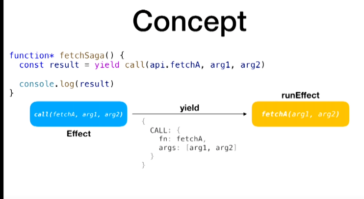

> 컴포넌트에서 dispatch를 통해 action을 넘겼을때 동작하는 순서  
>   
> 1\. ui에서 action creator를 통해 action을 생성하고 이를 dispatch를 통해 Store로 넘깁니다.  
> 2\. store로 넘어오면 이를 감지하고 있던 saga(watch)에서 action의 type에 맞는 effect를 실행하게 됩니다.  
> 3\. redux-saga에서는 effect를 통해 객체를 반환하기만 하고 이 객체는 middle-ware로 전달이 됩니다.  
> 4\. 실질적인 함수의 실행은 미들웨어에서 실행이 됩니다.  
> 5\. put을 통해 store에 dispatch를 전달하고 store에서는 리듀서를 통해 상태를 변화시킵니다.  
> 6\. 상태가 변화가 되면 상태를 참조하고 있던 컴포넌트는 리렌더링이 발생하게 됩니다.  
>   
> \---------------------------------   
>   
> component에서 action creator가 호출이 됨  
> action이 store로 이동됩니다.  
> saga의 effect인 take(Every, Latest)등이 이를 확인합니다.  
> saga에서 작성한 제너레이터 함수들이 동작합니다(네트워크 요청 등)  
> saga의 제너레이터 함수가 put을 통해 store로 결과 값을 (순수한 객체) dispatch 합니다.  
> reducer에서는 이를 확인하고 state값을 변경합니다.  
> 변경 된 state를 통해 component는 리렌더링 됩니다.

redux는 어플리케이션에 예측가능한 상태를 제공하기 위한 가벼운 라이브러리 이다.

redux를 사용하게 되면 아래와 같은 사이클이 형성되는데 (action은 객체, reducer는 순수함수)

ui -> action -> reducer -> state -> ui

이때 비동기적인 부분이 들어갈 수 있는 부분은 존재하지 않게 된다.

미들웨어는 어떤걸까??

미들웨어를 설명하기 전에 이해해야 하는 것은 리덕스 안에 baseDispatch라는 함수가 있고 baseDispatch는 Reducer에 직접적으로 연결이 되는 함수이다. 

미들웨어는 이 baseDispatch를 감싸는 고차 함수, higher order function의 일종입니다

redux-thunk는 Test가 어렵고, action creator가 action object를 반환하는 것이 아닌, 함수를 실행시켰다.
그래서 redux-saga가 등장하게 되었다.

saga는 side effect을 관리하기 위한 모델로서 어플리케이션의 스레드와 같은 역할을 수행한다
이때 side effect은 브라우저 캐시, 로컬스토리지, 비동기 api요청등 부수함수를 일으키는 것이다.
자바스크립트의 경우에는 코드가 외부에 영향을 주거나 받는 것을 side effect이라 할 수 있다.
이때 외부라는 것은 스코프의 바깥을 의미
부작용은 negative side effect으로 프로그래밍 분야에서는 언급되는것으로 이해하였다.

sagas라는 논문은 장기 트랜잭션들을 어떻게 관리하고 실패했을때 이들에 대한 처리를 어떻게 할것이냐에 관한 내용이다.
redux-saga에서는 이 논문에 영향을 받았을것 같고 여기에서 스코프를 줄여서 side effect에 관한 Handling에 대한 개념

action creator에 의해 action이 발생하면 saga에서는 이를 지켜보고 있다가 발생했다는 것을 확인하고 action의 type에 맞는 동작을 수행한다. 
이때 effect를 사용하여 원하는 동작을 수행하게 할 수 있다.

effect는 redux-saga에게 어떤 동작을 수행해달라고 표현하는 방법
saga는 effect를 yield하고 middleware는 effect를 처리한다.

call effect는 async/await의 await과 같은 역할. 비동기작업을 내려주고 계속 기다린다.

call을 사용하면 위의 객체와 같은 정보만 미들웨어 에게 전달이 된다.
미들웨어에서 실제로 이 함수를 호출하고 작업을 기다려준다.

take, put, call, fork, join과 같은 effect들이 있다.
take는 action을 가져오고 put은 dispatch를 발생시킨다.

call은 비동기 처리를 기다려주고
fork는 작업을 실행은 시켜주지만 끝날때까지 기다려주지 않는다. task만 반환할 뿐

fork를 통해 othersaga가 다른 공간에서 실행이 된다. 근데 이게 끝날때까지 기다려주지는 않는다.

channel 개념

Generator 내부에서 try/catch 사용이 가능하다. 그래서 에러처리 나면 기존처리 뒤짚고 하는 것과 같은 동작을 수행할것 같다.
toolkit의 createSlice를 이용하면 boilerplate 코드를 매우 줄일수 있다.

takeLatest를 사용하면 작업이 들어왔을때 가장 마지막에 작업만 해서 수행하겠다는 뜻이다.

yield는 generator 함수에서만 사용할 수 있다.
yield all을 사용하면 스레드별로 생성해서 동작을 수행해줄 수 있다.

redux-saga는 테스트를 쉽게 할수 있다.
saga자체는 side effect, 일반적인 객체만 yield하기 때문에 비동기 적인 동작들은 테스트 하고 완전히 분리 할수가 있다.

redux-saga는 typescript지원을 위해서는 typesafe-actions 라이브러리를 사용해야 하는것으로 알고 있습니다.
