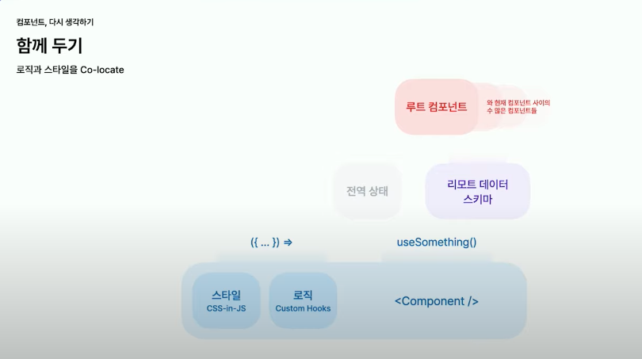

https://www.youtube.com/watch?v=HYgKBvLr49c
컴포넌트, 다시 생각하기

케이크를 만드려면 밀가루, 설탕, 계란이 필요하다
케이크는 밀가루, 설탕, 계란에 의존한다.
케이크의 의존성: 밀가루, 설탕, 계란

React 컴포넌트를 만들려면 무엇이 필요할까? 

특징적 분류 
스타일, 
로직(ui 조작에 필요한 커스텀 로직), 
전역상태(유저의 액션을 통해 초래된 상태), 
리모트 데이터 스키마(API 서버에서 내려주는 데이터의 모양)


딸기 케이크는 생크림이 필요하다.
딸기 케이크는 생크림에 의존한다.

React 컴포넌트에 정보를 추가하려면 새로운 정보뿐 아니라 ?도 필요하다.
정보를 표현하는 React 컴포넌트의 숨은 의존성 ? 


```
<Article /> 컴포넌트에 정보 새로 추가하기

remote data -> <Article /> 컴포넌트의 Props 수정
React 컴포넌트 -> <Article />의 렌더링 부분 수정
숨은 의존성 -> <ArticleList />의 Props 수정
숨은 의존성 -> <PageArticleList />의 useEffect훅 수정
```


컴포넌트, 다시 생각하기 
Keep locality -> 비슷한 관심사라면 가까운 곳에


css-in-js도 결국 colocation의 일종이다.   
스타일과 로직(custom hook)은 컴포넌트와 지역성을 이룰수 있어서 컴포넌트 내재화가 이루어짐    
스타일 혹은 로직이 너무 커지면 같은 폴더내에 다른 파일로 구분해서 개발자의 피로가 덜 하게끔 해주자     

 
결국 컴포넌트의 핵심은 지역성인건가.    
클린코드 에서도 비슷한 역할을 하는 친구들은 모아두라고 했었고     
컴포넌트의 구조 자체도 클린코드의 정신에서 파생된것 같기도 하다   


데이터 저장소가 등장한 이유는 의존성을 끊어내기 위함이다.   
원래는 api 서버에서 부터 루트 컴포넌트 -> 부모 컴포넌트 -> 내 컴포넌트 까지 다 타고 왔어야 해서 의존성이 짙게 생겼다.    
이걸 끊어 내기 위해 데이터 저장소가 등장!!    

Abstraction by Normalization -> 데이터를 ID 기반으로 정리하기    

아래 이미지는 데이터 응답의 리팩토링 된 예시

위의 이미지처럼 처리 도와주는게 normalizr package


아래와 같은식으로 모델명 까지 같이 넘겨주면서 처리하면 모델에 대한 의존성 조차도 끊어진다


아래 이미지 처럼 구축하려면 서버에서 모델명과 id를 params로 받아서 처리가 가능해야겠네(object 컨트롤러 느낌?)


아래 이미지 보다보니 약간 react query 느낌인데??


이름 짓기


### 의존한다면 그대로 드러내기


### 컴포넌트를 재사용하는 이유
=> 개발할때 편리하기 위한 것보다 **변경할 때 편리하기** 위해

왼쪽은 user모델을 참조하고 오른쪽은 page모델을 참조하는 상황


### 모델 기준으로 컴포넌트를 분리하기

각자의 컴포넌트는 각자의 방향대로 변화를 할것이다.
우리의 제품은 끊임없이 변화하면서도 유저에게 일관된 경험을 전달해주어야 한다.
유저들이 생각하는 일관된 경험은 대부분 모델을 기반으로 한다.
따라서 변화의 방향성 역시 모델별로 정렬될 것이다.


컴포넌트를 분리해야 할지, 재사용해야 할지 고민이 될때는 
같은 모델을 의존하는 컴포넌트 : 재사용
다른 모델을 의존하는 컴포넌트 : 분리


중간에 하나의 컴포넌트는 다른 방향으로 변화를 하고 있다

인터페이스가 서로 다른 모습을 확인할 수 있다.


결론
1. Keep Locality -> 비슷한 관심사라면 가까운 곳에
2. Abstraction by Normalization -> 데이터를 ID 기반으로 정리하기
3. Make Explicit -> 의존한다면 그대로 드러내기
4. Seperating Components by Model -> 모델 기준으로 컴포넌트 분리하기


